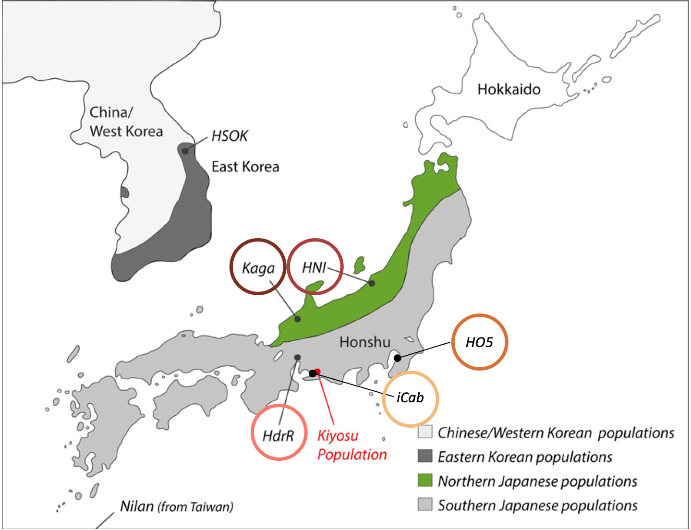

# Data collection

Between 11 and 16 June 2019, we ran this behavioural assay 77 times on 307 pairs of fish (one run had only 3 pairs), for a total test fish count of 68 *iCab*, 60 *HdrR*, 76 *HNI*, 47 *Kaga*, and 56 *HO5*. The locations of the lines' originating populations are shown in **Figure \@ref(fig:line-locs)**. The two fish in each pair were denoted as either the "reference fish", which always came from the *iCab* line, and was introduced to the test tank first; or the "test fish" – which was either another *iCab* fish for the control condition, or a fish from one of the other four lines that were assayed in this experiment (*HdrR*, *HNI*, *Kaga*, *HO5*). The order in which the lines were assayed across the six days was randomly determined prior to the collection of the data (**Figure \@ref(fig:test-line-counts)**). The test tanks were also rinsed between runs to remove any substances released by subjects during previous runs that could influence the behaviour of the following subjects.

(ref:line-locs) Image adapted from @spivakov2014genomic, showing the locations of the originating populations of the 5 inbred medaka lines used in this study.

(\#fig:line-locs)(ref:line-locs)

(ref:test-line-counts) Order of test-fish lines assayed over the course of the data-collection period. The sequence of lines to be assayed was randomised prior to data collection.

