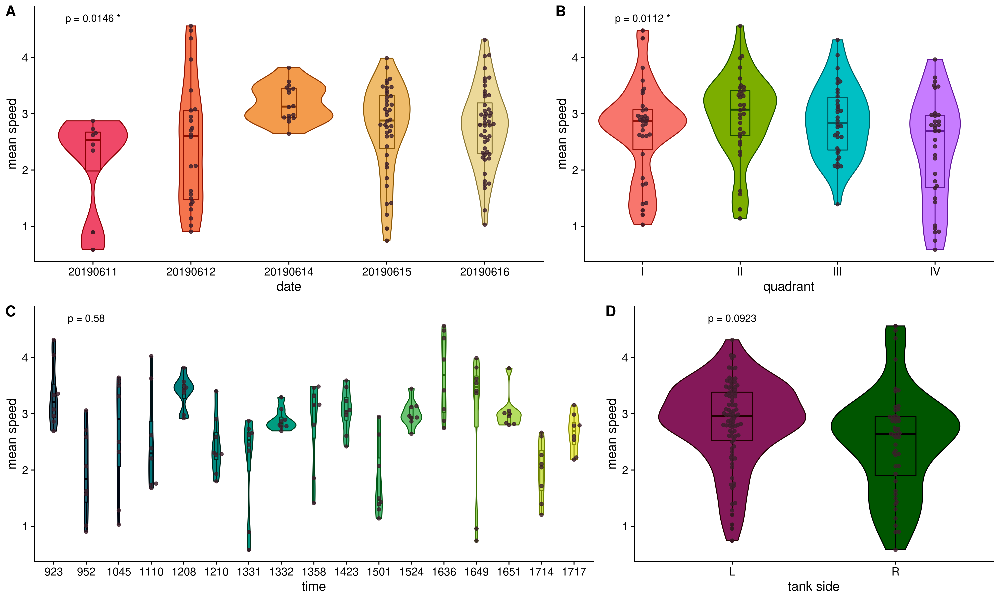

# Effect of covariates

We examined the effects of several covariates, including date of assay, time of assay, tank quadrant, and tank side. To achieve this, we calculated the mean speed of individuals in iCab-iCab pairings (N = 136) over the course of the entire 20-minute video (including both open field and novel object assays), and ran a multi-way ANOVA with all covariates (Figure \@ref(fig:covariates)). 

## Setup

### Load libraries


```r
library(tidyverse)
library(ggbeeswarm)
library(devtools)
library(cowplot)
library(ggpubr)
```

### Set variables


```r
IN = "/hps/nobackup/birney/users/ian/pilot/hmm_out/0.08/dist_angle/14.csv"
OUT_OF = "book/figs/covariate_effects/0.08/dist_angle/14/covariate_effects_of.png"
OUT_NO = "book/figs/covariate_effects/0.08/dist_angle/14/covariate_effects_no.png"
OUT_NOASSAY = "book/figs/covariate_effects/0.08/dist_angle/14/covariate_effects_no-split-by-assay.png"
```

### Source lighter/darker functions


```r
devtools::source_gist("c5015ee666cdf8d9f7e25fa3c8063c99")
#> ℹ Sourcing https://gist.githubusercontent.com/brettellebi/c5015ee666cdf8d9f7e25fa3c8063c99/raw/15832e2684e4c08a652eb82d4b559bea4e8994e4/karyoploteR_lighter_darker.R
#> ℹ SHA-1 hash of file is 3d840ff655bd54f4b19517cf99ec4bd3640a30c5
```

## Read and process data


```r
df = readr::read_csv(IN) 
#> Rows: 9152328 Columns: 15
#> ── Column specification ────────────────────────────────────
#> Delimiter: ","
#> chr (6): assay, ref_fish, test_fish, tank_side, quadrant...
#> dbl (9): date, time, frame, seconds, x, y, distance, ang...
#> 
#> ℹ Use `spec()` to retrieve the full column specification for this data.
#> ℹ Specify the column types or set `show_col_types = FALSE` to quiet this message.

df_control = df %>% 
  # Filter for only iCabs paired with iCabs
  dplyr::filter(test_fish == "icab") %>% 
  # Get individual
  tidyr::unite(date, time, quadrant, fish,
               col = "indiv", 
               remove = F) %>% 
  # Group by assay and individual to get mean speed
  dplyr::group_by(assay, date, time, quadrant, tank_side, indiv) %>% 
  # Calculate mean speed
  dplyr::summarise(mean_speed = mean(distance)) %>% 
  dplyr::ungroup() %>% 
  # Make date a factor
  dplyr::mutate(date = as.factor(date))
#> `summarise()` has grouped output by 'assay', 'date',
#> 'time', 'quadrant', 'tank_side'. You can override using the
#> `.groups` argument.
```

### Calculate mean speed across both assays for each individual


```r
df_control_noassay = df %>% 
  # Filter for only iCabs paired with iCabs
  dplyr::filter(test_fish == "icab") %>% 
  # Get individual
  tidyr::unite(date, time, quadrant, fish,
               col = "indiv", 
               remove = F) %>% 
  # Group by assay and individual to get mean speed
  dplyr::group_by(date, time, quadrant, tank_side, indiv) %>% 
  # Calculate mean speed
  dplyr::summarise(mean_speed = mean(distance)) %>% 
  dplyr::ungroup() %>% 
  # Make date a factor
  dplyr::mutate(date = as.factor(date))
#> `summarise()` has grouped output by 'date', 'time',
#> 'quadrant', 'tank_side'. You can override using the
#> `.groups` argument.
```

## ANOVA

### Model

$$
\operatorname{mean\_speed} = \beta_{1}(\operatorname{date}) + \beta_{2}(\operatorname{time}) + \beta_{3}(\operatorname{quadrant}) + \beta_{4}(\operatorname{tank\_side}) + \beta_{5}() + \epsilon
$$
$$
\operatorname{mean\_speed} = \beta_{1}(\operatorname{date}) + \beta_{2}(\operatorname{time}) + \beta_{3}(\operatorname{quadrant}) + \beta_{4}(\operatorname{tank\_side}) + \epsilon
$$

### All days


```r
aov_df_noassay = df_control_noassay %>% 
  aov(mean_speed ~ date + time + quadrant + tank_side,
      data = .) %>%
  broom::tidy(.) %>% 
  rstatix::add_significance(p.col = "p.value") %>% 
  # reduce to 3 digits
  dplyr::mutate(dplyr::across(c("sumsq", "meansq", "statistic", "p.value"),
                              ~signif(.x, digits = 3))) %>% 
  # paste p-value with significance
  dplyr::mutate(p_final = dplyr::case_when(p.value.signif == "ns" ~ paste("p =", p.value),
                                           TRUE ~ paste("p =", p.value, p.value.signif)))

DT::datatable(aov_df_noassay)
```

```{=html}
<div id="htmlwidget-53c7e85625059c108cf5" style="width:100%;height:auto;" class="datatables html-widget"></div>
<script type="application/json" data-for="htmlwidget-53c7e85625059c108cf5">{"x":{"filter":"none","vertical":false,"data":[["1","2","3","4","5"],["date","time","quadrant","tank_side","Residuals"],[4,1,3,1,126],[7.8,0.185,6.96,1.74,76],[1.95,0.185,2.32,1.74,0.603],[3.23,0.307,3.85,2.88,null],[0.0146,0.58,0.0112,0.0923,null],["*","ns","*","ns",""],["p = 0.0146 *","p = 0.58","p = 0.0112 *","p = 0.0923","p = NA "]],"container":"<table class=\"display\">\n  <thead>\n    <tr>\n      <th> <\/th>\n      <th>term<\/th>\n      <th>df<\/th>\n      <th>sumsq<\/th>\n      <th>meansq<\/th>\n      <th>statistic<\/th>\n      <th>p.value<\/th>\n      <th>p.value.signif<\/th>\n      <th>p_final<\/th>\n    <\/tr>\n  <\/thead>\n<\/table>","options":{"columnDefs":[{"className":"dt-right","targets":[2,3,4,5,6]},{"orderable":false,"targets":0}],"order":[],"autoWidth":false,"orderClasses":false}},"evals":[],"jsHooks":[]}</script>
```

As shown above, we found significant differences for date of assay and and tank quadrant (p = 0.0139 and 0.0108), but not for time of assay or tank side. This may have been caused by a difference in the way the assay was performed on the first day of the experiment (11 June 2019), where we used a thick fabric sheet to cover the front of the box rather than the wooden doors shown in Figure 1, as they were only installed the following day. The greater level of external light and sound permeating through the fabric may have caused the fishes to exhibit slower movement on that first day. The model below excludes the data collected on that first day.

### Excluding the first day


```r
aov_df_noassay_nofirstday = df_control_noassay %>% 
  dplyr::filter(date != "20190611") %>% 
  aov(mean_speed ~ date + time + quadrant + tank_side,
      data = .) %>%
  broom::tidy(.) %>% 
  rstatix::add_significance(p.col = "p.value") %>% 
  # reduce to 3 digits
  dplyr::mutate(dplyr::across(c("sumsq", "meansq", "statistic", "p.value"),
                              ~signif(.x, digits = 3))) %>% 
  # paste p-value with significance
  dplyr::mutate(p_final = dplyr::case_when(p.value.signif == "ns" ~ paste("p =", p.value),
                                           TRUE ~ paste("p =", p.value, p.value.signif)))

DT::datatable(aov_df_noassay_nofirstday)
```

```{=html}
<div id="htmlwidget-dc650f8d82c96200a31c" style="width:100%;height:auto;" class="datatables html-widget"></div>
<script type="application/json" data-for="htmlwidget-dc650f8d82c96200a31c">{"x":{"filter":"none","vertical":false,"data":[["1","2","3","4","5"],["date","time","quadrant","tank_side","Residuals"],[3,1,3,1,119],[4.96,0.185,4.99,1.74,72.4],[1.65,0.185,1.66,1.74,0.609],[2.72,0.304,2.73,2.85,null],[0.0477,0.582,0.0469,0.094,null],["*","ns","*","ns",""],["p = 0.0477 *","p = 0.582","p = 0.0469 *","p = 0.094","p = NA "]],"container":"<table class=\"display\">\n  <thead>\n    <tr>\n      <th> <\/th>\n      <th>term<\/th>\n      <th>df<\/th>\n      <th>sumsq<\/th>\n      <th>meansq<\/th>\n      <th>statistic<\/th>\n      <th>p.value<\/th>\n      <th>p.value.signif<\/th>\n      <th>p_final<\/th>\n    <\/tr>\n  <\/thead>\n<\/table>","options":{"columnDefs":[{"className":"dt-right","targets":[2,3,4,5,6]},{"orderable":false,"targets":0}],"order":[],"autoWidth":false,"orderClasses":false}},"evals":[],"jsHooks":[]}</script>
```

When the data from the first day is excluded, the p-values for date of assay and tank quadrant increase to 0.0477 and 0.0469 respectively.

## Plot


```r
P_VAL_HEI = 4.7
```

### Date


```r
date_pal = colorspace::sequential_hcl(length(unique(df_control_noassay$date)),
                                      palette = "OrYel")

date_fig_noassay = df_control_noassay %>% 
  dplyr::mutate(date = factor(date, levels = sort(unique(date)))) %>% 
  #ggplot(aes(date, mean_speed, fill = date)) +
  ggplot() +
  geom_violin(aes(date, mean_speed, fill = date, colour = date)) +
  geom_boxplot(aes(date, mean_speed, fill = date, colour = date),
               width = 0.25) +
  ggbeeswarm::geom_beeswarm(aes(date, mean_speed),
                            colour = "#3B1F2B", alpha = 0.8) +
  geom_text(data = aov_df_noassay %>% 
              dplyr::filter(term == "date"),
            aes(x = "20190611", y = P_VAL_HEI, label = p_final)) +
  #geom_text(x = "20190611", y = 3.15, label = paste("p =", kw_date)) +
  scale_fill_manual(values = date_pal) +
  scale_colour_manual(values = darker(date_pal, amount = 100)) +
  cowplot::theme_cowplot() +
  guides(fill = "none",
         colour = "none") +
  ylab("mean speed") 
```

### Time


```r
time_pal = colorspace::sequential_hcl(length(unique(df_control_noassay$time)),
                                      palette = "ag_GrnYl")

time_fig_noassay = df_control_noassay %>% 
  dplyr::mutate(time = factor(time)) %>% 
  ggplot() +
  geom_violin(aes(time, mean_speed, fill = time, colour = time)) +
  geom_boxplot(aes(time, mean_speed, fill = time, colour = time),
               width = 0.15) +
  ggbeeswarm::geom_beeswarm(aes(time, mean_speed),
                            colour = "#3B1F2B", alpha = 0.8) +
  geom_text(data = aov_df_noassay %>% 
              dplyr::filter(term == "time"),
            aes(x = "952", y = P_VAL_HEI, label = p_final)) +
  scale_fill_manual(values = time_pal) +
  scale_colour_manual(values = darker(time_pal, amount = 100)) +
  cowplot::theme_cowplot() +
  guides(colour = "none",
         fill = "none") +
  ylab("mean speed") 
```

### Quadrant


```r
quad_pal = scales::hue_pal()(4)

quad_fig_noassay = df_control_noassay %>% 
  dplyr::mutate(quadrant = dplyr::recode(quadrant,
                                         "q1" = "I",
                                         "q2" = "II",
                                         "q3" = "III",
                                         "q4" = "IV")) %>% 
  dplyr::mutate(quadrant = factor(quadrant, levels = c("I", "II", "III", "IV"))) %>% 
  #ggplot(aes(quadrant, mean_speed, fill = quadrant)) +
  ggplot() +
  geom_violin(aes(quadrant, mean_speed, fill = quadrant, colour = quadrant)) +
  geom_boxplot(aes(quadrant, mean_speed, fill = quadrant, colour = quadrant),
               width = 0.3) +
  ggbeeswarm::geom_beeswarm(aes(quadrant, mean_speed),
                            colour = "#3B1F2B", alpha = 0.8) +
  geom_text(data = aov_df_noassay %>% 
              dplyr::filter(term == "quadrant"),
            aes(x = "I", y = P_VAL_HEI, label = p_final)) +
  scale_fill_manual(values = quad_pal) +
  scale_colour_manual(values = darker(quad_pal, amount = 100)) +
  cowplot::theme_cowplot() +
  guides(colour = "none",
         fill = "none") +
  ylab("mean speed") 
```

### Tank side


```r
tank_pal = colorspace::diverging_hcl(length(unique(df_control_noassay$tank_side)),
                                     palette = "Red-Green")

tank_fig_noassay = df_control_noassay %>% 
  dplyr::mutate(tank_side = factor(tank_side, levels = c("L", "R"))) %>% 
  #ggplot(aes(tank_side, mean_speed, fill = tank_side)) +]
  ggplot() +
  geom_violin(aes(tank_side, mean_speed, fill = tank_side, colour = tank_side)) +
  geom_boxplot(aes(tank_side, mean_speed, fill = tank_side, colour = tank_side),
               width = 0.25) +
  ggbeeswarm::geom_beeswarm(aes(tank_side, mean_speed),
                            colour = "#3B1F2B", alpha = 0.8) +  
  geom_text(data = aov_df_noassay %>% 
              dplyr::filter(term == "tank_side"),
            aes(x = "L", y = P_VAL_HEI, label = p_final)) +
  scale_fill_manual(values = tank_pal) +
  scale_colour_manual(values = darker(tank_pal, amount = 100)) +
  cowplot::theme_cowplot() +
  guides(colour = "none",
         fill = "none") +
  ylab("mean speed") +
  xlab("tank side")
```

### Compile


```r
final_noassay = cowplot::ggdraw() +
  cowplot::draw_plot(date_fig_noassay,
                     x = 0, y = 0.5,
                     width = 0.55, height = 0.5) + 
  cowplot::draw_plot(quad_fig_noassay,
                     x = 0.55, y = 0.5,
                     width = 0.45, height = 0.5) + 
  cowplot::draw_plot(time_fig_noassay,
                     x = 0, y = 0,
                     width = 0.6, height = 0.5) + 
  cowplot::draw_plot(tank_fig_noassay,
                     x = 0.6, y = 0,
                     width = 0.4, height = 0.5) +
  cowplot::draw_plot_label(c("A", "B", "C", "D"),
                           x = c(0, 0.55, 0, 0.6),
                           y = c(1, 1, 0.5, 0.5))
```


```r
# Save
ggsave(here::here(OUT_NOASSAY),
       final_noassay,
       device = "png",
       width = 15,
       height = 9,
       units = "in",
       dpi = 400)
```


```r
knitr::include_graphics(here::here(OUT_NOASSAY))
```




