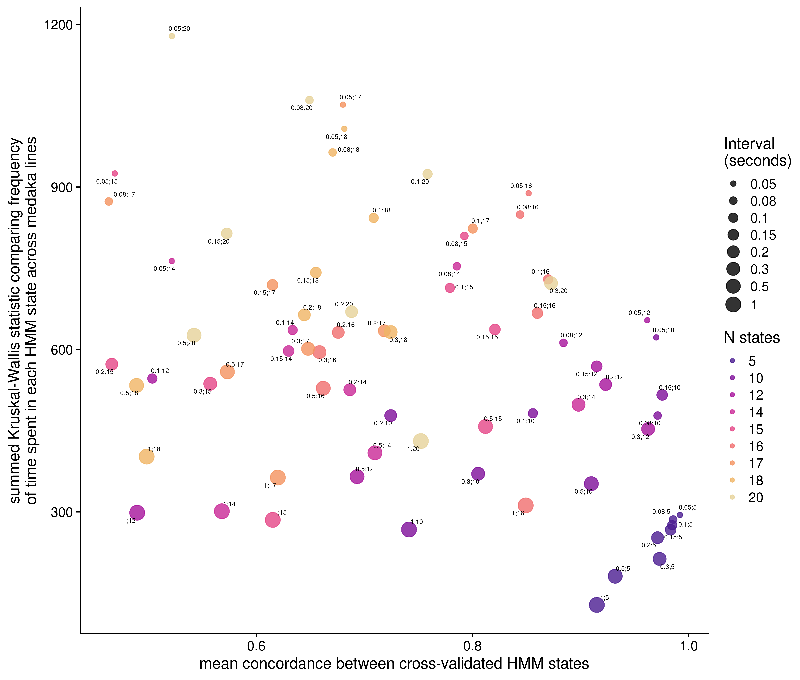

# HMM parameter optimisation

## Setup

### Load libraries


```r
library(tidyverse)
#> ── Attaching packages ─────────────────── tidyverse 1.3.1 ──
#> ✔ ggplot2 3.3.6     ✔ purrr   0.3.4
#> ✔ tibble  3.1.7     ✔ dplyr   1.0.9
#> ✔ tidyr   1.2.0     ✔ stringr 1.4.0
#> ✔ readr   2.1.2     ✔ forcats 0.5.1
#> ── Conflicts ────────────────────── tidyverse_conflicts() ──
#> ✖ dplyr::filter() masks stats::filter()
#> ✖ dplyr::lag()    masks stats::lag()
library(cowplot)
```

### Set variables


```r
CONC = as.list(list.files("/hps/nobackup/birney/users/ian/pilot/hmm_concordance_recode/",full.names = T, recursive = T))
KW = "/hps/nobackup/birney/users/ian/pilot/kruskal_wallis/out.rds"
OUT_PNG = here::here("book/figs/compare_params/compare_params.png")
OUT_PDF = here::here("book/figs/compare_params/compare_params.pdf")
```

## Read data and process


```r
kw = readRDS(KW) %>% 
  dplyr::mutate(INTERVAL = as.numeric(INTERVAL)) %>% 
  dplyr::mutate(N_STATES = as.numeric(N_STATES))

conc = purrr::map_dfr(CONC, readRDS) %>% 
  dplyr::group_by(INTERVAL, N_STATES) %>% 
  # get mean across groups A and B
  dplyr::summarise(MEAN_CONC = mean(CONCORDANCE))
#> `summarise()` has grouped output by 'INTERVAL'. You can
#> override using the `.groups` argument.

df = dplyr::left_join(kw, conc, by = c("INTERVAL", "N_STATES"))
```

## Plot


```r
pal = colorspace::sequential_hcl(length(unique(df$N_STATES)), palette = "ag_Sunset")

out_plot = df %>% 
  dplyr::mutate(N_STATES = factor(N_STATES, levels = sort(unique(N_STATES)))) %>% 
  dplyr::mutate(INTERVAL = factor(INTERVAL, levels = sort(unique(INTERVAL)))) %>% 
  # make new column combining `INTERVAL` and `N_STATES`
  tidyr::unite(INTERVAL, N_STATES,
               col = "INT_STATE",
               sep = ";",
               remove = F) %>% 
  ggplot(aes(MEAN_CONC, SUM_KW_STAT)) +
    geom_point(aes(size = INTERVAL, colour = N_STATES),
               alpha = 0.8) +
    ggrepel::geom_text_repel(aes(label = INT_STATE),
              size = 2,
              ) +
    theme_bw() +
    guides(size = guide_legend(title = "Interval\n(seconds)"),
           colour = guide_legend(title = "N states")) +
    scale_colour_manual(values = pal) +
    xlab("mean concordance between cross-validated HMM states") +
    ylab("summed Kruskal-Wallis statistic comparing frequency\nof time spent in each HMM state across medaka lines")

plotly::ggplotly(out_plot)
#> Warning: Using size for a discrete variable is not advised.
#> Warning in geom2trace.default(dots[[1L]][[1L]], dots[[2L]][[1L]], dots[[3L]][[1L]]): geom_GeomTextRepel() has yet to be implemented in plotly.
#>   If you'd like to see this geom implemented,
#>   Please open an issue with your example code at
#>   https://github.com/ropensci/plotly/issues
```

```{=html}
<div id="htmlwidget-0330c0bd900d1b1caf63" style="width:672px;height:480px;" class="plotly html-widget"></div>
<script type="application/json" data-for="htmlwidget-0330c0bd900d1b1caf63">{"x":{"data":[{"x":[0.991687998534494],"y":[294.375017415802],"text":"MEAN_CONC: 0.9916880<br />SUM_KW_STAT:  294.3750<br />INTERVAL: 0.05<br />N_STATES: 5","type":"scatter","mode":"markers","marker":{"autocolorscale":false,"color":"rgba(75,29,145,1)","opacity":0.8,"size":7.55905511811024,"symbol":"circle","line":{"width":1.88976377952756,"color":"rgba(75,29,145,1)"}},"hoveron":"points","name":"(5,0.05)","legendgroup":"(5,0.05)","showlegend":true,"xaxis":"x","yaxis":"y","hoverinfo":"text","frame":null},{"x":[0.98555839547469],"y":[285.921377382315],"text":"MEAN_CONC: 0.9855584<br />SUM_KW_STAT:  285.9214<br />INTERVAL: 0.08<br />N_STATES: 5","type":"scatter","mode":"markers","marker":{"autocolorscale":false,"color":"rgba(75,29,145,1)","opacity":0.8,"size":11.0653236617786,"symbol":"circle","line":{"width":1.88976377952756,"color":"rgba(75,29,145,1)"}},"hoveron":"points","name":"(5,0.08)","legendgroup":"(5,0.08)","showlegend":true,"xaxis":"x","yaxis":"y","hoverinfo":"text","frame":null},{"x":[0.984674085355211],"y":[275.530077205401],"text":"MEAN_CONC: 0.9846741<br />SUM_KW_STAT:  275.5301<br />INTERVAL: 0.1<br />N_STATES: 5","type":"scatter","mode":"markers","marker":{"autocolorscale":false,"color":"rgba(75,29,145,1)","opacity":0.8,"size":13.7019509998105,"symbol":"circle","line":{"width":1.88976377952756,"color":"rgba(75,29,145,1)"}},"hoveron":"points","name":"(5,0.1)","legendgroup":"(5,0.1)","showlegend":true,"xaxis":"x","yaxis":"y","hoverinfo":"text","frame":null},{"x":[0.983213677057527],"y":[267.069659325621],"text":"MEAN_CONC: 0.9832137<br />SUM_KW_STAT:  267.0697<br />INTERVAL: 0.15<br />N_STATES: 5","type":"scatter","mode":"markers","marker":{"autocolorscale":false,"color":"rgba(75,29,145,1)","opacity":0.8,"size":15.9074050260405,"symbol":"circle","line":{"width":1.88976377952756,"color":"rgba(75,29,145,1)"}},"hoveron":"points","name":"(5,0.15)","legendgroup":"(5,0.15)","showlegend":true,"xaxis":"x","yaxis":"y","hoverinfo":"text","frame":null},{"x":[0.971107069034397],"y":[252.463085300165],"text":"MEAN_CONC: 0.9711071<br />SUM_KW_STAT:  252.4631<br />INTERVAL: 0.2<br />N_STATES: 5","type":"scatter","mode":"markers","marker":{"autocolorscale":false,"color":"rgba(75,29,145,1)","opacity":0.8,"size":17.8422982859212,"symbol":"circle","line":{"width":1.88976377952756,"color":"rgba(75,29,145,1)"}},"hoveron":"points","name":"(5,0.2)","legendgroup":"(5,0.2)","showlegend":true,"xaxis":"x","yaxis":"y","hoverinfo":"text","frame":null},{"x":[0.972992774480992],"y":[213.222156755431],"text":"MEAN_CONC: 0.9729928<br />SUM_KW_STAT:  213.2222<br />INTERVAL: 0.3<br />N_STATES: 5","type":"scatter","mode":"markers","marker":{"autocolorscale":false,"color":"rgba(75,29,145,1)","opacity":0.8,"size":19.5869773468261,"symbol":"circle","line":{"width":1.88976377952756,"color":"rgba(75,29,145,1)"}},"hoveron":"points","name":"(5,0.3)","legendgroup":"(5,0.3)","showlegend":true,"xaxis":"x","yaxis":"y","hoverinfo":"text","frame":null},{"x":[0.931947409107206],"y":[181.260506576507],"text":"MEAN_CONC: 0.9319474<br />SUM_KW_STAT:  181.2605<br />INTERVAL: 0.5<br />N_STATES: 5","type":"scatter","mode":"markers","marker":{"autocolorscale":false,"color":"rgba(75,29,145,1)","opacity":0.8,"size":21.188481659769,"symbol":"circle","line":{"width":1.88976377952756,"color":"rgba(75,29,145,1)"}},"hoveron":"points","name":"(5,0.5)","legendgroup":"(5,0.5)","showlegend":true,"xaxis":"x","yaxis":"y","hoverinfo":"text","frame":null},{"x":[0.914987413799384],"y":[128.19652278905],"text":"MEAN_CONC: 0.9149874<br />SUM_KW_STAT:  128.1965<br />INTERVAL: 1<br />N_STATES: 5","type":"scatter","mode":"markers","marker":{"autocolorscale":false,"color":"rgba(75,29,145,1)","opacity":0.8,"size":22.6771653543307,"symbol":"circle","line":{"width":1.88976377952756,"color":"rgba(75,29,145,1)"}},"hoveron":"points","name":"(5,1)","legendgroup":"(5,1)","showlegend":true,"xaxis":"x","yaxis":"y","hoverinfo":"text","frame":null},{"x":[0.969865147337446],"y":[622.322079596481],"text":"MEAN_CONC: 0.9698651<br />SUM_KW_STAT:  622.3221<br />INTERVAL: 0.05<br />N_STATES: 10","type":"scatter","mode":"markers","marker":{"autocolorscale":false,"color":"rgba(128,17,154,1)","opacity":0.8,"size":7.55905511811024,"symbol":"circle","line":{"width":1.88976377952756,"color":"rgba(128,17,154,1)"}},"hoveron":"points","name":"(10,0.05)","legendgroup":"(10,0.05)","showlegend":true,"xaxis":"x","yaxis":"y","hoverinfo":"text","frame":null},{"x":[0.971202541828612],"y":[477.847399166051],"text":"MEAN_CONC: 0.9712025<br />SUM_KW_STAT:  477.8474<br />INTERVAL: 0.08<br />N_STATES: 10","type":"scatter","mode":"markers","marker":{"autocolorscale":false,"color":"rgba(128,17,154,1)","opacity":0.8,"size":11.0653236617786,"symbol":"circle","line":{"width":1.88976377952756,"color":"rgba(128,17,154,1)"}},"hoveron":"points","name":"(10,0.08)","legendgroup":"(10,0.08)","showlegend":true,"xaxis":"x","yaxis":"y","hoverinfo":"text","frame":null},{"x":[0.855851362859039],"y":[482.21154740845],"text":"MEAN_CONC: 0.8558514<br />SUM_KW_STAT:  482.2115<br />INTERVAL: 0.1<br />N_STATES: 10","type":"scatter","mode":"markers","marker":{"autocolorscale":false,"color":"rgba(128,17,154,1)","opacity":0.8,"size":13.7019509998105,"symbol":"circle","line":{"width":1.88976377952756,"color":"rgba(128,17,154,1)"}},"hoveron":"points","name":"(10,0.1)","legendgroup":"(10,0.1)","showlegend":true,"xaxis":"x","yaxis":"y","hoverinfo":"text","frame":null},{"x":[0.975397096420277],"y":[516.064264582555],"text":"MEAN_CONC: 0.9753971<br />SUM_KW_STAT:  516.0643<br />INTERVAL: 0.15<br />N_STATES: 10","type":"scatter","mode":"markers","marker":{"autocolorscale":false,"color":"rgba(128,17,154,1)","opacity":0.8,"size":15.9074050260405,"symbol":"circle","line":{"width":1.88976377952756,"color":"rgba(128,17,154,1)"}},"hoveron":"points","name":"(10,0.15)","legendgroup":"(10,0.15)","showlegend":true,"xaxis":"x","yaxis":"y","hoverinfo":"text","frame":null},{"x":[0.724385862344818],"y":[477.876503591892],"text":"MEAN_CONC: 0.7243859<br />SUM_KW_STAT:  477.8765<br />INTERVAL: 0.2<br />N_STATES: 10","type":"scatter","mode":"markers","marker":{"autocolorscale":false,"color":"rgba(128,17,154,1)","opacity":0.8,"size":17.8422982859212,"symbol":"circle","line":{"width":1.88976377952756,"color":"rgba(128,17,154,1)"}},"hoveron":"points","name":"(10,0.2)","legendgroup":"(10,0.2)","showlegend":true,"xaxis":"x","yaxis":"y","hoverinfo":"text","frame":null},{"x":[0.80522554412872],"y":[370.373430077981],"text":"MEAN_CONC: 0.8052255<br />SUM_KW_STAT:  370.3734<br />INTERVAL: 0.3<br />N_STATES: 10","type":"scatter","mode":"markers","marker":{"autocolorscale":false,"color":"rgba(128,17,154,1)","opacity":0.8,"size":19.5869773468261,"symbol":"circle","line":{"width":1.88976377952756,"color":"rgba(128,17,154,1)"}},"hoveron":"points","name":"(10,0.3)","legendgroup":"(10,0.3)","showlegend":true,"xaxis":"x","yaxis":"y","hoverinfo":"text","frame":null},{"x":[0.909872755963662],"y":[352.045430143832],"text":"MEAN_CONC: 0.9098728<br />SUM_KW_STAT:  352.0454<br />INTERVAL: 0.5<br />N_STATES: 10","type":"scatter","mode":"markers","marker":{"autocolorscale":false,"color":"rgba(128,17,154,1)","opacity":0.8,"size":21.188481659769,"symbol":"circle","line":{"width":1.88976377952756,"color":"rgba(128,17,154,1)"}},"hoveron":"points","name":"(10,0.5)","legendgroup":"(10,0.5)","showlegend":true,"xaxis":"x","yaxis":"y","hoverinfo":"text","frame":null},{"x":[0.74130620864185],"y":[267.521158917678],"text":"MEAN_CONC: 0.7413062<br />SUM_KW_STAT:  267.5212<br />INTERVAL: 1<br />N_STATES: 10","type":"scatter","mode":"markers","marker":{"autocolorscale":false,"color":"rgba(128,17,154,1)","opacity":0.8,"size":22.6771653543307,"symbol":"circle","line":{"width":1.88976377952756,"color":"rgba(128,17,154,1)"}},"hoveron":"points","name":"(10,1)","legendgroup":"(10,1)","showlegend":true,"xaxis":"x","yaxis":"y","hoverinfo":"text","frame":null},{"x":[0.961589937516849],"y":[654.022541091045],"text":"MEAN_CONC: 0.9615899<br />SUM_KW_STAT:  654.0225<br />INTERVAL: 0.05<br />N_STATES: 12","type":"scatter","mode":"markers","marker":{"autocolorscale":false,"color":"rgba(168,19,156,1)","opacity":0.8,"size":7.55905511811024,"symbol":"circle","line":{"width":1.88976377952756,"color":"rgba(168,19,156,1)"}},"hoveron":"points","name":"(12,0.05)","legendgroup":"(12,0.05)","showlegend":true,"xaxis":"x","yaxis":"y","hoverinfo":"text","frame":null},{"x":[0.884126928891367],"y":[612.247225590266],"text":"MEAN_CONC: 0.8841269<br />SUM_KW_STAT:  612.2472<br />INTERVAL: 0.08<br />N_STATES: 12","type":"scatter","mode":"markers","marker":{"autocolorscale":false,"color":"rgba(168,19,156,1)","opacity":0.8,"size":11.0653236617786,"symbol":"circle","line":{"width":1.88976377952756,"color":"rgba(168,19,156,1)"}},"hoveron":"points","name":"(12,0.08)","legendgroup":"(12,0.08)","showlegend":true,"xaxis":"x","yaxis":"y","hoverinfo":"text","frame":null},{"x":[0.503978710052432],"y":[546.337962704772],"text":"MEAN_CONC: 0.5039787<br />SUM_KW_STAT:  546.3380<br />INTERVAL: 0.1<br />N_STATES: 12","type":"scatter","mode":"markers","marker":{"autocolorscale":false,"color":"rgba(168,19,156,1)","opacity":0.8,"size":13.7019509998105,"symbol":"circle","line":{"width":1.88976377952756,"color":"rgba(168,19,156,1)"}},"hoveron":"points","name":"(12,0.1)","legendgroup":"(12,0.1)","showlegend":true,"xaxis":"x","yaxis":"y","hoverinfo":"text","frame":null},{"x":[0.914854782186138],"y":[568.927746601174],"text":"MEAN_CONC: 0.9148548<br />SUM_KW_STAT:  568.9277<br />INTERVAL: 0.15<br />N_STATES: 12","type":"scatter","mode":"markers","marker":{"autocolorscale":false,"color":"rgba(168,19,156,1)","opacity":0.8,"size":15.9074050260405,"symbol":"circle","line":{"width":1.88976377952756,"color":"rgba(168,19,156,1)"}},"hoveron":"points","name":"(12,0.15)","legendgroup":"(12,0.15)","showlegend":true,"xaxis":"x","yaxis":"y","hoverinfo":"text","frame":null},{"x":[0.923091290669571],"y":[535.185925430994],"text":"MEAN_CONC: 0.9230913<br />SUM_KW_STAT:  535.1859<br />INTERVAL: 0.2<br />N_STATES: 12","type":"scatter","mode":"markers","marker":{"autocolorscale":false,"color":"rgba(168,19,156,1)","opacity":0.8,"size":17.8422982859212,"symbol":"circle","line":{"width":1.88976377952756,"color":"rgba(168,19,156,1)"}},"hoveron":"points","name":"(12,0.2)","legendgroup":"(12,0.2)","showlegend":true,"xaxis":"x","yaxis":"y","hoverinfo":"text","frame":null},{"x":[0.962376245701195],"y":[453.107423381615],"text":"MEAN_CONC: 0.9623762<br />SUM_KW_STAT:  453.1074<br />INTERVAL: 0.3<br />N_STATES: 12","type":"scatter","mode":"markers","marker":{"autocolorscale":false,"color":"rgba(168,19,156,1)","opacity":0.8,"size":19.5869773468261,"symbol":"circle","line":{"width":1.88976377952756,"color":"rgba(168,19,156,1)"}},"hoveron":"points","name":"(12,0.3)","legendgroup":"(12,0.3)","showlegend":true,"xaxis":"x","yaxis":"y","hoverinfo":"text","frame":null},{"x":[0.693251223924068],"y":[365.210240734773],"text":"MEAN_CONC: 0.6932512<br />SUM_KW_STAT:  365.2102<br />INTERVAL: 0.5<br />N_STATES: 12","type":"scatter","mode":"markers","marker":{"autocolorscale":false,"color":"rgba(168,19,156,1)","opacity":0.8,"size":21.188481659769,"symbol":"circle","line":{"width":1.88976377952756,"color":"rgba(168,19,156,1)"}},"hoveron":"points","name":"(12,0.5)","legendgroup":"(12,0.5)","showlegend":true,"xaxis":"x","yaxis":"y","hoverinfo":"text","frame":null},{"x":[0.489968569061647],"y":[298.565429136384],"text":"MEAN_CONC: 0.4899686<br />SUM_KW_STAT:  298.5654<br />INTERVAL: 1<br />N_STATES: 12","type":"scatter","mode":"markers","marker":{"autocolorscale":false,"color":"rgba(168,19,156,1)","opacity":0.8,"size":22.6771653543307,"symbol":"circle","line":{"width":1.88976377952756,"color":"rgba(168,19,156,1)"}},"hoveron":"points","name":"(12,1)","legendgroup":"(12,1)","showlegend":true,"xaxis":"x","yaxis":"y","hoverinfo":"text","frame":null},{"x":[0.521913875702974],"y":[763.260325024776],"text":"MEAN_CONC: 0.5219139<br />SUM_KW_STAT:  763.2603<br />INTERVAL: 0.05<br />N_STATES: 14","type":"scatter","mode":"markers","marker":{"autocolorscale":false,"color":"rgba(202,42,151,1)","opacity":0.8,"size":7.55905511811024,"symbol":"circle","line":{"width":1.88976377952756,"color":"rgba(202,42,151,1)"}},"hoveron":"points","name":"(14,0.05)","legendgroup":"(14,0.05)","showlegend":true,"xaxis":"x","yaxis":"y","hoverinfo":"text","frame":null},{"x":[0.785500069604545],"y":[753.634902479627],"text":"MEAN_CONC: 0.7855001<br />SUM_KW_STAT:  753.6349<br />INTERVAL: 0.08<br />N_STATES: 14","type":"scatter","mode":"markers","marker":{"autocolorscale":false,"color":"rgba(202,42,151,1)","opacity":0.8,"size":11.0653236617786,"symbol":"circle","line":{"width":1.88976377952756,"color":"rgba(202,42,151,1)"}},"hoveron":"points","name":"(14,0.08)","legendgroup":"(14,0.08)","showlegend":true,"xaxis":"x","yaxis":"y","hoverinfo":"text","frame":null},{"x":[0.633706453229919],"y":[635.865620733113],"text":"MEAN_CONC: 0.6337065<br />SUM_KW_STAT:  635.8656<br />INTERVAL: 0.1<br />N_STATES: 14","type":"scatter","mode":"markers","marker":{"autocolorscale":false,"color":"rgba(202,42,151,1)","opacity":0.8,"size":13.7019509998105,"symbol":"circle","line":{"width":1.88976377952756,"color":"rgba(202,42,151,1)"}},"hoveron":"points","name":"(14,0.1)","legendgroup":"(14,0.1)","showlegend":true,"xaxis":"x","yaxis":"y","hoverinfo":"text","frame":null},{"x":[0.630017358692122],"y":[597.16492104765],"text":"MEAN_CONC: 0.6300174<br />SUM_KW_STAT:  597.1649<br />INTERVAL: 0.15<br />N_STATES: 14","type":"scatter","mode":"markers","marker":{"autocolorscale":false,"color":"rgba(202,42,151,1)","opacity":0.8,"size":15.9074050260405,"symbol":"circle","line":{"width":1.88976377952756,"color":"rgba(202,42,151,1)"}},"hoveron":"points","name":"(14,0.15)","legendgroup":"(14,0.15)","showlegend":true,"xaxis":"x","yaxis":"y","hoverinfo":"text","frame":null},{"x":[0.686557294826764],"y":[525.54640816623],"text":"MEAN_CONC: 0.6865573<br />SUM_KW_STAT:  525.5464<br />INTERVAL: 0.2<br />N_STATES: 14","type":"scatter","mode":"markers","marker":{"autocolorscale":false,"color":"rgba(202,42,151,1)","opacity":0.8,"size":17.8422982859212,"symbol":"circle","line":{"width":1.88976377952756,"color":"rgba(202,42,151,1)"}},"hoveron":"points","name":"(14,0.2)","legendgroup":"(14,0.2)","showlegend":true,"xaxis":"x","yaxis":"y","hoverinfo":"text","frame":null},{"x":[0.898044476340351],"y":[497.913853430863],"text":"MEAN_CONC: 0.8980445<br />SUM_KW_STAT:  497.9139<br />INTERVAL: 0.3<br />N_STATES: 14","type":"scatter","mode":"markers","marker":{"autocolorscale":false,"color":"rgba(202,42,151,1)","opacity":0.8,"size":19.5869773468261,"symbol":"circle","line":{"width":1.88976377952756,"color":"rgba(202,42,151,1)"}},"hoveron":"points","name":"(14,0.3)","legendgroup":"(14,0.3)","showlegend":true,"xaxis":"x","yaxis":"y","hoverinfo":"text","frame":null},{"x":[0.709788572142802],"y":[409.004615311023],"text":"MEAN_CONC: 0.7097886<br />SUM_KW_STAT:  409.0046<br />INTERVAL: 0.5<br />N_STATES: 14","type":"scatter","mode":"markers","marker":{"autocolorscale":false,"color":"rgba(202,42,151,1)","opacity":0.8,"size":21.188481659769,"symbol":"circle","line":{"width":1.88976377952756,"color":"rgba(202,42,151,1)"}},"hoveron":"points","name":"(14,0.5)","legendgroup":"(14,0.5)","showlegend":true,"xaxis":"x","yaxis":"y","hoverinfo":"text","frame":null},{"x":[0.568210414150659],"y":[301.166051539911],"text":"MEAN_CONC: 0.5682104<br />SUM_KW_STAT:  301.1661<br />INTERVAL: 1<br />N_STATES: 14","type":"scatter","mode":"markers","marker":{"autocolorscale":false,"color":"rgba(202,42,151,1)","opacity":0.8,"size":22.6771653543307,"symbol":"circle","line":{"width":1.88976377952756,"color":"rgba(202,42,151,1)"}},"hoveron":"points","name":"(14,1)","legendgroup":"(14,1)","showlegend":true,"xaxis":"x","yaxis":"y","hoverinfo":"text","frame":null},{"x":[0.469277637983749],"y":[925.058827264525],"text":"MEAN_CONC: 0.4692776<br />SUM_KW_STAT:  925.0588<br />INTERVAL: 0.05<br />N_STATES: 15","type":"scatter","mode":"markers","marker":{"autocolorscale":false,"color":"rgba(229,71,135,1)","opacity":0.8,"size":7.55905511811024,"symbol":"circle","line":{"width":1.88976377952756,"color":"rgba(229,71,135,1)"}},"hoveron":"points","name":"(15,0.05)","legendgroup":"(15,0.05)","showlegend":true,"xaxis":"x","yaxis":"y","hoverinfo":"text","frame":null},{"x":[0.792470696872107],"y":[809.742527665253],"text":"MEAN_CONC: 0.7924707<br />SUM_KW_STAT:  809.7425<br />INTERVAL: 0.08<br />N_STATES: 15","type":"scatter","mode":"markers","marker":{"autocolorscale":false,"color":"rgba(229,71,135,1)","opacity":0.8,"size":11.0653236617786,"symbol":"circle","line":{"width":1.88976377952756,"color":"rgba(229,71,135,1)"}},"hoveron":"points","name":"(15,0.08)","legendgroup":"(15,0.08)","showlegend":true,"xaxis":"x","yaxis":"y","hoverinfo":"text","frame":null},{"x":[0.779159752336407],"y":[713.627441983578],"text":"MEAN_CONC: 0.7791598<br />SUM_KW_STAT:  713.6274<br />INTERVAL: 0.1<br />N_STATES: 15","type":"scatter","mode":"markers","marker":{"autocolorscale":false,"color":"rgba(229,71,135,1)","opacity":0.8,"size":13.7019509998105,"symbol":"circle","line":{"width":1.88976377952756,"color":"rgba(229,71,135,1)"}},"hoveron":"points","name":"(15,0.1)","legendgroup":"(15,0.1)","showlegend":true,"xaxis":"x","yaxis":"y","hoverinfo":"text","frame":null},{"x":[0.820711684513755],"y":[636.965333237209],"text":"MEAN_CONC: 0.8207117<br />SUM_KW_STAT:  636.9653<br />INTERVAL: 0.15<br />N_STATES: 15","type":"scatter","mode":"markers","marker":{"autocolorscale":false,"color":"rgba(229,71,135,1)","opacity":0.8,"size":15.9074050260405,"symbol":"circle","line":{"width":1.88976377952756,"color":"rgba(229,71,135,1)"}},"hoveron":"points","name":"(15,0.15)","legendgroup":"(15,0.15)","showlegend":true,"xaxis":"x","yaxis":"y","hoverinfo":"text","frame":null},{"x":[0.46647258323418],"y":[572.739037460277],"text":"MEAN_CONC: 0.4664726<br />SUM_KW_STAT:  572.7390<br />INTERVAL: 0.2<br />N_STATES: 15","type":"scatter","mode":"markers","marker":{"autocolorscale":false,"color":"rgba(229,71,135,1)","opacity":0.8,"size":17.8422982859212,"symbol":"circle","line":{"width":1.88976377952756,"color":"rgba(229,71,135,1)"}},"hoveron":"points","name":"(15,0.2)","legendgroup":"(15,0.2)","showlegend":true,"xaxis":"x","yaxis":"y","hoverinfo":"text","frame":null},{"x":[0.557556625214906],"y":[536.662445020335],"text":"MEAN_CONC: 0.5575566<br />SUM_KW_STAT:  536.6624<br />INTERVAL: 0.3<br />N_STATES: 15","type":"scatter","mode":"markers","marker":{"autocolorscale":false,"color":"rgba(229,71,135,1)","opacity":0.8,"size":19.5869773468261,"symbol":"circle","line":{"width":1.88976377952756,"color":"rgba(229,71,135,1)"}},"hoveron":"points","name":"(15,0.3)","legendgroup":"(15,0.3)","showlegend":true,"xaxis":"x","yaxis":"y","hoverinfo":"text","frame":null},{"x":[0.812000504252945],"y":[457.759552373181],"text":"MEAN_CONC: 0.8120005<br />SUM_KW_STAT:  457.7596<br />INTERVAL: 0.5<br />N_STATES: 15","type":"scatter","mode":"markers","marker":{"autocolorscale":false,"color":"rgba(229,71,135,1)","opacity":0.8,"size":21.188481659769,"symbol":"circle","line":{"width":1.88976377952756,"color":"rgba(229,71,135,1)"}},"hoveron":"points","name":"(15,0.5)","legendgroup":"(15,0.5)","showlegend":true,"xaxis":"x","yaxis":"y","hoverinfo":"text","frame":null},{"x":[0.615313881749778],"y":[285.272957110499],"text":"MEAN_CONC: 0.6153139<br />SUM_KW_STAT:  285.2730<br />INTERVAL: 1<br />N_STATES: 15","type":"scatter","mode":"markers","marker":{"autocolorscale":false,"color":"rgba(229,71,135,1)","opacity":0.8,"size":22.6771653543307,"symbol":"circle","line":{"width":1.88976377952756,"color":"rgba(229,71,135,1)"}},"hoveron":"points","name":"(15,1)","legendgroup":"(15,1)","showlegend":true,"xaxis":"x","yaxis":"y","hoverinfo":"text","frame":null},{"x":[0.851928640604341],"y":[888.558913113183],"text":"MEAN_CONC: 0.8519286<br />SUM_KW_STAT:  888.5589<br />INTERVAL: 0.05<br />N_STATES: 16","type":"scatter","mode":"markers","marker":{"autocolorscale":false,"color":"rgba(241,110,111,1)","opacity":0.8,"size":7.55905511811024,"symbol":"circle","line":{"width":1.88976377952756,"color":"rgba(241,110,111,1)"}},"hoveron":"points","name":"(16,0.05)","legendgroup":"(16,0.05)","showlegend":true,"xaxis":"x","yaxis":"y","hoverinfo":"text","frame":null},{"x":[0.844070668913329],"y":[849.099351277237],"text":"MEAN_CONC: 0.8440707<br />SUM_KW_STAT:  849.0994<br />INTERVAL: 0.08<br />N_STATES: 16","type":"scatter","mode":"markers","marker":{"autocolorscale":false,"color":"rgba(241,110,111,1)","opacity":0.8,"size":11.0653236617786,"symbol":"circle","line":{"width":1.88976377952756,"color":"rgba(241,110,111,1)"}},"hoveron":"points","name":"(16,0.08)","legendgroup":"(16,0.08)","showlegend":true,"xaxis":"x","yaxis":"y","hoverinfo":"text","frame":null},{"x":[0.869933978762205],"y":[729.402063476802],"text":"MEAN_CONC: 0.8699340<br />SUM_KW_STAT:  729.4021<br />INTERVAL: 0.1<br />N_STATES: 16","type":"scatter","mode":"markers","marker":{"autocolorscale":false,"color":"rgba(241,110,111,1)","opacity":0.8,"size":13.7019509998105,"symbol":"circle","line":{"width":1.88976377952756,"color":"rgba(241,110,111,1)"}},"hoveron":"points","name":"(16,0.1)","legendgroup":"(16,0.1)","showlegend":true,"xaxis":"x","yaxis":"y","hoverinfo":"text","frame":null},{"x":[0.859976606106374],"y":[667.09338160962],"text":"MEAN_CONC: 0.8599766<br />SUM_KW_STAT:  667.0934<br />INTERVAL: 0.15<br />N_STATES: 16","type":"scatter","mode":"markers","marker":{"autocolorscale":false,"color":"rgba(241,110,111,1)","opacity":0.8,"size":15.9074050260405,"symbol":"circle","line":{"width":1.88976377952756,"color":"rgba(241,110,111,1)"}},"hoveron":"points","name":"(16,0.15)","legendgroup":"(16,0.15)","showlegend":true,"xaxis":"x","yaxis":"y","hoverinfo":"text","frame":null},{"x":[0.675865228637259],"y":[631.530548757697],"text":"MEAN_CONC: 0.6758652<br />SUM_KW_STAT:  631.5305<br />INTERVAL: 0.2<br />N_STATES: 16","type":"scatter","mode":"markers","marker":{"autocolorscale":false,"color":"rgba(241,110,111,1)","opacity":0.8,"size":17.8422982859212,"symbol":"circle","line":{"width":1.88976377952756,"color":"rgba(241,110,111,1)"}},"hoveron":"points","name":"(16,0.2)","legendgroup":"(16,0.2)","showlegend":true,"xaxis":"x","yaxis":"y","hoverinfo":"text","frame":null},{"x":[0.658521959586323],"y":[595.014840194762],"text":"MEAN_CONC: 0.6585220<br />SUM_KW_STAT:  595.0148<br />INTERVAL: 0.3<br />N_STATES: 16","type":"scatter","mode":"markers","marker":{"autocolorscale":false,"color":"rgba(241,110,111,1)","opacity":0.8,"size":19.5869773468261,"symbol":"circle","line":{"width":1.88976377952756,"color":"rgba(241,110,111,1)"}},"hoveron":"points","name":"(16,0.3)","legendgroup":"(16,0.3)","showlegend":true,"xaxis":"x","yaxis":"y","hoverinfo":"text","frame":null},{"x":[0.661995757456472],"y":[528.33814983434],"text":"MEAN_CONC: 0.6619958<br />SUM_KW_STAT:  528.3381<br />INTERVAL: 0.5<br />N_STATES: 16","type":"scatter","mode":"markers","marker":{"autocolorscale":false,"color":"rgba(241,110,111,1)","opacity":0.8,"size":21.188481659769,"symbol":"circle","line":{"width":1.88976377952756,"color":"rgba(241,110,111,1)"}},"hoveron":"points","name":"(16,0.5)","legendgroup":"(16,0.5)","showlegend":true,"xaxis":"x","yaxis":"y","hoverinfo":"text","frame":null},{"x":[0.849206193916031],"y":[311.971255924271],"text":"MEAN_CONC: 0.8492062<br />SUM_KW_STAT:  311.9713<br />INTERVAL: 1<br />N_STATES: 16","type":"scatter","mode":"markers","marker":{"autocolorscale":false,"color":"rgba(241,110,111,1)","opacity":0.8,"size":22.6771653543307,"symbol":"circle","line":{"width":1.88976377952756,"color":"rgba(241,110,111,1)"}},"hoveron":"points","name":"(16,1)","legendgroup":"(16,1)","showlegend":true,"xaxis":"x","yaxis":"y","hoverinfo":"text","frame":null},{"x":[0.680232224759937],"y":[1052.05301867606],"text":"MEAN_CONC: 0.6802322<br />SUM_KW_STAT: 1052.0530<br />INTERVAL: 0.05<br />N_STATES: 17","type":"scatter","mode":"markers","marker":{"autocolorscale":false,"color":"rgba(243,147,95,1)","opacity":0.8,"size":7.55905511811024,"symbol":"circle","line":{"width":1.88976377952756,"color":"rgba(243,147,95,1)"}},"hoveron":"points","name":"(17,0.05)","legendgroup":"(17,0.05)","showlegend":true,"xaxis":"x","yaxis":"y","hoverinfo":"text","frame":null},{"x":[0.463676872504461],"y":[873.327954772125],"text":"MEAN_CONC: 0.4636769<br />SUM_KW_STAT:  873.3280<br />INTERVAL: 0.08<br />N_STATES: 17","type":"scatter","mode":"markers","marker":{"autocolorscale":false,"color":"rgba(243,147,95,1)","opacity":0.8,"size":11.0653236617786,"symbol":"circle","line":{"width":1.88976377952756,"color":"rgba(243,147,95,1)"}},"hoveron":"points","name":"(17,0.08)","legendgroup":"(17,0.08)","showlegend":true,"xaxis":"x","yaxis":"y","hoverinfo":"text","frame":null},{"x":[0.800226704400596],"y":[823.34926645866],"text":"MEAN_CONC: 0.8002267<br />SUM_KW_STAT:  823.3493<br />INTERVAL: 0.1<br />N_STATES: 17","type":"scatter","mode":"markers","marker":{"autocolorscale":false,"color":"rgba(243,147,95,1)","opacity":0.8,"size":13.7019509998105,"symbol":"circle","line":{"width":1.88976377952756,"color":"rgba(243,147,95,1)"}},"hoveron":"points","name":"(17,0.1)","legendgroup":"(17,0.1)","showlegend":true,"xaxis":"x","yaxis":"y","hoverinfo":"text","frame":null},{"x":[0.615107683503191],"y":[719.288117918627],"text":"MEAN_CONC: 0.6151077<br />SUM_KW_STAT:  719.2881<br />INTERVAL: 0.15<br />N_STATES: 17","type":"scatter","mode":"markers","marker":{"autocolorscale":false,"color":"rgba(243,147,95,1)","opacity":0.8,"size":15.9074050260405,"symbol":"circle","line":{"width":1.88976377952756,"color":"rgba(243,147,95,1)"}},"hoveron":"points","name":"(17,0.15)","legendgroup":"(17,0.15)","showlegend":true,"xaxis":"x","yaxis":"y","hoverinfo":"text","frame":null},{"x":[0.718418388096711],"y":[634.444684176268],"text":"MEAN_CONC: 0.7184184<br />SUM_KW_STAT:  634.4447<br />INTERVAL: 0.2<br />N_STATES: 17","type":"scatter","mode":"markers","marker":{"autocolorscale":false,"color":"rgba(243,147,95,1)","opacity":0.8,"size":17.8422982859212,"symbol":"circle","line":{"width":1.88976377952756,"color":"rgba(243,147,95,1)"}},"hoveron":"points","name":"(17,0.2)","legendgroup":"(17,0.2)","showlegend":true,"xaxis":"x","yaxis":"y","hoverinfo":"text","frame":null},{"x":[0.647950757074859],"y":[601.293202353364],"text":"MEAN_CONC: 0.6479508<br />SUM_KW_STAT:  601.2932<br />INTERVAL: 0.3<br />N_STATES: 17","type":"scatter","mode":"markers","marker":{"autocolorscale":false,"color":"rgba(243,147,95,1)","opacity":0.8,"size":19.5869773468261,"symbol":"circle","line":{"width":1.88976377952756,"color":"rgba(243,147,95,1)"}},"hoveron":"points","name":"(17,0.3)","legendgroup":"(17,0.3)","showlegend":true,"xaxis":"x","yaxis":"y","hoverinfo":"text","frame":null},{"x":[0.573358427784764],"y":[558.719410390592],"text":"MEAN_CONC: 0.5733584<br />SUM_KW_STAT:  558.7194<br />INTERVAL: 0.5<br />N_STATES: 17","type":"scatter","mode":"markers","marker":{"autocolorscale":false,"color":"rgba(243,147,95,1)","opacity":0.8,"size":21.188481659769,"symbol":"circle","line":{"width":1.88976377952756,"color":"rgba(243,147,95,1)"}},"hoveron":"points","name":"(17,0.5)","legendgroup":"(17,0.5)","showlegend":true,"xaxis":"x","yaxis":"y","hoverinfo":"text","frame":null},{"x":[0.61997101890551],"y":[363.459760125285],"text":"MEAN_CONC: 0.6199710<br />SUM_KW_STAT:  363.4598<br />INTERVAL: 1<br />N_STATES: 17","type":"scatter","mode":"markers","marker":{"autocolorscale":false,"color":"rgba(243,147,95,1)","opacity":0.8,"size":22.6771653543307,"symbol":"circle","line":{"width":1.88976377952756,"color":"rgba(243,147,95,1)"}},"hoveron":"points","name":"(17,1)","legendgroup":"(17,1)","showlegend":true,"xaxis":"x","yaxis":"y","hoverinfo":"text","frame":null},{"x":[0.681485824940075],"y":[1007.49014267079],"text":"MEAN_CONC: 0.6814858<br />SUM_KW_STAT: 1007.4901<br />INTERVAL: 0.05<br />N_STATES: 18","type":"scatter","mode":"markers","marker":{"autocolorscale":false,"color":"rgba(240,181,102,1)","opacity":0.8,"size":7.55905511811024,"symbol":"circle","line":{"width":1.88976377952756,"color":"rgba(240,181,102,1)"}},"hoveron":"points","name":"(18,0.05)","legendgroup":"(18,0.05)","showlegend":true,"xaxis":"x","yaxis":"y","hoverinfo":"text","frame":null},{"x":[0.670693765873231],"y":[963.915101857954],"text":"MEAN_CONC: 0.6706938<br />SUM_KW_STAT:  963.9151<br />INTERVAL: 0.08<br />N_STATES: 18","type":"scatter","mode":"markers","marker":{"autocolorscale":false,"color":"rgba(240,181,102,1)","opacity":0.8,"size":11.0653236617786,"symbol":"circle","line":{"width":1.88976377952756,"color":"rgba(240,181,102,1)"}},"hoveron":"points","name":"(18,0.08)","legendgroup":"(18,0.08)","showlegend":true,"xaxis":"x","yaxis":"y","hoverinfo":"text","frame":null},{"x":[0.708599527488129],"y":[842.934265766899],"text":"MEAN_CONC: 0.7085995<br />SUM_KW_STAT:  842.9343<br />INTERVAL: 0.1<br />N_STATES: 18","type":"scatter","mode":"markers","marker":{"autocolorscale":false,"color":"rgba(240,181,102,1)","opacity":0.8,"size":13.7019509998105,"symbol":"circle","line":{"width":1.88976377952756,"color":"rgba(240,181,102,1)"}},"hoveron":"points","name":"(18,0.1)","legendgroup":"(18,0.1)","showlegend":true,"xaxis":"x","yaxis":"y","hoverinfo":"text","frame":null},{"x":[0.655150205251125],"y":[741.980722276743],"text":"MEAN_CONC: 0.6551502<br />SUM_KW_STAT:  741.9807<br />INTERVAL: 0.15<br />N_STATES: 18","type":"scatter","mode":"markers","marker":{"autocolorscale":false,"color":"rgba(240,181,102,1)","opacity":0.8,"size":15.9074050260405,"symbol":"circle","line":{"width":1.88976377952756,"color":"rgba(240,181,102,1)"}},"hoveron":"points","name":"(18,0.15)","legendgroup":"(18,0.15)","showlegend":true,"xaxis":"x","yaxis":"y","hoverinfo":"text","frame":null},{"x":[0.644501489202477],"y":[663.895145249473],"text":"MEAN_CONC: 0.6445015<br />SUM_KW_STAT:  663.8951<br />INTERVAL: 0.2<br />N_STATES: 18","type":"scatter","mode":"markers","marker":{"autocolorscale":false,"color":"rgba(240,181,102,1)","opacity":0.8,"size":17.8422982859212,"symbol":"circle","line":{"width":1.88976377952756,"color":"rgba(240,181,102,1)"}},"hoveron":"points","name":"(18,0.2)","legendgroup":"(18,0.2)","showlegend":true,"xaxis":"x","yaxis":"y","hoverinfo":"text","frame":null},{"x":[0.724281556519903],"y":[632.103225390297],"text":"MEAN_CONC: 0.7242816<br />SUM_KW_STAT:  632.1032<br />INTERVAL: 0.3<br />N_STATES: 18","type":"scatter","mode":"markers","marker":{"autocolorscale":false,"color":"rgba(240,181,102,1)","opacity":0.8,"size":19.5869773468261,"symbol":"circle","line":{"width":1.88976377952756,"color":"rgba(240,181,102,1)"}},"hoveron":"points","name":"(18,0.3)","legendgroup":"(18,0.3)","showlegend":true,"xaxis":"x","yaxis":"y","hoverinfo":"text","frame":null},{"x":[0.489381255842178],"y":[533.706513459761],"text":"MEAN_CONC: 0.4893813<br />SUM_KW_STAT:  533.7065<br />INTERVAL: 0.5<br />N_STATES: 18","type":"scatter","mode":"markers","marker":{"autocolorscale":false,"color":"rgba(240,181,102,1)","opacity":0.8,"size":21.188481659769,"symbol":"circle","line":{"width":1.88976377952756,"color":"rgba(240,181,102,1)"}},"hoveron":"points","name":"(18,0.5)","legendgroup":"(18,0.5)","showlegend":true,"xaxis":"x","yaxis":"y","hoverinfo":"text","frame":null},{"x":[0.498700113838004],"y":[402.156701841341],"text":"MEAN_CONC: 0.4987001<br />SUM_KW_STAT:  402.1567<br />INTERVAL: 1<br />N_STATES: 18","type":"scatter","mode":"markers","marker":{"autocolorscale":false,"color":"rgba(240,181,102,1)","opacity":0.8,"size":22.6771653543307,"symbol":"circle","line":{"width":1.88976377952756,"color":"rgba(240,181,102,1)"}},"hoveron":"points","name":"(18,1)","legendgroup":"(18,1)","showlegend":true,"xaxis":"x","yaxis":"y","hoverinfo":"text","frame":null},{"x":[0.522044123361186],"y":[1178.53192057887],"text":"MEAN_CONC: 0.5220441<br />SUM_KW_STAT: 1178.5319<br />INTERVAL: 0.05<br />N_STATES: 20","type":"scatter","mode":"markers","marker":{"autocolorscale":false,"color":"rgba(231,211,154,1)","opacity":0.8,"size":7.55905511811024,"symbol":"circle","line":{"width":1.88976377952756,"color":"rgba(231,211,154,1)"}},"hoveron":"points","name":"(20,0.05)","legendgroup":"(20,0.05)","showlegend":true,"xaxis":"x","yaxis":"y","hoverinfo":"text","frame":null},{"x":[0.649256498611556],"y":[1060.40625149762],"text":"MEAN_CONC: 0.6492565<br />SUM_KW_STAT: 1060.4063<br />INTERVAL: 0.08<br />N_STATES: 20","type":"scatter","mode":"markers","marker":{"autocolorscale":false,"color":"rgba(231,211,154,1)","opacity":0.8,"size":11.0653236617786,"symbol":"circle","line":{"width":1.88976377952756,"color":"rgba(231,211,154,1)"}},"hoveron":"points","name":"(20,0.08)","legendgroup":"(20,0.08)","showlegend":true,"xaxis":"x","yaxis":"y","hoverinfo":"text","frame":null},{"x":[0.758449837956682],"y":[924.050723754066],"text":"MEAN_CONC: 0.7584498<br />SUM_KW_STAT:  924.0507<br />INTERVAL: 0.1<br />N_STATES: 20","type":"scatter","mode":"markers","marker":{"autocolorscale":false,"color":"rgba(231,211,154,1)","opacity":0.8,"size":13.7019509998105,"symbol":"circle","line":{"width":1.88976377952756,"color":"rgba(231,211,154,1)"}},"hoveron":"points","name":"(20,0.1)","legendgroup":"(20,0.1)","showlegend":true,"xaxis":"x","yaxis":"y","hoverinfo":"text","frame":null},{"x":[0.572779483515187],"y":[814.368047234697],"text":"MEAN_CONC: 0.5727795<br />SUM_KW_STAT:  814.3680<br />INTERVAL: 0.15<br />N_STATES: 20","type":"scatter","mode":"markers","marker":{"autocolorscale":false,"color":"rgba(231,211,154,1)","opacity":0.8,"size":15.9074050260405,"symbol":"circle","line":{"width":1.88976377952756,"color":"rgba(231,211,154,1)"}},"hoveron":"points","name":"(20,0.15)","legendgroup":"(20,0.15)","showlegend":true,"xaxis":"x","yaxis":"y","hoverinfo":"text","frame":null},{"x":[0.688195208530833],"y":[669.79524754481],"text":"MEAN_CONC: 0.6881952<br />SUM_KW_STAT:  669.7952<br />INTERVAL: 0.2<br />N_STATES: 20","type":"scatter","mode":"markers","marker":{"autocolorscale":false,"color":"rgba(231,211,154,1)","opacity":0.8,"size":17.8422982859212,"symbol":"circle","line":{"width":1.88976377952756,"color":"rgba(231,211,154,1)"}},"hoveron":"points","name":"(20,0.2)","legendgroup":"(20,0.2)","showlegend":true,"xaxis":"x","yaxis":"y","hoverinfo":"text","frame":null},{"x":[0.872597161796583],"y":[722.475155896026],"text":"MEAN_CONC: 0.8725972<br />SUM_KW_STAT:  722.4752<br />INTERVAL: 0.3<br />N_STATES: 20","type":"scatter","mode":"markers","marker":{"autocolorscale":false,"color":"rgba(231,211,154,1)","opacity":0.8,"size":19.5869773468261,"symbol":"circle","line":{"width":1.88976377952756,"color":"rgba(231,211,154,1)"}},"hoveron":"points","name":"(20,0.3)","legendgroup":"(20,0.3)","showlegend":true,"xaxis":"x","yaxis":"y","hoverinfo":"text","frame":null},{"x":[0.542514789939151],"y":[626.297031378978],"text":"MEAN_CONC: 0.5425148<br />SUM_KW_STAT:  626.2970<br />INTERVAL: 0.5<br />N_STATES: 20","type":"scatter","mode":"markers","marker":{"autocolorscale":false,"color":"rgba(231,211,154,1)","opacity":0.8,"size":21.188481659769,"symbol":"circle","line":{"width":1.88976377952756,"color":"rgba(231,211,154,1)"}},"hoveron":"points","name":"(20,0.5)","legendgroup":"(20,0.5)","showlegend":true,"xaxis":"x","yaxis":"y","hoverinfo":"text","frame":null},{"x":[0.752276186014379],"y":[430.82189202221],"text":"MEAN_CONC: 0.7522762<br />SUM_KW_STAT:  430.8219<br />INTERVAL: 1<br />N_STATES: 20","type":"scatter","mode":"markers","marker":{"autocolorscale":false,"color":"rgba(231,211,154,1)","opacity":0.8,"size":22.6771653543307,"symbol":"circle","line":{"width":1.88976377952756,"color":"rgba(231,211,154,1)"}},"hoveron":"points","name":"(20,1)","legendgroup":"(20,1)","showlegend":true,"xaxis":"x","yaxis":"y","hoverinfo":"text","frame":null},{"showlegend":false,"xaxis":"x","yaxis":"y","hoverinfo":"text","frame":null}],"layout":{"margin":{"t":26.2283105022831,"r":7.30593607305936,"b":40.1826484018265,"l":48.9497716894977},"plot_bgcolor":"rgba(255,255,255,1)","paper_bgcolor":"rgba(255,255,255,1)","font":{"color":"rgba(0,0,0,1)","family":"","size":14.6118721461187},"xaxis":{"domain":[0,1],"automargin":true,"type":"linear","autorange":false,"range":[0.437276316202959,1.018088554836],"tickmode":"array","ticktext":["0.6","0.8","1.0"],"tickvals":[0.6,0.8,1],"categoryorder":"array","categoryarray":["0.6","0.8","1.0"],"nticks":null,"ticks":"outside","tickcolor":"rgba(51,51,51,1)","ticklen":3.65296803652968,"tickwidth":0.66417600664176,"showticklabels":true,"tickfont":{"color":"rgba(77,77,77,1)","family":"","size":11.689497716895},"tickangle":-0,"showline":false,"linecolor":null,"linewidth":0,"showgrid":true,"gridcolor":"rgba(235,235,235,1)","gridwidth":0.66417600664176,"zeroline":false,"anchor":"y","title":{"text":"mean concordance between cross-validated HMM states","font":{"color":"rgba(0,0,0,1)","family":"","size":14.6118721461187}},"hoverformat":".2f"},"yaxis":{"domain":[0,1],"automargin":true,"type":"linear","autorange":false,"range":[75.6797528995587,1231.04869046836],"tickmode":"array","ticktext":["300","600","900","1200"],"tickvals":[300,600,900,1200],"categoryorder":"array","categoryarray":["300","600","900","1200"],"nticks":null,"ticks":"outside","tickcolor":"rgba(51,51,51,1)","ticklen":3.65296803652968,"tickwidth":0.66417600664176,"showticklabels":true,"tickfont":{"color":"rgba(77,77,77,1)","family":"","size":11.689497716895},"tickangle":-0,"showline":false,"linecolor":null,"linewidth":0,"showgrid":true,"gridcolor":"rgba(235,235,235,1)","gridwidth":0.66417600664176,"zeroline":false,"anchor":"x","title":{"text":"summed Kruskal-Wallis statistic comparing frequency<br />of time spent in each HMM state across medaka lines","font":{"color":"rgba(0,0,0,1)","family":"","size":14.6118721461187}},"hoverformat":".2f"},"shapes":[{"type":"rect","fillcolor":"transparent","line":{"color":"rgba(51,51,51,1)","width":0.66417600664176,"linetype":"solid"},"yref":"paper","xref":"paper","x0":0,"x1":1,"y0":0,"y1":1}],"showlegend":true,"legend":{"bgcolor":"rgba(255,255,255,1)","bordercolor":"transparent","borderwidth":1.88976377952756,"font":{"color":"rgba(0,0,0,1)","family":"","size":11.689497716895},"title":{"text":"Interval<br />(seconds)<br />N states","font":{"color":"rgba(0,0,0,1)","family":"","size":14.6118721461187}}},"hovermode":"closest","barmode":"relative"},"config":{"doubleClick":"reset","modeBarButtonsToAdd":["hoverclosest","hovercompare"],"showSendToCloud":false},"source":"A","attrs":{"2a236857a0c1":{"x":{},"y":{},"size":{},"colour":{},"type":"scatter"},"2a2365423be1f":{"x":{},"y":{},"label":{}}},"cur_data":"2a236857a0c1","visdat":{"2a236857a0c1":["function (y) ","x"],"2a2365423be1f":["function (y) ","x"]},"highlight":{"on":"plotly_click","persistent":false,"dynamic":false,"selectize":false,"opacityDim":0.2,"selected":{"opacity":1},"debounce":0},"shinyEvents":["plotly_hover","plotly_click","plotly_selected","plotly_relayout","plotly_brushed","plotly_brushing","plotly_clickannotation","plotly_doubleclick","plotly_deselect","plotly_afterplot","plotly_sunburstclick"],"base_url":"https://plot.ly"},"evals":[],"jsHooks":[]}</script>
```

### Save


```r
ggsave(OUT_PNG,
       out_plot,
       device = "png",
       width = 10,
       height = 8.5,
       units = "in",
       dpi = 400)

ggsave(OUT_PDF,
       out_plot,
       device = "pdf",
       width = 10,
       height = 8.5,
       units = "in",
       dpi = 400)
```

### Show paper figure

(ref:hmm-param) Comparison between HMM parameters. Horizontal axis: Mean concordance between states assigned by HMMs through a 2-fold cross-validation process. Vertical axis: Kruskal-Wallis statistic comparing lines based on the proportion of time spent in each HMM state, summed across all states. Size of points correspond to the interval, in seconds, between which the distance and angle of travel was calculated.


```r
knitr::include_graphics(OUT_PNG)
```

<div class="figure">

<p class="caption">(\#fig:hmm-param)(ref:hmm-param)</p>
</div>

