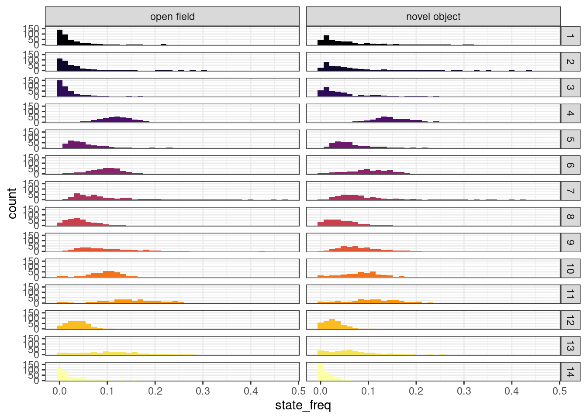

# Model proportion of time spent in HMM states

We used a multi-way ANOVA model to determine whether: 

a) the test fish lines differed in the proportions of time they spent in each state; and

b) the *iCab* reference fishes differed in the proportions of time they spent in each state depending on the line of their tank partner. 

The ANOVA model we used was:

$$
\operatorname{inverse-normalised~state~frequency} = \beta_{1}(\operatorname{date}) + \beta_{2}(\operatorname{time}) + \beta_{3}(\operatorname{quadrant}) + \beta_{4}(\operatorname{tank~side}) + \beta_{4}(\operatorname{test~fish~line}) + \epsilon
$$

Where date, time, quadrant, and tank side were included as covariates.

All results were written to this spreadsheet: https://docs.google.com/spreadsheets/d/1_l72BZkmWyNAOfCUI8WGP4UfQuIPQtPZZmlRjQffvEs.

## Setup


```r
library(tidyverse)
library(DT)
```

## Read in and clean data


```r
IN = "/hps/nobackup/birney/users/ian/pilot/hmm_out/0.08/dist_angle/14.csv"
N_STATES = 14
```


```r
# Read 

raw = readr::read_csv(IN)
#> Rows: 9152328 Columns: 15
#> ── Column specification ────────────────────────────────────
#> Delimiter: ","
#> chr (6): assay, ref_fish, test_fish, tank_side, quadrant...
#> dbl (9): date, time, frame, seconds, x, y, distance, ang...
#> 
#> ℹ Use `spec()` to retrieve the full column specification for this data.
#> ℹ Specify the column types or set `show_col_types = FALSE` to quiet this message.

# Create line recode vector
line_vec = c("iCab", "HdrR", "HNI", "Kaga", "HO5")
names(line_vec) = c("icab", "hdr", "hni", "kaga", "ho5")

# Clean

df = raw %>% 
  # Get individual
  tidyr::unite(date, time, quadrant, fish,
               col = "indiv", 
               remove = F) %>% 
  # add `line` %>% 
  dplyr::mutate(line = dplyr::case_when(fish == "ref" ~ ref_fish,
                                        fish == "test" ~ test_fish)) %>% 
  # recode and order `assay` 
  dplyr::mutate(assay = stringr::str_replace(assay, pattern = "_", " "),
                assay = factor(assay, levels = c("open field", "novel object"))) %>% 
  # recode and order `line`
  dplyr::mutate(line = dplyr::recode(line, !!!line_vec),
                line = factor(line, levels = line_vec)) %>% 
  # convert `date` to factor
  dplyr::mutate(date = factor(date))

# Recode states by mean distance

rank_df = df %>% 
  dplyr::group_by(state) %>% 
  dplyr::summarise(mean_dist = mean(distance)) %>% 
  # rank
  dplyr::arrange(mean_dist) %>% 
  dplyr::mutate(rank = 1:nrow(.))

recode_vec = rank_df %>% 
  dplyr::pull(rank)
names(recode_vec) = rank_df %>% 
  dplyr::pull(state)

# Recode `state`

df = df %>% 
  dplyr::mutate(state_recode = dplyr::recode(state, !!!recode_vec),
                state_recode = factor(state_recode, levels = recode_vec))
```

## DGE


```r
# Get proportion of time each fish spent in each state
df_dge = df %>% 
  # remove iCab when paired with a different test fish
  dplyr::filter(!(fish == "ref" & test_fish != "icab")) %>% 
  ## count rows per fish per state
  dplyr::count(indiv, assay, line, date, time, quadrant, tank_side, state_recode) %>% 
  # add total row count per fish
  dplyr::add_count(indiv, assay, line, date, time, quadrant, tank_side, wt = n, name = "nn") %>% 
  # get proportion of time fish spent in each state
  dplyr::mutate(state_freq = n / nn)

# Split by assay

df_dge %>% 
  ggplot() + 
  geom_histogram(aes(state_freq, fill = state_recode),
                 bins = 40) +
  facet_grid(rows = vars(state_recode),
             cols = vars(assay)) +
  theme_bw() +
  scale_fill_viridis_d() +
  guides(fill = "none")
```


### Inverse-normalise


```r
# Add function
invnorm = function(x) {
  res = rank(x)
  res = qnorm(res/(length(res)+0.5))
  return(res)
}

df_dge = df_dge %>% 
  dplyr::group_by(assay, state_recode) %>% 
  dplyr::mutate(state_freq_invnorm = invnorm(state_freq)) %>% 
  dplyr::ungroup() %>% 
  dplyr::arrange(indiv, assay, line, date, time, quadrant, tank_side, state_recode)

df_dge %>% 
  ggplot() + 
  geom_histogram(aes(state_freq_invnorm, fill = state_recode),
                 bins = 40) +
  facet_grid(rows = vars(state_recode),
             cols = vars(assay)) +
  theme_bw() +
  scale_fill_viridis_d() +
  guides(fill = "none")
```


### Calculate variance explained


```r
aov_dge = df_dge %>% 
  dplyr::group_by(assay, state_recode) %>% 
  tidyr::nest() %>%
  dplyr::mutate(model = purrr::map(data, ~aov(
    state_freq_invnorm ~ date + time + quadrant + tank_side + line,
    data = .))) %>%
  select(-data) %>% 
  dplyr::mutate(model_tidy = purrr::map(model, broom::tidy)) %>%
  tidyr::unnest(model_tidy) %>% 
  rstatix::adjust_pvalue(p.col = "p.value", method = "fdr") %>% 
  rstatix::add_significance(p.col = "p.value.adj") %>% 
  # reduce to 3 digits
  dplyr::mutate(dplyr::across(c("sumsq", "meansq", "statistic", "p.value", "p.value.adj"),
                              ~signif(.x, digits = 3)))

DT::datatable(aov_dge %>% 
                dplyr::select(-model),
              options = list(pageLength = 20))
```

```{=html}
<div id="htmlwidget-0f30a3b376404f9a3f48" style="width:100%;height:auto;" class="datatables html-widget"></div>
<script type="application/json" data-for="htmlwidget-0f30a3b376404f9a3f48">{"x":{"filter":"none","vertical":false,"data":[["1","2","3","4","5","6","7","8","9","10","11","12","13","14","15","16","17","18","19","20","21","22","23","24","25","26","27","28","29","30","31","32","33","34","35","36","37","38","39","40","41","42","43","44","45","46","47","48","49","50","51","52","53","54","55","56","57","58","59","60","61","62","63","64","65","66","67","68","69","70","71","72","73","74","75","76","77","78","79","80","81","82","83","84","85","86","87","88","89","90","91","92","93","94","95","96","97","98","99","100","101","102","103","104","105","106","107","108","109","110","111","112","113","114","115","116","117","118","119","120","121","122","123","124","125","126","127","128","129","130","131","132","133","134","135","136","137","138","139","140","141","142","143","144","145","146","147","148","149","150","151","152","153","154","155","156","157","158","159","160","161","162","163","164","165","166","167","168"],["open field","open field","open field","open field","open field","open field","open field","open field","open field","open field","open field","open field","open field","open field","open field","open field","open field","open field","open field","open field","open field","open field","open field","open field","open field","open field","open field","open field","open field","open field","open field","open field","open field","open field","open field","open field","open field","open field","open field","open field","open field","open field","open field","open field","open field","open field","open field","open field","open field","open field","open field","open field","open field","open field","open field","open field","open field","open field","open field","open field","open field","open field","open field","open field","open field","open field","open field","open field","open field","open field","open field","open field","open field","open field","open field","open field","open field","open field","open field","open field","open field","open field","open field","open field","novel object","novel object","novel object","novel object","novel object","novel object","novel object","novel object","novel object","novel object","novel object","novel object","novel object","novel object","novel object","novel object","novel object","novel object","novel object","novel object","novel object","novel object","novel object","novel object","novel object","novel object","novel object","novel object","novel object","novel object","novel object","novel object","novel object","novel object","novel object","novel object","novel object","novel object","novel object","novel object","novel object","novel object","novel object","novel object","novel object","novel object","novel object","novel object","novel object","novel object","novel object","novel object","novel object","novel object","novel object","novel object","novel object","novel object","novel object","novel object","novel object","novel object","novel object","novel object","novel object","novel object","novel object","novel object","novel object","novel object","novel object","novel object","novel object","novel object","novel object","novel object","novel object","novel object","novel object","novel object","novel object","novel object","novel object","novel object"],["1","1","1","1","1","1","2","2","2","2","2","2","3","3","3","3","3","3","4","4","4","4","4","4","5","5","5","5","5","5","6","6","6","6","6","6","7","7","7","7","7","7","8","8","8","8","8","8","9","9","9","9","9","9","10","10","10","10","10","10","11","11","11","11","11","11","12","12","12","12","12","12","13","13","13","13","13","13","14","14","14","14","14","14","1","1","1","1","1","1","2","2","2","2","2","2","3","3","3","3","3","3","4","4","4","4","4","4","5","5","5","5","5","5","6","6","6","6","6","6","7","7","7","7","7","7","8","8","8","8","8","8","9","9","9","9","9","9","10","10","10","10","10","10","11","11","11","11","11","11","12","12","12","12","12","12","13","13","13","13","13","13","14","14","14","14","14","14"],["date","time","quadrant","tank_side","line","Residuals","date","time","quadrant","tank_side","line","Residuals","date","time","quadrant","tank_side","line","Residuals","date","time","quadrant","tank_side","line","Residuals","date","time","quadrant","tank_side","line","Residuals","date","time","quadrant","tank_side","line","Residuals","date","time","quadrant","tank_side","line","Residuals","date","time","quadrant","tank_side","line","Residuals","date","time","quadrant","tank_side","line","Residuals","date","time","quadrant","tank_side","line","Residuals","date","time","quadrant","tank_side","line","Residuals","date","time","quadrant","tank_side","line","Residuals","date","time","quadrant","tank_side","line","Residuals","date","time","quadrant","tank_side","line","Residuals","date","time","quadrant","tank_side","line","Residuals","date","time","quadrant","tank_side","line","Residuals","date","time","quadrant","tank_side","line","Residuals","date","time","quadrant","tank_side","line","Residuals","date","time","quadrant","tank_side","line","Residuals","date","time","quadrant","tank_side","line","Residuals","date","time","quadrant","tank_side","line","Residuals","date","time","quadrant","tank_side","line","Residuals","date","time","quadrant","tank_side","line","Residuals","date","time","quadrant","tank_side","line","Residuals","date","time","quadrant","tank_side","line","Residuals","date","time","quadrant","tank_side","line","Residuals","date","time","quadrant","tank_side","line","Residuals","date","time","quadrant","tank_side","line","Residuals"],[5,1,3,1,4,348,5,1,3,1,4,350,5,1,3,1,4,350,5,1,3,1,4,360,5,1,3,1,4,360,5,1,3,1,4,360,5,1,3,1,4,359,5,1,3,1,4,360,5,1,3,1,4,358,5,1,3,1,4,358,5,1,3,1,4,354,5,1,3,1,4,353,5,1,3,1,4,346,5,1,3,1,4,325,5,1,3,1,4,359,5,1,3,1,4,360,5,1,3,1,4,360,5,1,3,1,4,360,5,1,3,1,4,359,5,1,3,1,4,359,5,1,3,1,4,356,5,1,3,1,4,359,5,1,3,1,4,352,5,1,3,1,4,353,5,1,3,1,4,350,5,1,3,1,4,347,5,1,3,1,4,337,5,1,3,1,4,291],[3.15,0.347,1.01,0.684,95.1,257,6.64,0.349,4.04,0.000549,78.7,269,4.31,0.845,1.55,0.34,101,250,28.1,1.44,1.83,2.06,65.4,270,10.4,0.776,8.63,0.571,27.6,321,34.6,0.186,7.15,0.0865,20.7,307,38.3,1.92,3.68,0.423,20.1,304,47.5,1.03,4.11,0.254,21.4,295,36.8,0.488,0.716,0.031,27,302,21.3,0.185,11,0.0101,13.9,321,2.58,0.000476,2.36,0.182,8.84,349,37.1,0.366,1.77,0.00413,4.28,318,19.4,0.239,4,1.18,16.5,313,32.9,0.343,5.17,0.215,9.52,283,7.68,0.114,6.55,0.207,63.2,290,7.87,0.0145,9.21,0.172,52.7,299,7.4,0.245,6.9,0.101,71.2,283,25.3,0.392,3.09,0.37,48.5,292,7.72,5.17,4.79,1.76,7.06,342,32.2,0.658,11.5,0.00237,15.2,309,16.3,1.91,0.122,1.98,32.6,312,44.1,0.539,6.24,0.565,7.45,309,14.4,0.0061,0.273,0.0843,38.6,308,31.8,0.628,9.74,0.399,2.48,317,10.2,0.961,3.85,1.41,5.17,338,34.2,0.0788,6.7,1.35,2.44,311,15.7,1.6,8.58,3.55,2.18,315,14,1.2,2.08,5.08,6.87,268],[0.631,0.347,0.335,0.684,23.8,0.737,1.33,0.349,1.35,0.000549,19.7,0.768,0.862,0.845,0.515,0.34,25.2,0.714,5.62,1.44,0.611,2.06,16.3,0.751,2.07,0.776,2.88,0.571,6.9,0.893,6.92,0.186,2.38,0.0865,5.16,0.852,7.67,1.92,1.23,0.423,5.02,0.846,9.5,1.03,1.37,0.254,5.36,0.819,7.36,0.488,0.239,0.031,6.74,0.844,4.25,0.185,3.67,0.0101,3.48,0.896,0.515,0.000476,0.787,0.182,2.21,0.986,7.41,0.366,0.591,0.00413,1.07,0.901,3.88,0.239,1.33,1.18,4.12,0.906,6.58,0.343,1.72,0.215,2.38,0.871,1.54,0.114,2.18,0.207,15.8,0.809,1.57,0.0145,3.07,0.172,13.2,0.831,1.48,0.245,2.3,0.101,17.8,0.787,5.05,0.392,1.03,0.37,12.1,0.81,1.54,5.17,1.6,1.76,1.77,0.952,6.44,0.658,3.82,0.00237,3.8,0.86,3.27,1.91,0.0407,1.98,8.16,0.877,8.82,0.539,2.08,0.565,1.86,0.862,2.88,0.0061,0.091,0.0843,9.64,0.875,6.35,0.628,3.25,0.399,0.62,0.899,2.04,0.961,1.28,1.41,1.29,0.965,6.83,0.0788,2.23,1.35,0.61,0.896,3.13,1.6,2.86,3.55,0.544,0.934,2.81,1.2,0.694,5.08,1.72,0.922],[0.856,0.471,0.455,0.927,32.2,null,1.73,0.454,1.76,0.000715,25.6,null,1.21,1.18,0.722,0.477,35.3,null,7.48,1.92,0.813,2.75,21.8,null,2.32,0.869,3.22,0.64,7.73,null,8.12,0.219,2.8,0.102,6.06,null,9.06,2.27,1.45,0.5,5.93,null,11.6,1.25,1.67,0.311,6.54,null,8.72,0.578,0.283,0.0368,7.98,null,4.75,0.206,4.1,0.0112,3.88,null,0.523,0.000483,0.798,0.184,2.24,null,8.22,0.407,0.656,0.00459,1.19,null,4.28,0.263,1.47,1.3,4.55,null,7.55,0.394,1.98,0.247,2.73,null,1.9,0.141,2.7,0.256,19.5,null,1.89,0.0174,3.69,0.207,15.8,null,1.88,0.311,2.92,0.128,22.6,null,6.23,0.484,1.27,0.457,15,null,1.62,5.43,1.68,1.84,1.85,null,7.49,0.765,4.45,0.00276,4.42,null,3.73,2.18,0.0463,2.26,9.3,null,10.2,0.626,2.41,0.656,2.16,null,3.3,0.00697,0.104,0.0964,11,null,7.07,0.699,3.61,0.444,0.69,null,2.12,0.997,1.33,1.46,1.34,null,7.62,0.088,2.49,1.51,0.68,null,3.35,1.71,3.06,3.8,0.583,null,3.04,1.3,0.752,5.51,1.86,null],[0.511,0.493,0.714,0.336,7.19e-23,null,0.127,0.501,0.155,0.979,1.24e-18,null,0.305,0.277,0.539,0.49,8.9e-25,null,1.07e-06,0.167,0.487,0.0984,4.24e-16,null,0.0427,0.352,0.0228,0.424,5.55e-06,null,2.8e-07,0.64,0.0401,0.75,9.9e-05,null,3.96e-08,0.133,0.229,0.48,0.000124,null,2.06e-10,0.263,0.173,0.578,4.32e-05,null,8.15e-08,0.448,0.838,0.848,3.58e-06,null,0.000326,0.65,0.00706,0.916,0.00423,null,0.759,0.982,0.496,0.668,0.0642,null,2.31e-07,0.524,0.58,0.946,0.317,null,0.000858,0.608,0.222,0.255,0.00137,null,1e-06,0.53,0.117,0.62,0.0291,null,0.0939,0.708,0.0457,0.613,1.46e-14,null,0.0946,0.895,0.0121,0.65,5.84e-12,null,0.0972,0.577,0.034,0.721,1.11e-16,null,1.46e-05,0.487,0.284,0.5,2.52e-11,null,0.154,0.0203,0.172,0.175,0.118,null,1.07e-06,0.382,0.0044,0.958,0.00168,null,0.00267,0.14,0.987,0.134,3.67e-07,null,3.5e-09,0.429,0.0664,0.419,0.0728,null,0.00637,0.934,0.958,0.756,1.97e-08,null,2.57e-06,0.404,0.0135,0.506,0.599,null,0.0629,0.319,0.264,0.228,0.255,null,8.23e-07,0.767,0.0601,0.221,0.606,null,0.00569,0.191,0.0283,0.0519,0.675,null,0.0108,0.255,0.522,0.0196,0.117,null],[0.639,0.639,0.714,0.639,3.6e-22,null,0.259,0.626,0.259,0.979,6.18e-18,null,0.508,0.508,0.539,0.539,4.45e-24,null,2.67e-06,0.209,0.487,0.164,2.12e-15,null,0.0712,0.424,0.057,0.424,2.78e-05,null,1.4e-06,0.75,0.0668,0.75,0.000248,null,1.98e-07,0.221,0.286,0.48,0.000311,null,1.03e-09,0.329,0.288,0.578,0.000108,null,4.07e-07,0.746,0.848,0.848,8.96e-06,null,0.00163,0.812,0.0118,0.916,0.0106,null,0.949,0.982,0.949,0.949,0.321,null,1.16e-06,0.725,0.725,0.946,0.725,null,0.00342,0.608,0.318,0.318,0.00342,null,5.01e-06,0.62,0.195,0.62,0.0728,null,0.156,0.708,0.114,0.708,7.28e-14,null,0.158,0.895,0.0303,0.812,2.92e-11,null,0.162,0.721,0.085,0.721,5.53e-16,null,3.66e-05,0.5,0.473,0.5,1.26e-10,null,0.175,0.102,0.175,0.175,0.175,null,5.33e-06,0.478,0.00733,0.958,0.0042,null,0.00667,0.176,0.987,0.176,1.84e-06,null,1.75e-08,0.429,0.121,0.429,0.121,null,0.0159,0.958,0.958,0.958,9.87e-08,null,1.29e-05,0.599,0.0338,0.599,0.599,null,0.315,0.319,0.319,0.319,0.319,null,4.11e-06,0.767,0.15,0.368,0.757,null,0.0285,0.239,0.0707,0.0865,0.675,null,0.049,0.318,0.522,0.049,0.195,null],["ns","ns","ns","ns","****","","ns","ns","ns","ns","****","","ns","ns","ns","ns","****","","****","ns","ns","ns","****","","ns","ns","ns","ns","****","","****","ns","ns","ns","***","","****","ns","ns","ns","***","","****","ns","ns","ns","***","","****","ns","ns","ns","****","","**","ns","*","ns","*","","ns","ns","ns","ns","ns","","****","ns","ns","ns","ns","","**","ns","ns","ns","**","","****","ns","ns","ns","ns","","ns","ns","ns","ns","****","","ns","ns","*","ns","****","","ns","ns","ns","ns","****","","****","ns","ns","ns","****","","ns","ns","ns","ns","ns","","****","ns","**","ns","**","","**","ns","ns","ns","****","","****","ns","ns","ns","ns","","*","ns","ns","ns","****","","****","ns","*","ns","ns","","ns","ns","ns","ns","ns","","****","ns","ns","ns","ns","","*","ns","ns","ns","ns","","*","ns","ns","*","ns",""]],"container":"<table class=\"display\">\n  <thead>\n    <tr>\n      <th> <\/th>\n      <th>assay<\/th>\n      <th>state_recode<\/th>\n      <th>term<\/th>\n      <th>df<\/th>\n      <th>sumsq<\/th>\n      <th>meansq<\/th>\n      <th>statistic<\/th>\n      <th>p.value<\/th>\n      <th>p.value.adj<\/th>\n      <th>p.value.adj.signif<\/th>\n    <\/tr>\n  <\/thead>\n<\/table>","options":{"pageLength":20,"columnDefs":[{"className":"dt-right","targets":[4,5,6,7,8,9]},{"orderable":false,"targets":0}],"order":[],"autoWidth":false,"orderClasses":false,"lengthMenu":[10,20,25,50,100]}},"evals":[],"jsHooks":[]}</script>
```

### Save to Google Drive

To `aov_state_freq` here: https://docs.google.com/spreadsheets/d/1_l72BZkmWyNAOfCUI8WGP4UfQuIPQtPZZmlRjQffvEs


```r
# Open field
dge_tbl_of = aov_dge %>% 
  dplyr::filter(assay == "open field") %>% 
  # add variance explained
  dplyr::group_by(assay, state_recode) %>% 
  dplyr::mutate(tot_ss = sum(sumsq)) %>% 
  dplyr::ungroup() %>% 
  dplyr::mutate(var_expl_perc = (sumsq / tot_ss) * 100 ) %>%
  # select and rename key columns
  dplyr::select(State = state_recode,
                Variable = term,
                Statistic = statistic,
                `p-value` = p.value,
                `p-value FDR-adj` = p.value.adj,
                `Significance (p-value FDR-adj)` = p.value.adj.signif,
                `Variance explained (%)` = var_expl_perc) %>% 
  # show only 2 decimals
  dplyr::mutate(dplyr::across(c("Statistic", 
                                #"p-value", 
                                "Variance explained (%)"),
                              ~ format(round(.x, 2), nsmall = 2)))

## Write to google sheet
googlesheets4::write_sheet(
  data = dge_tbl_of,
  ss = "https://docs.google.com/spreadsheets/d/1_l72BZkmWyNAOfCUI8WGP4UfQuIPQtPZZmlRjQffvEs",
  sheet = "DGE_OF")
#> ! Using an auto-discovered, cached token.
#>   To suppress this message, modify your code or options to
#>   clearly consent to the use of a cached token.
#>   See gargle's "Non-interactive auth" vignette for more
#>   details:
#>   <https://gargle.r-lib.org/articles/non-interactive-auth.html>
#> ℹ The googlesheets4 package is using a cached token for
#>   'brettell@ebi.ac.uk'.
#> Auto-refreshing stale OAuth token.
#> ✔ Writing to "aov_state_freq".
#> ✔ Writing to sheet 'DGE_OF'.

# Novel object
dge_tbl_no = aov_dge %>% 
  dplyr::filter(assay == "novel object") %>% 
  # add variance explained
  dplyr::group_by(assay, state_recode) %>% 
  dplyr::mutate(tot_ss = sum(sumsq)) %>% 
  dplyr::ungroup() %>% 
  dplyr::mutate(var_expl_perc = (sumsq / tot_ss) * 100 ) %>%
  # select and rename key columns
  dplyr::select(State = state_recode,
                Variable = term,
                Statistic = statistic,
                `p-value` = p.value,
                `p-value FDR-adj` = p.value.adj,
                `Significance (p-value FDR-adj)` = p.value.adj.signif,
                `Variance explained (%)` = var_expl_perc) %>% 
  # show only 2 decimals
  dplyr::mutate(dplyr::across(c("Statistic", 
                                #"p-value", 
                                "Variance explained (%)"),
                              ~ format(round(.x, 2), nsmall = 2)))

## Write to google sheet
googlesheets4::write_sheet(
  data = dge_tbl_no,
  ss = "https://docs.google.com/spreadsheets/d/1_l72BZkmWyNAOfCUI8WGP4UfQuIPQtPZZmlRjQffvEs",
  sheet = "DGE_NO")
#> ✔ Writing to "aov_state_freq".
#> ✔ Writing to sheet 'DGE_NO'.
```

## SGE


```r
# Get proportion of time each fish spent in each state
df_sge = df %>% 
  # take all iCab fishes
  dplyr::filter(line == "iCab") %>% 
  ## count rows per fish per state
  dplyr::count(indiv, assay, test_fish, date, time, quadrant, tank_side, state_recode) %>% 
  # add total row count per fish
  dplyr::add_count(indiv, assay, test_fish, date, time, quadrant, tank_side, wt = n, name = "nn") %>% 
  # get proportion of time fish spent in each state
  dplyr::mutate(state_freq = n / nn)

# Split by assay

df_sge %>% 
  ggplot() + 
  geom_histogram(aes(state_freq, fill = state_recode),
                 bins = 40) +
  facet_grid(rows = vars(state_recode),
             cols = vars(assay)) +
  theme_bw() +
  scale_fill_viridis_d(option = "inferno") +
  guides(fill = "none")
```




### Inverse-normalise


```r
df_sge = df_sge %>% 
  dplyr::group_by(assay, state_recode) %>% 
  dplyr::mutate(state_freq_invnorm = invnorm(state_freq)) %>% 
  dplyr::ungroup() %>% 
  dplyr::arrange(indiv, assay, test_fish, date, time, quadrant, tank_side, state_recode)

df_sge %>% 
  ggplot() + 
  geom_histogram(aes(state_freq_invnorm, fill = state_recode),
                 bins = 40) +
  facet_grid(rows = vars(state_recode),
             cols = vars(assay)) +
  theme_bw() +
  scale_fill_viridis_d(option = "inferno") +
  guides(fill = "none")
```


### Calculate variance explained


```r
aov_sge = df_sge %>% 
  dplyr::group_by(assay, state_recode) %>% 
  tidyr::nest() %>%
  dplyr::mutate(model = purrr::map(data, ~aov(
    state_freq_invnorm ~ date + time + quadrant + tank_side + test_fish,
    data = .))) %>%
  select(-data) %>% 
  dplyr::mutate(model_tidy = purrr::map(model, broom::tidy)) %>%
  tidyr::unnest(model_tidy) %>% 
  rstatix::adjust_pvalue(p.col = "p.value", method = "fdr") %>% 
  rstatix::add_significance(p.col = "p.value.adj") %>% 
  # reduce to 3 digits
  dplyr::mutate(dplyr::across(c("sumsq", "meansq", "statistic", "p.value", "p.value.adj"),
                              ~signif(.x, digits = 3)))

DT::datatable(aov_sge %>% 
                dplyr::select(-model),
              options = list(pageLength = 20))
```

```{=html}
<div id="htmlwidget-d6fbb3ba25bb54d88d19" style="width:100%;height:auto;" class="datatables html-widget"></div>
<script type="application/json" data-for="htmlwidget-d6fbb3ba25bb54d88d19">{"x":{"filter":"none","vertical":false,"data":[["1","2","3","4","5","6","7","8","9","10","11","12","13","14","15","16","17","18","19","20","21","22","23","24","25","26","27","28","29","30","31","32","33","34","35","36","37","38","39","40","41","42","43","44","45","46","47","48","49","50","51","52","53","54","55","56","57","58","59","60","61","62","63","64","65","66","67","68","69","70","71","72","73","74","75","76","77","78","79","80","81","82","83","84","85","86","87","88","89","90","91","92","93","94","95","96","97","98","99","100","101","102","103","104","105","106","107","108","109","110","111","112","113","114","115","116","117","118","119","120","121","122","123","124","125","126","127","128","129","130","131","132","133","134","135","136","137","138","139","140","141","142","143","144","145","146","147","148","149","150","151","152","153","154","155","156","157","158","159","160","161","162","163","164","165","166","167","168"],["open field","open field","open field","open field","open field","open field","open field","open field","open field","open field","open field","open field","open field","open field","open field","open field","open field","open field","open field","open field","open field","open field","open field","open field","open field","open field","open field","open field","open field","open field","open field","open field","open field","open field","open field","open field","open field","open field","open field","open field","open field","open field","open field","open field","open field","open field","open field","open field","open field","open field","open field","open field","open field","open field","open field","open field","open field","open field","open field","open field","open field","open field","open field","open field","open field","open field","open field","open field","open field","open field","open field","open field","open field","open field","open field","open field","open field","open field","open field","open field","open field","open field","open field","open field","novel object","novel object","novel object","novel object","novel object","novel object","novel object","novel object","novel object","novel object","novel object","novel object","novel object","novel object","novel object","novel object","novel object","novel object","novel object","novel object","novel object","novel object","novel object","novel object","novel object","novel object","novel object","novel object","novel object","novel object","novel object","novel object","novel object","novel object","novel object","novel object","novel object","novel object","novel object","novel object","novel object","novel object","novel object","novel object","novel object","novel object","novel object","novel object","novel object","novel object","novel object","novel object","novel object","novel object","novel object","novel object","novel object","novel object","novel object","novel object","novel object","novel object","novel object","novel object","novel object","novel object","novel object","novel object","novel object","novel object","novel object","novel object","novel object","novel object","novel object","novel object","novel object","novel object","novel object","novel object","novel object","novel object","novel object","novel object"],["1","1","1","1","1","1","2","2","2","2","2","2","3","3","3","3","3","3","4","4","4","4","4","4","5","5","5","5","5","5","6","6","6","6","6","6","7","7","7","7","7","7","8","8","8","8","8","8","9","9","9","9","9","9","10","10","10","10","10","10","11","11","11","11","11","11","12","12","12","12","12","12","13","13","13","13","13","13","14","14","14","14","14","14","1","1","1","1","1","1","2","2","2","2","2","2","3","3","3","3","3","3","4","4","4","4","4","4","5","5","5","5","5","5","6","6","6","6","6","6","7","7","7","7","7","7","8","8","8","8","8","8","9","9","9","9","9","9","10","10","10","10","10","10","11","11","11","11","11","11","12","12","12","12","12","12","13","13","13","13","13","13","14","14","14","14","14","14"],["date","time","quadrant","tank_side","test_fish","Residuals","date","time","quadrant","tank_side","test_fish","Residuals","date","time","quadrant","tank_side","test_fish","Residuals","date","time","quadrant","tank_side","test_fish","Residuals","date","time","quadrant","tank_side","test_fish","Residuals","date","time","quadrant","tank_side","test_fish","Residuals","date","time","quadrant","tank_side","test_fish","Residuals","date","time","quadrant","tank_side","test_fish","Residuals","date","time","quadrant","tank_side","test_fish","Residuals","date","time","quadrant","tank_side","test_fish","Residuals","date","time","quadrant","tank_side","test_fish","Residuals","date","time","quadrant","tank_side","test_fish","Residuals","date","time","quadrant","tank_side","test_fish","Residuals","date","time","quadrant","tank_side","test_fish","Residuals","date","time","quadrant","tank_side","test_fish","Residuals","date","time","quadrant","tank_side","test_fish","Residuals","date","time","quadrant","tank_side","test_fish","Residuals","date","time","quadrant","tank_side","test_fish","Residuals","date","time","quadrant","tank_side","test_fish","Residuals","date","time","quadrant","tank_side","test_fish","Residuals","date","time","quadrant","tank_side","test_fish","Residuals","date","time","quadrant","tank_side","test_fish","Residuals","date","time","quadrant","tank_side","test_fish","Residuals","date","time","quadrant","tank_side","test_fish","Residuals","date","time","quadrant","tank_side","test_fish","Residuals","date","time","quadrant","tank_side","test_fish","Residuals","date","time","quadrant","tank_side","test_fish","Residuals","date","time","quadrant","tank_side","test_fish","Residuals"],[5,1,3,1,4,358,5,1,3,1,4,359,5,1,3,1,4,359,5,1,3,1,4,360,5,1,3,1,4,360,5,1,3,1,4,360,5,1,3,1,4,360,5,1,3,1,4,360,5,1,3,1,4,359,5,1,3,1,4,360,5,1,3,1,4,358,5,1,3,1,4,357,5,1,3,1,4,351,5,1,3,1,4,334,5,1,3,1,4,360,5,1,3,1,4,360,5,1,3,1,4,360,5,1,3,1,4,360,5,1,3,1,4,360,5,1,3,1,4,360,5,1,3,1,4,359,5,1,3,1,4,359,5,1,3,1,4,358,5,1,3,1,4,358,5,1,3,1,4,354,5,1,3,1,4,352,5,1,3,1,4,348,5,1,3,1,4,311],[3.25,0.0652,4.91,2.88,31.3,325,2.42,0.095,4.49,3.21,33.4,324,2.59,0.0316,4.11,2.5,29.3,329,21.8,3.8,0.917,3.15,1.6,338,23.8,12.3,4.13,0.844,14.5,314,20.7,2.85,7.76,2.12,2.02,334,46.3,12.6,0.794,0.913,5.1,304,43.8,6.32,4.66,0.62,5.87,308,34.6,2.58,0.673,0.254,3.8,326,24.7,0.985,4.5,0.204,7.46,331,14.5,3.05,4.72,1.21,9.92,334,42.9,9.23,1.53,0.0247,10.9,302,14.4,7.91,2.48,1.04,7.87,326,22.5,3.02,2.22,0.00979,6.72,307,16.2,0.296,6.7,2.71,29.3,314,15.2,1.12,5.76,4.19,34.6,308,18.9,0.163,5.71,3.07,32.2,309,26.3,0.235,2.77,1.05,1.07,338,12.8,13.7,0.278,0.783,5.24,337,37.1,1.21,5.06,0.858,17.6,308,11,8.06,0.575,0.689,1.59,346,51.9,2.33,2.01,0.854,10.3,301,5.95,0.517,1.87,0.0432,5.29,354,35.8,2.74,3.2,0.583,14,311,8.41,3.34,6.06,0.473,9.59,335,38.2,3.79,2.47,1.9,8.29,306,13.4,5.91,8.88,1.08,6.45,321,15.4,4.15,1.25,6.66,3.84,286],[0.651,0.0652,1.64,2.88,7.83,0.907,0.485,0.095,1.5,3.21,8.35,0.904,0.518,0.0316,1.37,2.5,7.32,0.917,4.37,3.8,0.306,3.15,0.401,0.939,4.76,12.3,1.38,0.844,3.63,0.871,4.14,2.85,2.59,2.12,0.506,0.927,9.26,12.6,0.265,0.913,1.27,0.843,8.77,6.32,1.55,0.62,1.47,0.855,6.92,2.58,0.224,0.254,0.95,0.909,4.93,0.985,1.5,0.204,1.87,0.921,2.9,3.05,1.57,1.21,2.48,0.932,8.58,9.23,0.51,0.0247,2.73,0.845,2.87,7.91,0.826,1.04,1.97,0.93,4.49,3.02,0.741,0.00979,1.68,0.918,3.24,0.296,2.23,2.71,7.32,0.872,3.04,1.12,1.92,4.19,8.64,0.857,3.79,0.163,1.9,3.07,8.06,0.859,5.25,0.235,0.922,1.05,0.266,0.939,2.56,13.7,0.0926,0.783,1.31,0.935,7.42,1.21,1.69,0.858,4.39,0.854,2.2,8.06,0.192,0.689,0.397,0.965,10.4,2.33,0.671,0.854,2.58,0.838,1.19,0.517,0.623,0.0432,1.32,0.988,7.16,2.74,1.07,0.583,3.49,0.869,1.68,3.34,2.02,0.473,2.4,0.948,7.64,3.79,0.825,1.9,2.07,0.87,2.69,5.91,2.96,1.08,1.61,0.923,3.07,4.15,0.415,6.66,0.959,0.92],[0.717,0.0719,1.8,3.17,8.63,null,0.536,0.105,1.65,3.55,9.24,null,0.565,0.0345,1.49,2.73,7.99,null,4.65,4.05,0.326,3.35,0.427,null,5.47,14.1,1.58,0.969,4.17,null,4.46,3.07,2.79,2.28,0.546,null,11,15,0.314,1.08,1.51,null,10.2,7.38,1.82,0.725,1.72,null,7.62,2.84,0.247,0.279,1.04,null,5.36,1.07,1.63,0.221,2.03,null,3.11,3.27,1.69,1.29,2.66,null,10.2,10.9,0.604,0.0292,3.23,null,3.09,8.51,0.888,1.11,2.12,null,4.9,3.28,0.807,0.0107,1.83,null,3.71,0.34,2.56,3.1,8.4,null,3.55,1.31,2.24,4.89,10.1,null,4.41,0.189,2.22,3.58,9.39,null,5.59,0.251,0.982,1.12,0.284,null,2.74,14.6,0.0991,0.838,1.4,null,8.68,1.42,1.97,1,5.14,null,2.28,8.36,0.199,0.714,0.412,null,12.4,2.78,0.801,1.02,3.08,null,1.21,0.524,0.631,0.0437,1.34,null,8.24,3.15,1.23,0.671,4.01,null,1.77,3.53,2.13,0.499,2.53,null,8.78,4.36,0.948,2.18,2.38,null,2.91,6.4,3.2,1.17,1.75,null,3.34,4.51,0.451,7.24,1.04,null],[0.611,0.789,0.146,0.0758,1.18e-06,null,0.749,0.746,0.176,0.0604,4.08e-07,null,0.727,0.853,0.216,0.0992,3.54e-06,null,0.000397,0.0449,0.807,0.068,0.789,null,7.27e-05,0.000198,0.194,0.326,0.00257,null,0.000584,0.0806,0.0405,0.132,0.702,null,7.4e-10,0.00013,0.815,0.299,0.198,null,3.4e-09,0.0069,0.144,0.395,0.146,null,8.09e-07,0.0927,0.864,0.597,0.384,null,9.11e-05,0.302,0.182,0.638,0.0901,null,0.00925,0.0714,0.17,0.256,0.0327,null,4.08e-09,0.00105,0.613,0.864,0.0127,null,0.00958,0.00377,0.447,0.292,0.0783,null,0.000245,0.0708,0.491,0.918,0.122,null,0.00273,0.56,0.0548,0.0791,1.75e-06,null,0.00383,0.254,0.0831,0.0277,9.53e-08,null,0.000652,0.664,0.0859,0.0593,3.15e-07,null,5.58e-05,0.617,0.401,0.292,0.888,null,0.0193,0.000154,0.96,0.361,0.233,null,8.73e-08,0.234,0.117,0.317,0.00049,null,0.0463,0.00408,0.897,0.399,0.8,null,4.2e-11,0.0965,0.494,0.313,0.0162,null,0.306,0.47,0.596,0.834,0.255,null,2.22e-07,0.0766,0.299,0.413,0.00337,null,0.117,0.0611,0.096,0.48,0.0402,null,7.24e-08,0.0376,0.417,0.14,0.0511,null,0.0137,0.0118,0.0234,0.279,0.139,null,0.0059,0.0345,0.716,0.00753,0.385,null],[0.764,0.789,0.244,0.19,5.88e-06,null,0.749,0.749,0.294,0.151,2.04e-06,null,0.853,0.853,0.36,0.248,1.77e-05,null,0.00199,0.112,0.807,0.113,0.807,null,0.000364,0.000496,0.242,0.326,0.00429,null,0.00292,0.134,0.101,0.165,0.702,null,3.7e-09,0.000325,0.815,0.373,0.331,null,1.7e-08,0.0173,0.182,0.395,0.182,null,4.04e-06,0.232,0.864,0.747,0.64,null,0.000456,0.377,0.304,0.638,0.225,null,0.0463,0.119,0.212,0.256,0.0817,null,2.04e-08,0.00261,0.766,0.864,0.0211,null,0.024,0.0188,0.447,0.365,0.131,null,0.00122,0.177,0.613,0.918,0.204,null,0.00682,0.56,0.0913,0.0988,8.73e-06,null,0.00956,0.254,0.104,0.0461,4.76e-07,null,0.00163,0.664,0.107,0.0989,1.58e-06,null,0.000279,0.771,0.669,0.669,0.888,null,0.0482,0.000771,0.96,0.451,0.388,null,4.37e-07,0.292,0.196,0.317,0.00123,null,0.116,0.0204,0.897,0.664,0.897,null,2.1e-10,0.161,0.494,0.392,0.0406,null,0.745,0.745,0.745,0.834,0.745,null,1.11e-06,0.128,0.374,0.413,0.00843,null,0.147,0.147,0.147,0.48,0.147,null,3.62e-07,0.0852,0.417,0.175,0.0852,null,0.0343,0.0343,0.039,0.279,0.174,null,0.0188,0.0575,0.716,0.0188,0.481,null],["ns","ns","ns","ns","****","","ns","ns","ns","ns","****","","ns","ns","ns","ns","****","","**","ns","ns","ns","ns","","***","***","ns","ns","**","","**","ns","ns","ns","ns","","****","***","ns","ns","ns","","****","*","ns","ns","ns","","****","ns","ns","ns","ns","","***","ns","ns","ns","ns","","*","ns","ns","ns","ns","","****","**","ns","ns","*","","*","*","ns","ns","ns","","**","ns","ns","ns","ns","","**","ns","ns","ns","****","","**","ns","ns","*","****","","**","ns","ns","ns","****","","***","ns","ns","ns","ns","","*","***","ns","ns","ns","","****","ns","ns","ns","**","","ns","*","ns","ns","ns","","****","ns","ns","ns","*","","ns","ns","ns","ns","ns","","****","ns","ns","ns","**","","ns","ns","ns","ns","ns","","****","ns","ns","ns","ns","","*","*","*","ns","ns","","*","ns","ns","*","ns",""]],"container":"<table class=\"display\">\n  <thead>\n    <tr>\n      <th> <\/th>\n      <th>assay<\/th>\n      <th>state_recode<\/th>\n      <th>term<\/th>\n      <th>df<\/th>\n      <th>sumsq<\/th>\n      <th>meansq<\/th>\n      <th>statistic<\/th>\n      <th>p.value<\/th>\n      <th>p.value.adj<\/th>\n      <th>p.value.adj.signif<\/th>\n    <\/tr>\n  <\/thead>\n<\/table>","options":{"pageLength":20,"columnDefs":[{"className":"dt-right","targets":[4,5,6,7,8,9]},{"orderable":false,"targets":0}],"order":[],"autoWidth":false,"orderClasses":false,"lengthMenu":[10,20,25,50,100]}},"evals":[],"jsHooks":[]}</script>
```

### Save to Google Drive

To `aov_state_freq` here: https://docs.google.com/spreadsheets/d/1_l72BZkmWyNAOfCUI8WGP4UfQuIPQtPZZmlRjQffvEs


```r
# Open field
sge_tbl_of = aov_sge %>% 
  dplyr::filter(assay == "open field") %>% 
  dplyr::select(-model) %>% 
  # add variance explained
  dplyr::group_by(assay, state_recode) %>% 
  dplyr::mutate(tot_ss = sum(sumsq)) %>% 
  dplyr::ungroup() %>% 
  dplyr::mutate(var_expl_perc = (sumsq / tot_ss) * 100 ) %>%
  # select and rename key columns
  dplyr::select(State = state_recode,
                Variable = term,
                Statistic = statistic,
                `p-value` = p.value,
                `p-value FDR-adj` = p.value.adj,
                `Significance (p-value FDR-adj)` = p.value.adj.signif,
                `Variance explained (%)` = var_expl_perc) %>% 
  # show only 2 decimals
  dplyr::mutate(dplyr::across(c("Statistic", 
                                #"p-value", 
                                "Variance explained (%)"),
                              ~ format(round(.x, 2), nsmall = 2)))

## Write to Google sheet
googlesheets4::write_sheet(
  data = sge_tbl_of,
  ss = "https://docs.google.com/spreadsheets/d/1_l72BZkmWyNAOfCUI8WGP4UfQuIPQtPZZmlRjQffvEs",
  sheet = "SGE_OF")
#> ✔ Writing to "aov_state_freq".
#> ✔ Writing to sheet 'SGE_OF'.

# Novel object
sge_tbl_no = aov_sge %>% 
  dplyr::filter(assay == "novel object") %>% 
  dplyr::select(-model) %>% 
  # add variance explained
  dplyr::group_by(assay, state_recode) %>% 
  dplyr::mutate(tot_ss = sum(sumsq)) %>% 
  dplyr::ungroup() %>% 
  dplyr::mutate(var_expl_perc = (sumsq / tot_ss) * 100 ) %>%
  # select and rename key columns
  dplyr::select(State = state_recode,
                Variable = term,
                Statistic = statistic,
                `p-value` = p.value,
                `p-value FDR-adj` = p.value.adj,
                `Significance (p-value FDR-adj)` = p.value.adj.signif,
                `Variance explained (%)` = var_expl_perc) %>% 
  # show only 2 decimals
  dplyr::mutate(dplyr::across(c("Statistic", 
                                #"p-value", 
                                "Variance explained (%)"),
                              ~ format(round(.x, 2), nsmall = 2)))

## Write to Google sheet
googlesheets4::write_sheet(
  data = sge_tbl_no,
  ss = "https://docs.google.com/spreadsheets/d/1_l72BZkmWyNAOfCUI8WGP4UfQuIPQtPZZmlRjQffvEs",
  sheet = "SGE_NO")
#> ✔ Writing to "aov_state_freq".
#> ✔ Writing to sheet 'SGE_NO'.
```

## Write final table with only significant variables

### DGE


```r
final_dge = dplyr::bind_rows(
  list(
    "open field" = dge_tbl_of,
    "novel_object" = dge_tbl_no
    ),
  .id = "Assay") %>% 
  # filter for significant rows
  dplyr::filter(`p-value FDR-adj` < 0.05) %>% 
  # remove p-value
  dplyr::select(-`p-value`) %>% 
  # convert adjusted p-value to character in scientific notation
  dplyr::mutate(`p-value FDR-adj` = as.character(scales::scientific(`p-value FDR-adj`, digits = 3))) %>% 
  # remove underscores from values
  dplyr::mutate(dplyr::across(c("Assay", "Variable"),
                              ~stringr::str_replace(., pattern = "_", " "))) %>% 
  # rename columns
  dplyr::rename("p-value (FDR-adjusted)" = "p-value FDR-adj",
                "Significance" = "Significance (p-value FDR-adj)")

## Write to Google sheet
googlesheets4::write_sheet(
  data = final_dge,
  ss = "https://docs.google.com/spreadsheets/d/1_l72BZkmWyNAOfCUI8WGP4UfQuIPQtPZZmlRjQffvEs",
  sheet = "DGE_FINAL")
#> ✔ Writing to "aov_state_freq".
#> ✔ Writing to sheet 'DGE_FINAL'.
```

### SGE


```r
final_sge = dplyr::bind_rows(
  list(
    "open field" = sge_tbl_of,
    "novel_object" = sge_tbl_no
    ),
  .id = "Assay") %>% 
  # filter for significant rows
  dplyr::filter(`p-value FDR-adj` < 0.05) %>% 
  # remove p-value
  dplyr::select(-`p-value`) %>% 
  # convert adjusted p-value to character in scientific notation
  dplyr::mutate(`p-value FDR-adj` = as.character(scales::scientific(`p-value FDR-adj`, digits = 3))) %>% 
  # remove underscores from values
  dplyr::mutate(dplyr::across(c("Assay", "Variable"),
                              ~stringr::str_replace(., pattern = "_", " "))) %>% 
  # rename columns
  dplyr::rename("p-value (FDR-adjusted)" = "p-value FDR-adj",
                "Significance" = "Significance (p-value FDR-adj)")

## Write to Google sheet
googlesheets4::write_sheet(
  data = final_sge,
  ss = "https://docs.google.com/spreadsheets/d/1_l72BZkmWyNAOfCUI8WGP4UfQuIPQtPZZmlRjQffvEs",
  sheet = "SGE_FINAL")
#> ✔ Writing to "aov_state_freq".
#> ✔ Writing to sheet 'SGE_FINAL'.
```

