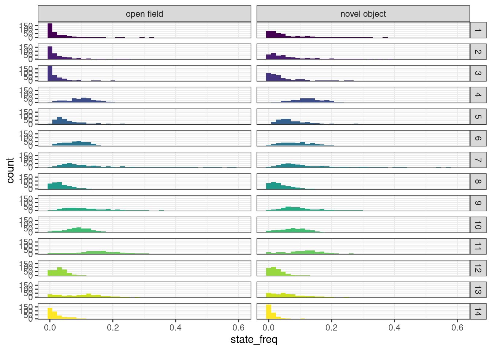

# Model proportion of time spent in HMM states


```r
library(tidyverse)
library(DT)
library()
```

## Read in and clean data


```r
IN = "/hps/nobackup/birney/users/ian/pilot/hmm_out/0.08/dist_angle/15.csv"
N_STATES = 15
```


```r
# Read 

raw = readr::read_csv(IN)
#> Rows: 9153444 Columns: 15
#> ── Column specification ────────────────────────────────────
#> Delimiter: ","
#> chr (6): assay, ref_fish, test_fish, tank_side, quadrant...
#> dbl (9): date, time, frame, seconds, x, y, distance, ang...
#> 
#> ℹ Use `spec()` to retrieve the full column specification for this data.
#> ℹ Specify the column types or set `show_col_types = FALSE` to quiet this message.

# Create line recode vector
line_vec = c("iCab", "HdrR", "HNI", "Kaga", "HO5")
names(line_vec) = c("icab", "hdr", "hni", "kaga", "ho5")

# Clean

df = raw %>% 
  # Get individual
  tidyr::unite(date, time, quadrant, fish,
               col = "indiv", 
               remove = F) %>% 
  # add `line` %>% 
  dplyr::mutate(line = dplyr::case_when(fish == "ref" ~ ref_fish,
                                        fish == "test" ~ test_fish)) %>% 
  # recode and order `assay` 
  dplyr::mutate(assay = stringr::str_replace(assay, pattern = "_", " "),
                assay = factor(assay, levels = c("open field", "novel object"))) %>% 
  # recode and order `line`
  dplyr::mutate(line = dplyr::recode(line, !!!line_vec),
                line = factor(line, levels = line_vec)) %>% 
  # convert `date` to factor
  dplyr::mutate(date = factor(date))

# Recode states by mean distance

rank_df = df %>% 
  dplyr::group_by(state) %>% 
  dplyr::summarise(mean_dist = mean(distance)) %>% 
  # rank
  dplyr::arrange(mean_dist) %>% 
  dplyr::mutate(rank = 1:nrow(.))

recode_vec = rank_df %>% 
  dplyr::pull(rank)
names(recode_vec) = rank_df %>% 
  dplyr::pull(state)

# Recode `state`

df = df %>% 
  dplyr::mutate(state_recode = dplyr::recode(state, !!!recode_vec),
                state_recode = factor(state_recode, levels = recode_vec))
```

## DGE


```r
# Get proportion of time each fish spent in each state
df_dge = df %>% 
  # remove iCab when paired with a different test fish
  dplyr::filter(!(fish == "ref" & test_fish != "icab")) %>% 
  ## count rows per fish per state
  dplyr::count(indiv, assay, line, date, time, quadrant, tank_side, state_recode) %>% 
  # add total row count per fish
  dplyr::add_count(indiv, assay, line, date, time, quadrant, tank_side, wt = n, name = "nn") %>% 
  # get proportion of time fish spent in each state
  dplyr::mutate(state_freq = n / nn)

# Split by assay

df_dge %>% 
  ggplot() + 
  geom_histogram(aes(state_freq, fill = state_recode),
                 bins = 40) +
  facet_grid(rows = vars(state_recode),
             cols = vars(assay)) +
  theme_bw() +
  scale_fill_viridis_d() +
  guides(fill = "none")
```




### Inverse-normalise


```r
# Add function
invnorm = function(x) {
  res = rank(x)
  res = qnorm(res/(length(res)+0.5))
  return(res)
}

df_dge = df_dge %>% 
  dplyr::group_by(assay, state_recode) %>% 
  dplyr::mutate(state_freq_invnorm = invnorm(state_freq)) %>% 
  dplyr::ungroup() %>% 
  dplyr::arrange(indiv, assay, line, date, time, quadrant, tank_side, state_recode)

df_dge %>% 
  ggplot() + 
  geom_histogram(aes(state_freq_invnorm, fill = state_recode),
                 bins = 40) +
  facet_grid(rows = vars(state_recode),
             cols = vars(assay)) +
  theme_bw() +
  scale_fill_viridis_d() +
  guides(fill = "none")
```


### Calculate variance explained


```r
aov_dge = df_dge %>% 
  dplyr::group_by(assay, state_recode) %>% 
  tidyr::nest() %>%
  dplyr::mutate(model = purrr::map(data, ~aov(
    state_freq_invnorm ~ date + time + quadrant + tank_side + line,
    data = .))) %>%
  select(-data) %>% 
  dplyr::mutate(model_tidy = purrr::map(model, broom::tidy)) %>%
  tidyr::unnest(model_tidy) %>% 
  rstatix::add_significance(p.col = "p.value")

DT::datatable(aov_dge %>% 
                dplyr::select(-model),
              options = list(pageLength = nrow(aov_dge)))
```

```{=html}
<div id="htmlwidget-898d63a54897823800ac" style="width:100%;height:auto;" class="datatables html-widget"></div>
<script type="application/json" data-for="htmlwidget-898d63a54897823800ac">{"x":{"filter":"none","vertical":false,"data":[["1","2","3","4","5","6","7","8","9","10","11","12","13","14","15","16","17","18","19","20","21","22","23","24","25","26","27","28","29","30","31","32","33","34","35","36","37","38","39","40","41","42","43","44","45","46","47","48","49","50","51","52","53","54","55","56","57","58","59","60","61","62","63","64","65","66","67","68","69","70","71","72","73","74","75","76","77","78","79","80","81","82","83","84","85","86","87","88","89","90","91","92","93","94","95","96","97","98","99","100","101","102","103","104","105","106","107","108","109","110","111","112","113","114","115","116","117","118","119","120","121","122","123","124","125","126","127","128","129","130","131","132","133","134","135","136","137","138","139","140","141","142","143","144","145","146","147","148","149","150","151","152","153","154","155","156","157","158","159","160","161","162","163","164","165","166","167","168","169","170","171","172","173","174","175","176","177","178","179","180"],["open field","open field","open field","open field","open field","open field","open field","open field","open field","open field","open field","open field","open field","open field","open field","open field","open field","open field","open field","open field","open field","open field","open field","open field","open field","open field","open field","open field","open field","open field","open field","open field","open field","open field","open field","open field","open field","open field","open field","open field","open field","open field","open field","open field","open field","open field","open field","open field","open field","open field","open field","open field","open field","open field","open field","open field","open field","open field","open field","open field","open field","open field","open field","open field","open field","open field","open field","open field","open field","open field","open field","open field","open field","open field","open field","open field","open field","open field","open field","open field","open field","open field","open field","open field","open field","open field","open field","open field","open field","open field","novel object","novel object","novel object","novel object","novel object","novel object","novel object","novel object","novel object","novel object","novel object","novel object","novel object","novel object","novel object","novel object","novel object","novel object","novel object","novel object","novel object","novel object","novel object","novel object","novel object","novel object","novel object","novel object","novel object","novel object","novel object","novel object","novel object","novel object","novel object","novel object","novel object","novel object","novel object","novel object","novel object","novel object","novel object","novel object","novel object","novel object","novel object","novel object","novel object","novel object","novel object","novel object","novel object","novel object","novel object","novel object","novel object","novel object","novel object","novel object","novel object","novel object","novel object","novel object","novel object","novel object","novel object","novel object","novel object","novel object","novel object","novel object","novel object","novel object","novel object","novel object","novel object","novel object","novel object","novel object","novel object","novel object","novel object","novel object","novel object","novel object","novel object","novel object","novel object","novel object"],["1","1","1","1","1","1","2","2","2","2","2","2","3","3","3","3","3","3","4","4","4","4","4","4","5","5","5","5","5","5","6","6","6","6","6","6","7","7","7","7","7","7","8","8","8","8","8","8","9","9","9","9","9","9","10","10","10","10","10","10","11","11","11","11","11","11","12","12","12","12","12","12","13","13","13","13","13","13","14","14","14","14","14","14","15","15","15","15","15","15","1","1","1","1","1","1","2","2","2","2","2","2","3","3","3","3","3","3","4","4","4","4","4","4","5","5","5","5","5","5","6","6","6","6","6","6","7","7","7","7","7","7","8","8","8","8","8","8","9","9","9","9","9","9","10","10","10","10","10","10","11","11","11","11","11","11","12","12","12","12","12","12","13","13","13","13","13","13","14","14","14","14","14","14","15","15","15","15","15","15"],["date","time","quadrant","tank_side","line","Residuals","date","time","quadrant","tank_side","line","Residuals","date","time","quadrant","tank_side","line","Residuals","date","time","quadrant","tank_side","line","Residuals","date","time","quadrant","tank_side","line","Residuals","date","time","quadrant","tank_side","line","Residuals","date","time","quadrant","tank_side","line","Residuals","date","time","quadrant","tank_side","line","Residuals","date","time","quadrant","tank_side","line","Residuals","date","time","quadrant","tank_side","line","Residuals","date","time","quadrant","tank_side","line","Residuals","date","time","quadrant","tank_side","line","Residuals","date","time","quadrant","tank_side","line","Residuals","date","time","quadrant","tank_side","line","Residuals","date","time","quadrant","tank_side","line","Residuals","date","time","quadrant","tank_side","line","Residuals","date","time","quadrant","tank_side","line","Residuals","date","time","quadrant","tank_side","line","Residuals","date","time","quadrant","tank_side","line","Residuals","date","time","quadrant","tank_side","line","Residuals","date","time","quadrant","tank_side","line","Residuals","date","time","quadrant","tank_side","line","Residuals","date","time","quadrant","tank_side","line","Residuals","date","time","quadrant","tank_side","line","Residuals","date","time","quadrant","tank_side","line","Residuals","date","time","quadrant","tank_side","line","Residuals","date","time","quadrant","tank_side","line","Residuals","date","time","quadrant","tank_side","line","Residuals","date","time","quadrant","tank_side","line","Residuals","date","time","quadrant","tank_side","line","Residuals"],[5,1,3,1,4,356,5,1,3,1,4,359,5,1,3,1,4,359,5,1,3,1,4,360,5,1,3,1,4,360,5,1,3,1,4,360,5,1,3,1,4,360,5,1,3,1,4,359,5,1,3,1,4,360,5,1,3,1,4,358,5,1,3,1,4,359,5,1,3,1,4,359,5,1,3,1,4,353,5,1,3,1,4,350,5,1,3,1,4,334,5,1,3,1,4,360,5,1,3,1,4,360,5,1,3,1,4,360,5,1,3,1,4,360,5,1,3,1,4,360,5,1,3,1,4,360,5,1,3,1,4,359,5,1,3,1,4,357,5,1,3,1,4,358,5,1,3,1,4,356,5,1,3,1,4,355,5,1,3,1,4,350,5,1,3,1,4,348,5,1,3,1,4,335,5,1,3,1,4,303],[4.46446947183829,0.095649663619844,7.34390224040907,2.17557241611733,58.5441386869491,292.404298225891,5.20279481337081,0.456162563436824,4.63908226795763,1.14770901278925,61.5513591746864,295.047418058765,7.28698939165254,0.881483343204453,3.72259940175474,0.698244467045328,60.2412017298547,295.07160366293,7.58201979726681,0.132121326888089,8.00589786093575,0.0255175848040835,41.4647863710703,312.027545507711,34.8683031359889,1.2027641846943,3.88085300980441,0.00110992022696703,7.97590464648528,321.344416817096,34.6680527285852,1.41934670206343,4.45064197002965,0.00983007740884268,7.9018337632033,320.808588648716,18.1237074377348,5.56763514676323,5.31965242552059,0.939479585607263,10.0772142474358,329.25070670845,39.5757289605737,2.65430588194494,0.182167020488664,2.64591055714699,0.733444638422541,322.489432373735,27.7771802417346,0.0221692930818817,9.23407242042463,0.00811714365884597,5.03699430008432,327.199152438583,39.2392663794357,2.54288907481813,3.2398780286258,0.0180071358707699,3.92491519885514,317.984934953049,24.9111177784691,0.352184706487241,2.18393597883281,0.0859970450533006,9.59134215437766,331.156542343603,27.5865148640917,1.48504244433025,5.5959506425049,0.0776433331281533,3.35688320731125,329.607242286303,7.34970542742188,3.41374487376864,2.51365285609578,2.36427651323218,6.48924293543766,340.149097933103,19.3388268878472,3.86221906896332,4.79275889261778,1.02201095061528,3.93958246779675,325.662281008249,26.611584576078,6.30884340789185,2.13746855045664,0.822728315081005,2.05172390617482,297.946916658496,9.65772059321907,0.00199782392681413,7.6111519764473,0.870184957690757,44.3844458020092,306.751394028006,10.4275665788889,0.0384786175156111,4.84414557579907,0.0992797695615537,44.2061767562028,309.659744574633,8.10863157186066,0.129942114393611,4.43553249720789,0.00261376900164589,46.8897840985057,309.63536930495,4.41141969171364,3.96427783631488,5.01843329633751,0.0977616244190076,24.3186058342127,331.467952109942,42.0762553278265,0.984259683225552,3.21844722359074,0.505020331580772,13.6798182222153,308.811361726317,41.4933561403847,0.714679905676128,3.41349579011965,0.510532145788387,13.0201553656455,310.122632271617,14.2010694719025,7.65331119816582,1.26327314520939,0.943860193463555,8.2281836474284,335.99101085408,21.3140622861531,2.97308150166319,0.244907791787284,1.02470086848375,12.1582223914611,328.570197912637,33.6544959313515,0.702197149584013,5.79364941231542,0.28601819204656,12.7823715895596,314.062235499173,46.2602586818548,1.18705213358767,3.35232214347046,0.271588808504209,5.94980728043608,308.135695609449,6.03575984128815,7.59271613942416e-06,1.45321472132719,0.353623274955586,16.4804903911965,339.962990300788,32.9548611751685,0.93965480971909,6.82996272123298,0.925042783504736,2.28392091291533,315.275559229242,10.7548075215025,2.28407248649712,6.64857707436348,4.58255843131077,6.32209023395251,326.625936729546,14.5045468933697,2.95898365281251,9.44654268168012,3.55160267144851,0.576411174278905,312.508887465811,30.2589043117803,0.704348406357703,1.55677178383864,1.421549824488,4.80379694493845,269.170716056535],[0.892893894367659,0.095649663619844,2.44796741346969,2.17557241611733,14.6360346717373,0.821360388274975,1.04055896267416,0.456162563436824,1.54636075598588,1.14770901278925,15.3878397936716,0.821859103227757,1.45739787833051,0.881483343204453,1.24086646725158,0.698244467045328,15.0603004324637,0.821926472598692,1.51640395945336,0.132121326888089,2.66863262031192,0.0255175848040835,10.3661965927676,0.866743181965863,6.97366062719778,1.2027641846943,1.2936176699348,0.00110992022696703,1.99397616162132,0.892623380047488,6.93361054571704,1.41934670206343,1.48354732334322,0.00983007740884268,1.97545844080082,0.891134968468655,3.62474148754696,5.56763514676323,1.77321747517353,0.939479585607263,2.51930356185894,0.91458529641236,7.91514579211475,2.65430588194494,0.060722340162888,2.64591055714699,0.183361159605635,0.898299254522939,5.55543604834691,0.0221692930818817,3.07802414014155,0.00811714365884597,1.25924857502108,0.908886534551619,7.84785327588713,2.54288907481813,1.07995934287527,0.0180071358707699,0.981228799713784,0.888226075287847,4.98222355569382,0.352184706487241,0.727978659610938,0.0859970450533006,2.39783553859441,0.922441622127029,5.51730297281833,1.48504244433025,1.86531688083497,0.0776433331281533,0.839220801827814,0.918126023081625,1.46994108548438,3.41374487376864,0.837884285365261,2.36427651323218,1.62231073385942,0.963595178280744,3.86776537756945,3.86221906896332,1.59758629753926,1.02201095061528,0.984895616949188,0.930463660023569,5.32231691521559,6.30884340789185,0.712489516818879,0.822728315081005,0.512930976543706,0.892056636702083,1.93154411864381,0.00199782392681413,2.53705065881577,0.870184957690757,11.0961114505023,0.852087205633349,2.08551331577777,0.0384786175156111,1.61471519193302,0.0992797695615537,11.0515441890507,0.860165957151758,1.62172631437213,0.129942114393611,1.47851083240263,0.00261376900164589,11.7224460246264,0.860098248069305,0.882283938342727,3.96427783631488,1.67281109877917,0.0977616244190076,6.07965145855316,0.920744311416507,8.41525106556529,0.984259683225552,1.07281574119691,0.505020331580772,3.41995455555383,0.857809338128659,8.29867122807693,0.714679905676128,1.13783193003988,0.510532145788387,3.25503884141139,0.861451756310048,2.8402138943805,7.65331119816582,0.421091048403129,0.943860193463555,2.0570459118571,0.935908108228634,4.26281245723061,2.97308150166319,0.0816359305957615,1.02470086848375,3.03955559786527,0.920364700035397,6.73089918627031,0.702197149584013,1.93121647077181,0.28601819204656,3.19559289738991,0.8772688142435,9.25205173637096,1.18705213358767,1.11744071449015,0.271588808504209,1.48745182010902,0.865549706768115,1.20715196825763,7.59271613942416e-06,0.484404907109064,0.353623274955586,4.12012259779913,0.957642226199404,6.59097223503369,0.93965480971909,2.27665424041099,0.925042783504736,0.570980228228831,0.900787312083549,2.1509615043005,2.28407248649712,2.21619235812116,4.58255843131077,1.58052255848813,0.938580277958466,2.90090937867394,2.95898365281251,3.14884756056004,3.55160267144851,0.144102793569726,0.932862350644211,6.05178086235606,0.704348406357703,0.518923927946214,1.421549824488,1.20094923623461,0.888352198206388],[1.08709149736685,0.116452734981203,2.98038163078563,2.64874280178824,17.8192604375236,null,1.26610383530156,0.555037428733585,1.88153997432495,1.39647904157995,18.7232090430557,null,1.77314872670136,1.07246009538719,1.50970495369047,0.849521812866889,18.323172369479,null,1.74954241464467,0.15243422692801,3.07891965675367,0.0294407678479881,11.9599401627319,null,7.81254533891637,1.34744866825056,1.44923121985219,0.00124343620364053,2.2338381518925,null,7.7806514064103,1.59274044032013,1.66478409650176,0.0110309636100746,2.21678927513696,null,3.96326236794503,6.08760622831284,1.93882132386047,1.02721920994417,2.75458568133711,null,8.8112572199765,2.95481251774451,0.0675970060724763,2.94546671816193,0.204120351522515,null,6.11235378361896,0.0243917059380998,3.38658789973165,0.0089308657904701,1.38548490614651,null,8.83542320387732,2.86288496314866,1.21586088600843,0.0202731448352654,1.10470614071513,null,5.4011261376145,0.381796200474074,0.789186699893609,0.0932276287089071,2.59944421530473,null,6.00930899910656,1.61747124795114,2.031656694115,0.084567184870274,0.9140583980084,null,1.52547575850998,3.54271684906049,0.869539723995114,2.45359936052248,1.68360196317499,null,4.15681508450473,4.15085428362188,1.71697871306311,1.09838889418787,1.05849982031995,null,5.96634417170204,7.07224535789064,0.798704350715823,0.922282600937331,0.574998218095212,null,2.26683854172897,0.00234462378217399,2.97745423478105,1.02123931909523,13.0222721068258,null,2.42454761018847,0.0447339460434172,1.87721355223099,0.11541931965117,12.8481534257009,null,1.88551286787583,0.15107822238366,1.71900226017376,0.00303891910896589,13.6291941658296,null,0.958229040791345,4.30551434004092,1.81680307772486,0.10617673463397,6.60297477070481,null,9.81016490671861,1.14741078171607,1.25064591105676,0.588732611237936,3.98684696416873,null,9.63335574777113,0.829622669454406,1.32083070433763,0.59264159838179,3.77855035707868,null,3.03471448682723,8.17741734565269,0.449927770366383,1.0084966517172,2.19791440395832,null,4.63165575240627,3.23032978290981,0.0886995455091028,1.11336393979945,3.30255560404301,null,7.67256179290335,0.800435554282802,2.20139646983481,0.326032553993388,3.64266100140078,null,10.6892205774262,1.37144305440299,1.29101853510248,0.31377609671696,1.71850537118548,null,1.26054588575157,7.92855194946591e-06,0.5058307725543,0.369264496991754,4.30236103325421,null,7.31690172210416,1.0431483626758,2.52740487112882,1.02692696832628,0.633867973681975,null,2.29171819908588,2.43353982619929,2.36121769247236,4.88243631251067,1.6839503190137,null,3.10968641479704,3.17194026618087,3.37546858696304,3.80720978716298,0.154473801488732,null,6.81236662055298,0.792870674243623,0.584142110520961,1.60020972240307,1.35188412733077,null],[0.367128097957237,0.733115413603878,0.0314517593621374,0.104516514963227,2.39245328369987e-13,null,0.277977933980526,0.456754118123946,0.132292078222603,0.238096169426806,5.422710607918e-14,null,0.117546965617761,0.301087490634056,0.211663362446611,0.35730662843386,1.03445178699868e-13,null,0.122573162264973,0.696450814352691,0.027575406417959,0.863861683567258,3.8993966719169e-09,null,5.36570896352129e-07,0.246493790239631,0.228189439553084,0.971890056209472,0.06494161381933,null,5.73587729303843e-07,0.20775204884292,0.17423709763583,0.916411770521739,0.0667321181018579,null,0.00163970068972701,0.014077953242416,0.12292655973668,0.311493378434649,0.027909473524451,null,6.68829373125433e-08,0.0864842736881476,0.977100985303719,0.0869814719745613,0.936042866291049,null,1.88788285286818e-05,0.875979910052856,0.0182884507520743,0.924761971249582,0.238418334329165,null,6.37797937443689e-08,0.0915149247256251,0.303771328399944,0.88685695958886,0.354081152459254,null,8.35990761676626e-05,0.537035272390933,0.500546455296907,0.760290262654807,0.035988947986198,null,2.34534309939146e-05,0.204268001897568,0.109097767099631,0.771368864544221,0.455756070026196,null,0.181071523477919,0.0606298061194143,0.457015964128928,0.118151685708345,0.153216454990688,null,0.00110895093663721,0.0423653386419543,0.163170093656122,0.295343123300686,0.37697465585244,null,2.65383179837229e-05,0.00820598258829225,0.495288522001434,0.337571045700377,0.680958706991328,null,0.0474501083447011,0.961407323639933,0.0315589831325275,0.312903947592503,6.48272808735896e-10,null,0.0351657447660128,0.832613686633326,0.133020388053224,0.734254830961022,8.69151185724631e-10,null,0.0960743909942606,0.697736869354955,0.162694570720942,0.956068350647686,2.33936959685058e-10,null,0.443401525480205,0.038698887605947,0.143684584021592,0.744728894301486,3.88437434013357e-05,null,8.37066021559505e-09,0.284809417434087,0.291216937003551,0.443412550196978,0.00353071393513202,null,1.20760998158271e-08,0.362991123500091,0.267320846065422,0.441904284322676,0.00503048900036216,null,0.0106944920388496,0.004489393962858,0.717502023146399,0.315939655822293,0.0687756102073624,null,0.000414722154347554,0.073131130124086,0.966223804705737,0.292065423086855,0.0112374913159001,null,7.22183287249007e-07,0.37156427662847,0.0875906413433283,0.568362903829655,0.00633619458877673,null,1.38425523875792e-09,0.24234734871325,0.277264049495229,0.575724523128147,0.145286034892885,null,0.280485879217903,0.99775492639865,0.678493261294695,0.543793972509495,0.0020648260650371,null,1.54407362973889e-06,0.307795804125042,0.0572525197689446,0.311581551959744,0.63864093605394,null,0.04535004957978,0.119673351236228,0.0711819155643534,0.0277819144112618,0.15317291391695,null,0.00928394044914026,0.0758194227958555,0.0186410396179616,0.0518656413313973,0.960910303775474,null,4.86565878188411e-06,0.37393996764145,0.62581907994078,0.20684550267042,0.250710474604818,null],["ns","ns","*","ns","****","","ns","ns","ns","ns","****","","ns","ns","ns","ns","****","","ns","ns","*","ns","****","","****","ns","ns","ns","ns","","****","ns","ns","ns","ns","","**","*","ns","ns","*","","****","ns","ns","ns","ns","","****","ns","*","ns","ns","","****","ns","ns","ns","ns","","****","ns","ns","ns","*","","****","ns","ns","ns","ns","","ns","ns","ns","ns","ns","","**","*","ns","ns","ns","","****","**","ns","ns","ns","","*","ns","*","ns","****","","*","ns","ns","ns","****","","ns","ns","ns","ns","****","","ns","*","ns","ns","****","","****","ns","ns","ns","**","","****","ns","ns","ns","**","","*","**","ns","ns","ns","","***","ns","ns","ns","*","","****","ns","ns","ns","**","","****","ns","ns","ns","ns","","ns","ns","ns","ns","**","","****","ns","ns","ns","ns","","*","ns","ns","*","ns","","**","ns","*","ns","ns","","****","ns","ns","ns","ns",""]],"container":"<table class=\"display\">\n  <thead>\n    <tr>\n      <th> <\/th>\n      <th>assay<\/th>\n      <th>state_recode<\/th>\n      <th>term<\/th>\n      <th>df<\/th>\n      <th>sumsq<\/th>\n      <th>meansq<\/th>\n      <th>statistic<\/th>\n      <th>p.value<\/th>\n      <th>p.value.signif<\/th>\n    <\/tr>\n  <\/thead>\n<\/table>","options":{"pageLength":180,"columnDefs":[{"className":"dt-right","targets":[4,5,6,7,8]},{"orderable":false,"targets":0}],"order":[],"autoWidth":false,"orderClasses":false,"lengthMenu":[10,25,50,100,180]}},"evals":[],"jsHooks":[]}</script>
```

### Save to Google Drive

To `aov_state_freq` here: https://docs.google.com/spreadsheets/d/1_l72BZkmWyNAOfCUI8WGP4UfQuIPQtPZZmlRjQffvEs


```r
aov_dge %>% 
  dplyr::select(-model) %>% 
  # add variance explained
  dplyr::group_by(assay, state_recode) %>% 
  dplyr::mutate(tot_ss = sum(sumsq)) %>% 
  dplyr::ungroup() %>% 
  dplyr::mutate(var_expl_perc = (sumsq / tot_ss) * 100 ) %>%
  googlesheets4::write_sheet(
    ss = "https://docs.google.com/spreadsheets/d/1_l72BZkmWyNAOfCUI8WGP4UfQuIPQtPZZmlRjQffvEs",
    sheet = "DGE")
#> ! Using an auto-discovered, cached token.
#>   To suppress this message, modify your code or options to
#>   clearly consent to the use of a cached token.
#>   See gargle's "Non-interactive auth" vignette for more
#>   details:
#>   <https://gargle.r-lib.org/articles/non-interactive-auth.html>
#> ℹ The googlesheets4 package is using a cached token for
#>   'brettell@ebi.ac.uk'.
#> Auto-refreshing stale OAuth token.
#> ✔ Writing to "aov_state_freq".
#> ✔ Writing to sheet 'DGE'.
```

## SGE


```r
# Get proportion of time each fish spent in each state
df_sge = df %>% 
  # take all iCab fishes
  dplyr::filter(line == "iCab") %>% 
  ## count rows per fish per state
  dplyr::count(indiv, assay, test_fish, date, time, quadrant, tank_side, state_recode) %>% 
  # add total row count per fish
  dplyr::add_count(indiv, assay, test_fish, date, time, quadrant, tank_side, wt = n, name = "nn") %>% 
  # get proportion of time fish spent in each state
  dplyr::mutate(state_freq = n / nn)

# Split by assay

df_sge %>% 
  ggplot() + 
  geom_histogram(aes(state_freq, fill = state_recode),
                 bins = 40) +
  facet_grid(rows = vars(state_recode),
             cols = vars(assay)) +
  theme_bw() +
  scale_fill_viridis_d(option = "inferno") +
  guides(fill = "none")
```


### Inverse-normalise


```r
df_sge = df_sge %>% 
  dplyr::group_by(assay, state_recode) %>% 
  dplyr::mutate(state_freq_invnorm = invnorm(state_freq)) %>% 
  dplyr::ungroup() %>% 
  dplyr::arrange(indiv, assay, test_fish, date, time, quadrant, tank_side, state_recode)

df_sge %>% 
  ggplot() + 
  geom_histogram(aes(state_freq_invnorm, fill = state_recode),
                 bins = 40) +
  facet_grid(rows = vars(state_recode),
             cols = vars(assay)) +
  theme_bw() +
  scale_fill_viridis_d(option = "inferno") +
  guides(fill = "none")
```


### Calculate variance explained


```r
aov_sge = df_sge %>% 
  dplyr::group_by(assay, state_recode) %>% 
  tidyr::nest() %>%
  dplyr::mutate(model = purrr::map(data, ~aov(
    state_freq_invnorm ~ date + time + quadrant + tank_side + test_fish,
    data = .))) %>%
  select(-data) %>% 
  dplyr::mutate(model_tidy = purrr::map(model, broom::tidy)) %>%
  tidyr::unnest(model_tidy) %>% 
  rstatix::add_significance(p.col = "p.value")

DT::datatable(aov_sge %>% 
                dplyr::select(-model),
              options = list(pageLength = nrow(aov_sge)))
```

```{=html}
<div id="htmlwidget-ba84750c927ed3f3350c" style="width:100%;height:auto;" class="datatables html-widget"></div>
<script type="application/json" data-for="htmlwidget-ba84750c927ed3f3350c">{"x":{"filter":"none","vertical":false,"data":[["1","2","3","4","5","6","7","8","9","10","11","12","13","14","15","16","17","18","19","20","21","22","23","24","25","26","27","28","29","30","31","32","33","34","35","36","37","38","39","40","41","42","43","44","45","46","47","48","49","50","51","52","53","54","55","56","57","58","59","60","61","62","63","64","65","66","67","68","69","70","71","72","73","74","75","76","77","78","79","80","81","82","83","84","85","86","87","88","89","90","91","92","93","94","95","96","97","98","99","100","101","102","103","104","105","106","107","108","109","110","111","112","113","114","115","116","117","118","119","120","121","122","123","124","125","126","127","128","129","130","131","132","133","134","135","136","137","138","139","140","141","142","143","144","145","146","147","148","149","150","151","152","153","154","155","156","157","158","159","160","161","162","163","164","165","166","167","168","169","170","171","172","173","174","175","176","177","178","179","180"],["open field","open field","open field","open field","open field","open field","open field","open field","open field","open field","open field","open field","open field","open field","open field","open field","open field","open field","open field","open field","open field","open field","open field","open field","open field","open field","open field","open field","open field","open field","open field","open field","open field","open field","open field","open field","open field","open field","open field","open field","open field","open field","open field","open field","open field","open field","open field","open field","open field","open field","open field","open field","open field","open field","open field","open field","open field","open field","open field","open field","open field","open field","open field","open field","open field","open field","open field","open field","open field","open field","open field","open field","open field","open field","open field","open field","open field","open field","open field","open field","open field","open field","open field","open field","open field","open field","open field","open field","open field","open field","novel object","novel object","novel object","novel object","novel object","novel object","novel object","novel object","novel object","novel object","novel object","novel object","novel object","novel object","novel object","novel object","novel object","novel object","novel object","novel object","novel object","novel object","novel object","novel object","novel object","novel object","novel object","novel object","novel object","novel object","novel object","novel object","novel object","novel object","novel object","novel object","novel object","novel object","novel object","novel object","novel object","novel object","novel object","novel object","novel object","novel object","novel object","novel object","novel object","novel object","novel object","novel object","novel object","novel object","novel object","novel object","novel object","novel object","novel object","novel object","novel object","novel object","novel object","novel object","novel object","novel object","novel object","novel object","novel object","novel object","novel object","novel object","novel object","novel object","novel object","novel object","novel object","novel object","novel object","novel object","novel object","novel object","novel object","novel object","novel object","novel object","novel object","novel object","novel object","novel object"],["1","1","1","1","1","1","2","2","2","2","2","2","3","3","3","3","3","3","4","4","4","4","4","4","5","5","5","5","5","5","6","6","6","6","6","6","7","7","7","7","7","7","8","8","8","8","8","8","9","9","9","9","9","9","10","10","10","10","10","10","11","11","11","11","11","11","12","12","12","12","12","12","13","13","13","13","13","13","14","14","14","14","14","14","15","15","15","15","15","15","1","1","1","1","1","1","2","2","2","2","2","2","3","3","3","3","3","3","4","4","4","4","4","4","5","5","5","5","5","5","6","6","6","6","6","6","7","7","7","7","7","7","8","8","8","8","8","8","9","9","9","9","9","9","10","10","10","10","10","10","11","11","11","11","11","11","12","12","12","12","12","12","13","13","13","13","13","13","14","14","14","14","14","14","15","15","15","15","15","15"],["date","time","quadrant","tank_side","test_fish","Residuals","date","time","quadrant","tank_side","test_fish","Residuals","date","time","quadrant","tank_side","test_fish","Residuals","date","time","quadrant","tank_side","test_fish","Residuals","date","time","quadrant","tank_side","test_fish","Residuals","date","time","quadrant","tank_side","test_fish","Residuals","date","time","quadrant","tank_side","test_fish","Residuals","date","time","quadrant","tank_side","test_fish","Residuals","date","time","quadrant","tank_side","test_fish","Residuals","date","time","quadrant","tank_side","test_fish","Residuals","date","time","quadrant","tank_side","test_fish","Residuals","date","time","quadrant","tank_side","test_fish","Residuals","date","time","quadrant","tank_side","test_fish","Residuals","date","time","quadrant","tank_side","test_fish","Residuals","date","time","quadrant","tank_side","test_fish","Residuals","date","time","quadrant","tank_side","test_fish","Residuals","date","time","quadrant","tank_side","test_fish","Residuals","date","time","quadrant","tank_side","test_fish","Residuals","date","time","quadrant","tank_side","test_fish","Residuals","date","time","quadrant","tank_side","test_fish","Residuals","date","time","quadrant","tank_side","test_fish","Residuals","date","time","quadrant","tank_side","test_fish","Residuals","date","time","quadrant","tank_side","test_fish","Residuals","date","time","quadrant","tank_side","test_fish","Residuals","date","time","quadrant","tank_side","test_fish","Residuals","date","time","quadrant","tank_side","test_fish","Residuals","date","time","quadrant","tank_side","test_fish","Residuals","date","time","quadrant","tank_side","test_fish","Residuals","date","time","quadrant","tank_side","test_fish","Residuals","date","time","quadrant","tank_side","test_fish","Residuals"],[5,1,3,1,4,356,5,1,3,1,4,359,5,1,3,1,4,359,5,1,3,1,4,360,5,1,3,1,4,360,5,1,3,1,4,360,5,1,3,1,4,360,5,1,3,1,4,360,5,1,3,1,4,360,5,1,3,1,4,360,5,1,3,1,4,358,5,1,3,1,4,356,5,1,3,1,4,355,5,1,3,1,4,347,5,1,3,1,4,326,5,1,3,1,4,360,5,1,3,1,4,359,5,1,3,1,4,360,5,1,3,1,4,360,5,1,3,1,4,360,5,1,3,1,4,360,5,1,3,1,4,360,5,1,3,1,4,356,5,1,3,1,4,359,5,1,3,1,4,355,5,1,3,1,4,356,5,1,3,1,4,353,5,1,3,1,4,349,5,1,3,1,4,337,5,1,3,1,4,314],[1.68553558171575,0.247520844911171,2.45505783171561,0.00797448188362752,70.2537875813775,290.621145385612,2.67894626732308,2.381294424757,2.00239357425053,0.490120033361161,70.6053994372714,289.861498178456,2.97748900959552,2.71337289885659,3.47883826431141,0.953888011159313,73.3954861829464,284.484744979811,2.92374995654748,0.50809711984483,2.98918509996253,2.02281542298639,57.8542652341286,302.979375567796,25.0413059596716,4.62355603106643,2.95558958056773,4.4708862055775,13.8358311316472,318.289579070203,25.5909827392924,4.34461813132312,2.98445850172842,4.49061506365026,13.6854222584423,318.150017016141,17.5487906867041,7.74855057531205,9.15956414519197,0.149899930332904,12.327105513292,322.343557247764,37.0544068557177,6.65022455588075,4.99054431763772,0.00283359334325466,5.14017217095589,315.439240165286,21.704709163941,2.2222750854228,6.18403292209662,0.92147631251609,7.53579305890238,330.709281779998,37.1573393688902,3.37838129235189,3.91620838243885,1.33025801284893,5.12239077526392,318.078338151261,27.1309372481225,1.12261010312777,1.52055501689106,0.23410524586164,10.8995196743789,326.376352407493,34.7922474359834,1.13434498392152,4.59763975862849,0.00141678937302522,5.94656451613293,318.597387122822,2.97407835336086,0.905406238782713,4.68475711215632,0.285948151359773,16.9731794254265,338.452284981087,24.5116498732951,1.06874330071095,3.47786472771647,0.933863815299851,7.25163358284412,318.786769514994,30.6481802949949,4.66763321529032,1.79427328981227,0.380938762485666,4.52665608468865,289.126356918776,15.9678861538308,0.0529320446014943,7.33716899415092,1.72570224031779,40.2793544606772,303.914841186614,18.7273318099039,0.00492446772983651,7.27334649073313,0.784283122410098,38.7124901938865,302.772121849488,16.5057642061603,0.0485958904115848,6.58103721544062,0.655933883911356,41.5862266774995,303.896535772138,15.568394860984,2.56582249376276,3.35504968718768,0.479613993006861,27.7768432590961,319.521846364042,25.9276901367178,1.76078062740199,9.74595201310264,1.75918920370501,7.65157507081153,322.430771835158,25.3398612664315,1.85998468311393,9.28940872054025,2.02767927499479,7.27358258656562,323.487535174749,4.12996251429433,8.76181004517595,0.353639202229363,1.20983711485645,4.75873473596895,350.0647985272,7.07802160379964,2.75252414111799,0.697702400831864,0.852500174294825,12.509378720681,341.397746010119,34.9045909280428,1.58368186375398,10.7417436317657,1.29274278539047,5.44884577232261,314.30929816771,38.9417537724595,2.23425385668599,4.60276455113521,1.59392048097976,2.65487574138576,313.992968572942,4.68383248158793,0.167495512006002,2.02726484723333,0.0653882076971963,18.1367229045938,340.208216894671,31.6473950312115,0.841745496572027,4.82351652882378,2.9591985575393,2.30171836834854,319.701507260326,6.12464540461455,3.4007634256103,6.72071541280131,0.0185045035796791,7.08841479093061,334.930534206487,12.3132837595746,2.85984068212858,4.81661047379861,2.1527601563444,1.14247720974514,323.004857102082,14.4841614163826,1.16319935274966,1.43281052445797,2.6746688501346,2.78442548347677,297.154555137943],[0.33710711634315,0.247520844911171,0.818352610571869,0.00797448188362752,17.5634468953444,0.816351531982056,0.535789253464617,2.381294424757,0.667464524750176,0.490120033361161,17.6513498593179,0.807413643951132,0.595497801919103,2.71337289885659,1.15961275477047,0.953888011159313,18.3488715457366,0.79243661554265,0.584749991309497,0.50809711984483,0.996395033320844,2.02281542298639,14.4635663085322,0.84160937657721,5.00826119193431,4.62355603106643,0.985196526855909,4.4708862055775,3.45895778291179,0.884137719639453,5.11819654785848,4.34461813132312,0.99481950057614,4.49061506365026,3.42135556461056,0.883750047267059,3.50975813734083,7.74855057531205,3.05318804839732,0.149899930332904,3.081776378323,0.895398770132677,7.41088137114354,6.65022455588075,1.66351477254591,0.00283359334325466,1.28504304273897,0.876220111570239,4.3409418327882,2.2222750854228,2.06134430736554,0.92147631251609,1.8839482647256,0.918636893833328,7.43146787377803,3.37838129235189,1.30540279414628,1.33025801284893,1.28059769381598,0.883550939309057,5.42618744962449,1.12261010312777,0.506851672297019,0.23410524586164,2.72487991859474,0.911665788847745,6.95844948719669,1.13434498392152,1.5325465862095,0.00141678937302522,1.48664112903323,0.894936480682085,0.594815670672172,0.905406238782713,1.56158570405211,0.285948151359773,4.24329485635662,0.953386718256582,4.90232997465903,1.06874330071095,1.15928824257216,0.933863815299851,1.81290839571103,0.918693860273758,6.12963605899899,4.66763321529032,0.598091096604091,0.380938762485666,1.13166402117216,0.886890665395019,3.19357723076616,0.0529320446014943,2.44572299805031,1.72570224031779,10.0698386151693,0.84420789218504,3.74546636198078,0.00492446772983651,2.42444883024438,0.784283122410098,9.67812254847162,0.84337638398186,3.30115284123206,0.0485958904115848,2.19367907181354,0.655933883911356,10.3965566693749,0.844157043811494,3.11367897219681,2.56582249376276,1.11834989572923,0.479613993006861,6.94421081477403,0.887560684344561,5.18553802734356,1.76078062740199,3.24865067103421,1.75918920370501,1.91289376770288,0.895641032875438,5.0679722532863,1.85998468311393,3.09646957351342,2.02767927499479,1.8183956466414,0.898576486596524,0.825992502858865,8.76181004517595,0.117879734076454,1.20983711485645,1.18968368399224,0.972402218131112,1.41560432075993,2.75252414111799,0.232567466943955,0.852500174294825,3.12734468017025,0.958982432612694,6.98091818560856,1.58368186375398,3.58058121058857,1.29274278539047,1.36221144308065,0.875513365369666,7.7883507544919,2.23425385668599,1.5342548503784,1.59392048097976,0.663718935346439,0.884487235416738,0.936766496317586,0.167495512006002,0.675754949077776,0.0653882076971963,4.53418072614846,0.955641058692895,6.3294790062423,0.841745496572027,1.60783884294126,2.9591985575393,0.575429592087136,0.905669992238885,1.22492908092291,3.4007634256103,2.24023847093377,0.0185045035796791,1.77210369773265,0.959686344431196,2.46265675191493,2.85984068212858,1.60553682459954,2.1527601563444,0.285619302436285,0.958471386059589,2.89683228327652,1.16319935274966,0.477603508152658,2.6746688501346,0.696106370869192,0.946352086426571],[0.412943570430587,0.303203748892593,1.00245124619899,0.00976844113254241,21.514563527187,null,0.663587069005543,2.94928682788166,0.826669860920227,0.607024710361255,21.8615947247805,null,0.751476888168923,3.42408824332091,1.46335079932719,1.20374045374734,23.1550021614934,null,0.694799758158174,0.603720840078137,1.18391626929484,2.4035086576781,17.1856049980751,null,5.6645713452613,5.22945229952625,1.11430211037446,5.05677577855259,3.91223867738879,null,5.79145264397573,4.91611643445856,1.125679714137,5.08131804636073,3.87140637241366,null,3.91977100529272,8.65374270523501,3.40986401840257,0.167411365006333,3.44179206083381,null,8.45778506254872,7.58967349421271,1.89851242921689,0.00323388302304165,1.4665756078528,null,4.72541638805092,2.41910062652676,2.24391630817686,1.00309090425371,2.05080840686049,null,8.41091050119814,3.82364065505245,1.47745051934087,1.50558157279443,1.44937618969362,null,5.95194808887439,1.23138338288052,0.555962150271789,0.256788451124755,2.98890224019343,null,7.77535572345116,1.26751452020033,1.71246409023515,0.00158311724195822,1.66116943618186,null,0.623897584560321,0.949673643910617,1.63793524091432,0.299928817849146,4.45075935619929,null,5.33619542553403,1.16332909898024,1.26188743900683,1.01651252466363,1.97335420873588,null,6.91137735254984,5.26291841532842,0.674368464953572,0.429521673132051,1.27599045218062,null,3.78292747595656,0.0627002484713709,2.89706246611852,2.0441673861295,11.9281502914002,null,4.44103775386404,0.00583899172820854,2.87469376222956,0.929932515666655,11.4754488414508,null,3.91059088523016,0.0575673575999166,2.59866228434078,0.777028265913315,12.3159034750606,null,3.5081307983985,2.89086993038403,1.26002640208776,0.540373184016192,7.82392791530884,null,5.78975039887966,1.96594457240201,3.62717936292454,1.96416771801663,2.13578174456967,null,5.64000096695374,2.0699236079044,3.44597217899803,2.25654610958594,2.02364036202284,null,0.849435025401695,9.01047928707477,0.121225282993503,1.24417354495722,1.22344813885629,null,1.4761525056337,2.87025501981187,0.2425148355537,0.888963285773897,3.26110737153962,null,7.97351412523672,1.80886086540244,4.08969337558513,1.47655402707033,1.55590022604108,null,8.80549819446779,2.52604420643028,1.73462633370341,1.80208421010029,0.750399676524126,null,0.980249318294124,0.175270317743671,0.707122138517215,0.0684233971556568,4.74464830168579,null,6.98872554074067,0.929417452035888,1.77530320836463,3.26741371901252,0.635363429304564,null,1.27638481888468,3.5436196892287,2.33434442819081,0.0192818244075846,1.84654466328056,null,2.5693586555977,2.98375175693641,1.67510146672205,2.24603487141614,0.297994605358545,null,3.06105129879828,1.22914015769956,0.504678454248556,2.82629360519947,0.735568062725673,null],[0.839741219049076,0.58222625354981,0.391791638202856,0.921324568973752,6.52884553641517e-16,null,0.651322105286488,0.086777866943898,0.479840846240653,0.436423536215455,3.66505228746054e-16,null,0.585432260061313,0.0650731134037854,0.224230985826215,0.273310729826408,4.84512303603885e-17,null,0.62767181990086,0.437672114588329,0.315708167832653,0.121942080989036,6.51902187354433e-13,null,4.81732626672301e-05,0.0227874348982508,0.343200749707944,0.025134026649624,0.00400866977292176,null,3.69488697842867e-05,0.0272313538532263,0.338567583405573,0.024785708752696,0.00429680054158881,null,0.00179227147227404,0.00347516345738602,0.0177275622928789,0.682666045776504,0.00888729834331558,null,1.39370087336225e-07,0.00616863235760852,0.129444199513923,0.954682499668406,0.211803158159489,null,0.000340733985755359,0.120742377322653,0.0828708096555436,0.317236463473276,0.0868041888821207,null,1.5369224212067e-07,0.0513076151869083,0.220331325958286,0.220616366720773,0.217217491721612,null,2.64773522580892e-05,0.26788299827127,0.644444346375417,0.612647125407121,0.0189585995002654,null,5.85069417574754e-07,0.260991866150637,0.164069911822523,0.968284123370519,0.158484083842025,null,0.681652522602982,0.330465943732978,0.180263642789941,0.584271203360312,0.00160168270108105,null,9.69098228391836e-05,0.281525358492006,0.287327355690292,0.314050201188497,0.0981095040378676,null,3.7722857497509e-06,0.0224199414695514,0.56827810559041,0.512685954712698,0.279196017408846,null,0.00236982814143266,0.802420732824964,0.0351129097428703,0.153657801188516,4.11528894689828e-09,null,0.000614208926304484,0.939132858247919,0.0361739418811772,0.335529583016878,8.90349977218384e-09,null,0.00182622685636028,0.810519541657594,0.0520865752710515,0.378639692477698,2.13440535231404e-09,null,0.00413974889059426,0.0899464816279388,0.287914822265832,0.462756707479602,4.68761431558281e-06,null,3.70806372883125e-05,0.161740643131558,0.0132476626619677,0.161929809811835,0.075902745289545,null,5.07115866877813e-05,0.151097865562007,0.0168909587347878,0.133927139037491,0.0905918163691285,null,0.51542330595538,0.00287170877516395,0.947575306445587,0.265412245080672,0.300440319453064,null,0.196828579038024,0.0911051653576901,0.866641350616245,0.346397793742829,0.0120483233533542,null,3.8409307112011e-07,0.179493965161031,0.00711136742850378,0.225113007406252,0.185582768055187,null,6.84580106796736e-08,0.112870779723684,0.159533841512408,0.180318535698531,0.558263587922096,null,0.429667922739752,0.675722220053246,0.548272468367722,0.793797566908089,0.00096680428398273,null,3.04836917689621e-06,0.335674303772974,0.151518151890724,0.0715200636832702,0.63757551095128,null,0.27351435770159,0.0606065931359143,0.0737172192107833,0.889641652986701,0.119444359724506,null,0.0267412486764185,0.0850203327663078,0.172120569518369,0.134893386457113,0.879184085567819,null,0.0102988055890004,0.268422755996364,0.67931976347051,0.0937264852590413,0.568274719000655,null],["ns","ns","ns","ns","****","","ns","ns","ns","ns","****","","ns","ns","ns","ns","****","","ns","ns","ns","ns","****","","****","*","ns","*","**","","****","*","ns","*","**","","**","**","*","ns","**","","****","**","ns","ns","ns","","***","ns","ns","ns","ns","","****","ns","ns","ns","ns","","****","ns","ns","ns","*","","****","ns","ns","ns","ns","","ns","ns","ns","ns","**","","****","ns","ns","ns","ns","","****","*","ns","ns","ns","","**","ns","*","ns","****","","***","ns","*","ns","****","","**","ns","ns","ns","****","","**","ns","ns","ns","****","","****","ns","*","ns","ns","","****","ns","*","ns","ns","","ns","**","ns","ns","ns","","ns","ns","ns","ns","*","","****","ns","**","ns","ns","","****","ns","ns","ns","ns","","ns","ns","ns","ns","***","","****","ns","ns","ns","ns","","ns","ns","ns","ns","ns","","*","ns","ns","ns","ns","","*","ns","ns","ns","ns",""]],"container":"<table class=\"display\">\n  <thead>\n    <tr>\n      <th> <\/th>\n      <th>assay<\/th>\n      <th>state_recode<\/th>\n      <th>term<\/th>\n      <th>df<\/th>\n      <th>sumsq<\/th>\n      <th>meansq<\/th>\n      <th>statistic<\/th>\n      <th>p.value<\/th>\n      <th>p.value.signif<\/th>\n    <\/tr>\n  <\/thead>\n<\/table>","options":{"pageLength":180,"columnDefs":[{"className":"dt-right","targets":[4,5,6,7,8]},{"orderable":false,"targets":0}],"order":[],"autoWidth":false,"orderClasses":false,"lengthMenu":[10,25,50,100,180]}},"evals":[],"jsHooks":[]}</script>
```

### Save to Google Drive

To `aov_state_freq` here: https://docs.google.com/spreadsheets/d/1_l72BZkmWyNAOfCUI8WGP4UfQuIPQtPZZmlRjQffvEs


```r
aov_sge %>% 
  dplyr::select(-model) %>% 
  # add variance explained
  dplyr::group_by(assay, state_recode) %>% 
  dplyr::mutate(tot_ss = sum(sumsq)) %>% 
  dplyr::ungroup() %>% 
  dplyr::mutate(var_expl_perc = (sumsq / tot_ss) * 100 ) %>%
  googlesheets4::write_sheet(
    ss = "https://docs.google.com/spreadsheets/d/1_l72BZkmWyNAOfCUI8WGP4UfQuIPQtPZZmlRjQffvEs",
    sheet = "SGE")
#> ✔ Writing to "aov_state_freq".
#> ✔ Writing to sheet 'SGE'.
```
