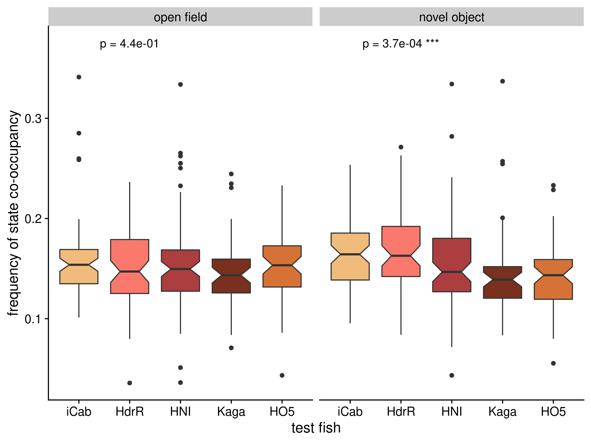

# SGE co-occupancy

## Setup

### Load libraries


```r
library(tidyverse)
library(wesanderson)
library(rstatix)
library(cowplot)
```

### Set variables


```r
IN = "/hps/nobackup/birney/users/ian/pilot/hmm_out/0.08/dist_angle/14.csv"
N_STATES = 14
VARIABLES = "distance and angle of travel"
INTERVAL = 0.08
OUT_PER_STATE = here::here("book/figs/sge/co-occupancy/dist_angle/0.08_14_cooc_box_heat_per-state.png")
OUT_BOX_ALL = here::here("book/figs/sge/co-occupancy/dist_angle/0.08_14_cooc_box_all.png")

# Create line recode vector
line_vec = c("iCab", "HdrR", "HNI", "Kaga", "HO5")
names(line_vec) = c("icab", "hdr", "hni", "kaga", "ho5")

# Create palette
new_pal = grDevices::colorRampPalette(wesanderson::wes_palette("GrandBudapest1"))
pal = new_pal(5)
names(pal) = line_vec

# Number of rows for plots
N_ROWS = 2
```

## Read data and process


```r
df = readr::read_csv(IN) %>% 
  # recode angle to sit between 0 and 360
  dplyr::mutate(angle_recode = ifelse(angle < 0,
                                      180 + (180 + angle),
                                      angle))
#> Rows: 9152328 Columns: 15
#> ── Column specification ────────────────────────────────────
#> Delimiter: ","
#> chr (6): assay, ref_fish, test_fish, tank_side, quadrant...
#> dbl (9): date, time, frame, seconds, x, y, distance, ang...
#> 
#> ℹ Use `spec()` to retrieve the full column specification for this data.
#> ℹ Specify the column types or set `show_col_types = FALSE` to quiet this message.

# Recode states by mean distance

rank_df = df %>% 
  dplyr::group_by(state) %>% 
  dplyr::summarise(mean_dist = mean(distance)) %>% 
  # rank
  dplyr::arrange(mean_dist) %>% 
  dplyr::mutate(rank = 1:nrow(.))

recode_vec = rank_df %>% 
  dplyr::pull(rank)
names(recode_vec) = rank_df %>% 
  dplyr::pull(state)

# Recode `state`

df = df %>% 
  dplyr::mutate(state_recode = dplyr::recode(state, !!!recode_vec))

# Get SGE df

sge_df = df %>% 
  ## add `line`
  dplyr::mutate(line = dplyr::case_when(fish == "ref" ~ ref_fish,
                                        fish == "test" ~ test_fish)) %>% 
  # recode `test_fish`
  dplyr::mutate(test_fish = dplyr::recode(test_fish, !!!line_vec)) %>% 
  # order `test_fish`
  dplyr::mutate(test_fish = factor(test_fish, levels = line_vec)) %>% 
  # rename and reorder assay
  dplyr::mutate(assay = stringr::str_replace(assay, "_", " "),
                assay = factor(assay, levels = c("open field", "novel object"))) %>% 
  # add `run` column
  tidyr::unite(date, time, quadrant,
               col = "run",
               sep = "_",
               remove = F) %>% 
  # add `indiv` column
  tidyr::unite(date, time, quadrant, fish,
               col = "indiv",
               sep = "_",
               remove = F)
```

## Co-occupancy boxplots -- all states

Calculating the frequency of co-occupancy across all states, compared between lines of the tank partner.


```r
cooc = sge_df %>% 
  # pivot wider to get cols for ref and test
  tidyr::pivot_wider(id_cols = c("run", "assay", "test_fish", "seconds"),
                     names_from = fish,
                     values_from = state_recode) %>% 
  # group by run and assay
  dplyr::group_by(run, assay, test_fish) %>% 
  summarise(TOTAL_ROWS = n(),
            TOTAL_CONC = sum(ref == test, na.rm = T),
            FREQ_CONC = TOTAL_CONC / TOTAL_ROWS) %>% 
  dplyr::ungroup()
#> `summarise()` has grouped output by 'run', 'assay'. You can
#> override using the `.groups` argument.

# Get KW stat
kw_all = cooc %>% 
  dplyr::group_by(assay) %>% 
  rstatix::kruskal_test(FREQ_CONC ~ test_fish) %>% 
  rstatix::adjust_pvalue(method = "fdr") %>% 
  rstatix::add_significance(p.col = "p.adj") %>% 
  #dplyr::mutate(p.adj = as.character(signif(p.adj, digits = 3))) %>% 
  # paste p-value and significance together
  dplyr::mutate(p_final = dplyr::case_when(p.adj.signif == "ns" ~ paste("p =", scales::scientific(p.adj, digits = 2)),
                                           TRUE ~ paste("p =", scales::scientific(p.adj, digits = 2), p.adj.signif)))

# Plot

box_all = cooc %>% 
  ggplot() +
  geom_boxplot(aes(test_fish, FREQ_CONC, fill = test_fish), notch = T) +
  facet_grid(cols = vars(assay)) +
  geom_text(data = kw_all,
            aes(x = "HdrR", y = 0.375, label = p_final),
            size = 4) +
  cowplot::theme_cowplot() +
  scale_fill_manual(values = pal) +
  guides(fill = "none") +
  xlab("test fish") +
  ylab("frequency of state co-occupancy") +
  labs(fill = "test fish")
```


```r
# Save
ggsave(OUT_BOX_ALL,
       box_all,
       device = "png",
       width = 8,
       height = 6,
       units = "in",
       dpi = 400)
```


```r
knitr::include_graphics(here::here("book/figs/sge/co-occupancy/dist_angle/0.08_14_cooc_box_all.png"))
```



## Co-occupancy boxplots -- per state


```r
FONT_SIZE = 10

cooc_per_state = sge_df %>% 
  # pivot wider to get cols for ref and test
  tidyr::pivot_wider(id_cols = c("run", "assay", "test_fish", "seconds"),
                     names_from = fish,
                     values_from = state_recode) %>% 
  # group by run and assay
  dplyr::group_by(run, assay, test_fish) %>% 
  dplyr::count(run, assay, ref, test) %>% 
  dplyr::add_count(run, assay, test_fish, wt = n, name = "nn") %>% 
  dplyr::ungroup() %>% 
  dplyr::mutate(FREQ_COOC = n / nn) %>% 
  # filter for same state co-occupancy
  dplyr::filter(ref == test)
  
# Get KW stat
kw_per_state = cooc_per_state %>% 
  dplyr::group_by(assay, ref, test) %>% 
  rstatix::kruskal_test(FREQ_COOC ~ test_fish) %>% 
  rstatix::adjust_pvalue(method = "fdr") %>% 
  rstatix::add_significance(p.col = "p.adj") %>% 
  # paste p-value and significance together
  dplyr::mutate(p_final = dplyr::case_when(p.adj.signif == "ns" ~ paste("p =", scales::scientific(p.adj, digits = 2)),
                                           TRUE ~ paste("p =", scales::scientific(p.adj, digits = 2), p.adj.signif)))

# Plot

## Polar
polar = df %>% 
  # select random sample of 1e5 rows
  dplyr::slice_sample(n = 1e5) %>% 
  # factorise `state_recode`
  #dplyr::mutate(state_recode = factor(state_recode, levels = recode_vec)) %>% 
  ggplot() +
  geom_point(aes(angle_recode, log10(distance), colour = state_recode),
             alpha = 0.3, size = 0.2) +
  coord_polar() +
  facet_wrap(~state_recode, nrow = N_ROWS) +
  scale_x_continuous(labels = c(0, 90, 180, 270),
                     breaks = c(0, 90, 180, 270)) +
  scale_color_viridis_c(option = "inferno") +
  guides(colour = "none") +
  xlab("angle of travel") +
  ylab(expression(log[10]("distance travelled in pixels"))) +
  #ggtitle("HMM states") +
  cowplot::theme_cowplot(font_size = FONT_SIZE) +
  theme(plot.title = element_text(hjust = 0.5))


## OF
ASSAY = "open field"
box_per_state_of = cooc_per_state %>% 
  dplyr::filter(assay == ASSAY) %>% 
  ggplot() +
  geom_boxplot(aes(test_fish, FREQ_COOC, fill = test_fish), notch = T) +
  facet_wrap(vars(ref), nrow = N_ROWS) +
  geom_text(data = kw_per_state %>% 
              dplyr::filter(assay == ASSAY),
            aes(x = "HNI", y = 0.2, label = p_final),
            size = 3) +
  cowplot::theme_cowplot(font_size = 8) +
  scale_fill_manual(values = pal) +
  guides(fill = "none") +
  xlab("test fish") +
  ylab("frequency of state co-occupancy") +
  ggtitle(ASSAY) +
  theme(plot.title = element_text(hjust = 0.5)) +
  ylim(0,max(cooc_per_state$FREQ_COOC))

## NO
ASSAY = "novel object"
box_per_state_no = cooc_per_state %>% 
  dplyr::filter(assay == ASSAY) %>% 
  ggplot() +
  geom_boxplot(aes(test_fish, FREQ_COOC, fill = test_fish), notch = T) +
  facet_wrap(vars(ref), nrow = N_ROWS) +
  geom_text(data = kw_per_state %>% 
              dplyr::filter(assay == ASSAY),
            aes(x = "HNI", y = 0.2, label = p_final),
            size = 3) +
  cowplot::theme_cowplot(font_size = 8) +
  scale_fill_manual(values = pal) +
  guides(fill = "none") +
  xlab("test fish") +
  ylab("frequency of state co-occupancy") +
  ggtitle(ASSAY) +
  theme(plot.title = element_text(hjust = 0.5)) +
  ylim(0,max(cooc_per_state$FREQ_COOC))
```

## Co-occupancy heatmap


```r
# Create df
cooc_heat = sge_df %>% 
  # pivot wider to get cols for ref and test
  tidyr::pivot_wider(id_cols = c("run", "assay", "test_fish", "seconds"),
                     names_from = fish,
                     values_from = state_recode) %>% 
  dplyr::group_by(assay, test_fish) %>% 
  dplyr::count(assay, ref, test) %>% 
  dplyr::add_count(assay, test_fish, wt = n, name = "nn") %>% 
  dplyr::ungroup() %>% 
  dplyr::mutate(FREQ_COOC = n / nn) 

# Plot
cooc_heat_plot = cooc_heat %>% 
  # recode NAs as character
  dplyr::mutate(across(c(ref, test),
                       ~as.character(.))) %>% 
  # replace NA with character
  dplyr::mutate(across(c(ref, test),
                       ~tidyr::replace_na(., "NA"))) %>% 
  # convert to factor for order
  dplyr::mutate(across(c(ref, test),
                       ~factor(., levels = c(seq(1:N_STATES), "NA")))) %>% 
  ggplot() +
  geom_tile(aes(ref, test, fill = FREQ_COOC)) +
  facet_grid(cols = vars(test_fish),
             rows = vars(assay)) +
  theme_cowplot(font_size = FONT_SIZE) +
  theme(aspect.ratio = 1) +
  #scale_x_di(breaks = unique(cooc_heat$ref)) +
  #scale_y_di(breaks = unique(cooc_heat$test))  +
  labs(fill = "Frequency\nof state\nco-occupancy\nwithin\nline-pairing") +
  scale_fill_viridis_c(option = "plasma") +
  xlab("reference fish state") +
  ylab("test fish state")
```

## Compose final figure


```r
final = cowplot::ggdraw() +
  cowplot::draw_plot(polar,
                     x = 0, y= 0.7,
                     width = 1, height = 0.3) +
  cowplot::draw_plot(box_per_state_of,
                     x = 0, y = 0.3,
                     width = 0.5, height = 0.4) +
  cowplot::draw_plot(box_per_state_no +
                       theme(axis.text.y=element_blank(),
                             axis.ticks.y=element_blank(),
                             axis.line.y = element_blank()) +
                       ylab(NULL),
                     x = 0.5, y = 0.3,
                     width = 0.5, height = 0.4) +
  cowplot::draw_plot(cooc_heat_plot,
                     x = 0, y = 0,
                     width = 1, height = 0.3) +
  cowplot::draw_plot_label(c("A", "B", "C"),
                           x = c(0,0,0),
                           y = c(1, 0.7, 0.3))
#> notch went outside hinges. Try setting notch=FALSE.
#> notch went outside hinges. Try setting notch=FALSE.
#> notch went outside hinges. Try setting notch=FALSE.
#> notch went outside hinges. Try setting notch=FALSE.
#> notch went outside hinges. Try setting notch=FALSE.
#> notch went outside hinges. Try setting notch=FALSE.
#> notch went outside hinges. Try setting notch=FALSE.
#> notch went outside hinges. Try setting notch=FALSE.
#> notch went outside hinges. Try setting notch=FALSE.
#> notch went outside hinges. Try setting notch=FALSE.
#> notch went outside hinges. Try setting notch=FALSE.
#> notch went outside hinges. Try setting notch=FALSE.
#> notch went outside hinges. Try setting notch=FALSE.
#> notch went outside hinges. Try setting notch=FALSE.
#> notch went outside hinges. Try setting notch=FALSE.
#> notch went outside hinges. Try setting notch=FALSE.
#> notch went outside hinges. Try setting notch=FALSE.
#> notch went outside hinges. Try setting notch=FALSE.
#> notch went outside hinges. Try setting notch=FALSE.
#> notch went outside hinges. Try setting notch=FALSE.
#> notch went outside hinges. Try setting notch=FALSE.
#> notch went outside hinges. Try setting notch=FALSE.
#> notch went outside hinges. Try setting notch=FALSE.
#> notch went outside hinges. Try setting notch=FALSE.
#> notch went outside hinges. Try setting notch=FALSE.
#> notch went outside hinges. Try setting notch=FALSE.
```


```r
ggsave(OUT_PER_STATE,
       final,
       device = "png",
       width = 18,
       height = 20,
       units = "in",
       dpi = 400)
```


```r
knitr::include_graphics(here::here("book/figs/sge/co-occupancy/dist_angle/0.08_14_cooc_box_heat_per-state.png"))
```


