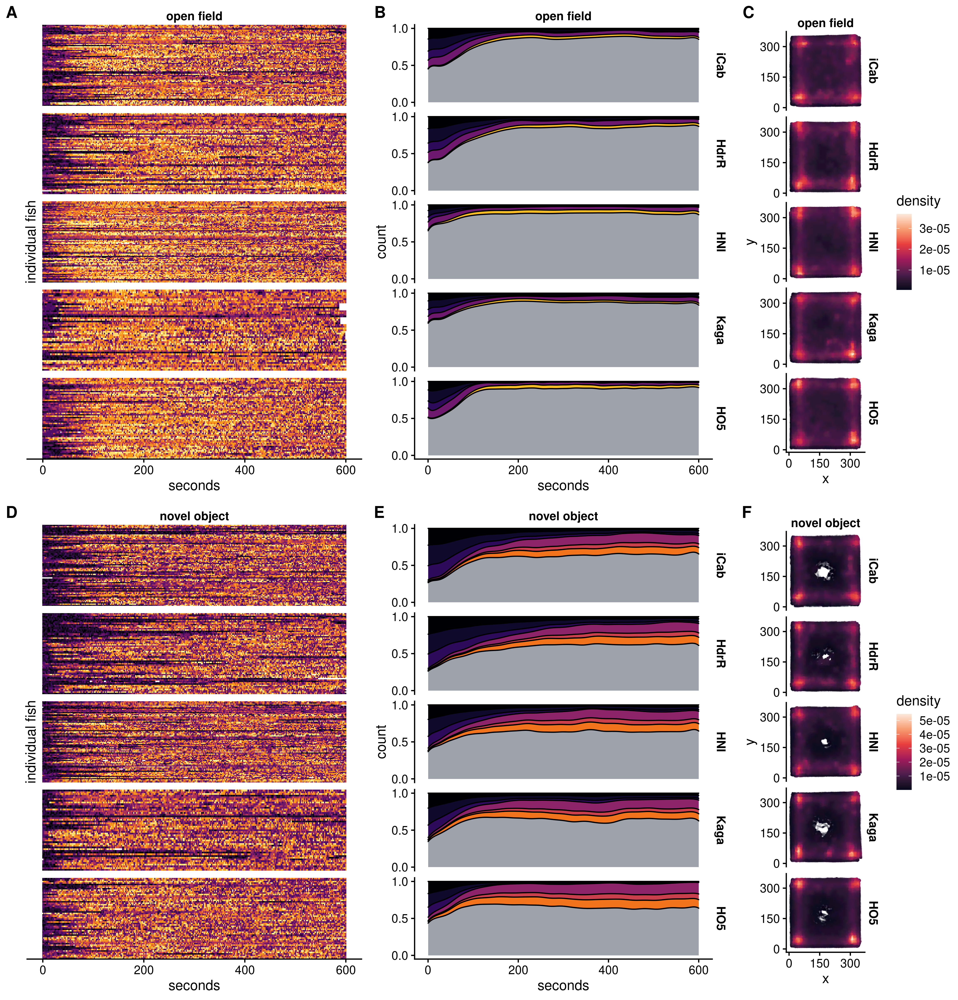

# Time dependence of HMM states (SGE)

## Setup

### Load libraries


```r
library(tidyverse)
library(cowplot)
library(ggridges)
library(viridisLite)
library(googlesheets4)
```

### Set variables


```r
IN = "/hps/nobackup/birney/users/ian/pilot/hmm_out/0.08/dist_angle/14.csv"
AOV_SHEET = "https://docs.google.com/spreadsheets/d/1_l72BZkmWyNAOfCUI8WGP4UfQuIPQtPZZmlRjQffvEs"
N_STATES = 15
OUT_SGE = here::here("book/figs/time_dependence/dist_angle/0.08_14_sge.png")

# Create line recode vector
line_vec = c("iCab", "HdrR", "HNI", "Kaga", "HO5")
names(line_vec) = c("icab", "hdr", "hni", "kaga", "ho5")
```

## Read and process data


```r
df = readr::read_csv(IN) %>% 
  # recode angle to sit between 0 and 360
  dplyr::mutate(angle_recode = ifelse(angle < 0,
                                      180 + (180 + angle),
                                      angle))
#> Rows: 9152328 Columns: 15
#> ── Column specification ────────────────────────────────────
#> Delimiter: ","
#> chr (6): assay, ref_fish, test_fish, tank_side, quadrant...
#> dbl (9): date, time, frame, seconds, x, y, distance, ang...
#> 
#> ℹ Use `spec()` to retrieve the full column specification for this data.
#> ℹ Specify the column types or set `show_col_types = FALSE` to quiet this message.

# Recode states by mean distance

rank_df = df %>% 
  dplyr::group_by(state) %>% 
  dplyr::summarise(mean_dist = mean(distance)) %>% 
  # rank
  dplyr::arrange(mean_dist) %>% 
  dplyr::mutate(rank = 1:nrow(.))

recode_vec = rank_df %>% 
  dplyr::pull(rank)
names(recode_vec) = rank_df %>% 
  dplyr::pull(state)

# Recode `state`

df = df %>% 
  dplyr::mutate(state_recode = dplyr::recode(state, !!!recode_vec))

# Recode `assay`

df = df %>% 
  dplyr::mutate(assay = stringr::str_replace(assay, "_", " "),
                assay = factor(assay, levels = c("open field", "novel object")))

# Add `line`

df = df %>% 
  dplyr::mutate(line = dplyr::case_when(fish == "ref" ~ ref_fish,
                                        fish == "test" ~ test_fish)) %>% 
  # recode
  dplyr::mutate(line = dplyr::recode(line, !!!line_vec)) %>% 
  # factorise to order
  dplyr::mutate(line = factor(line, levels = line_vec))

# Recode `test_fish` and order

df = df %>% 
  dplyr::mutate(test_fish = dplyr::recode(test_fish, !!!line_vec),
                test_fish = factor(test_fish, levels = line_vec))
```


## Pull significant states from spreadsheets


```r
SIGS_SGE_OF = googlesheets4::read_sheet(AOV_SHEET, sheet = "SGE_OF") %>% 
  dplyr::filter(`p-value FDR-adj` < 0.05 & `Variable` == "test_fish") %>% 
  dplyr::pull(State)%>% 
  as.integer()
#> ! Using an auto-discovered, cached token.
#>   To suppress this message, modify your code or options to
#>   clearly consent to the use of a cached token.
#>   See gargle's "Non-interactive auth" vignette for more
#>   details:
#>   <https://gargle.r-lib.org/articles/non-interactive-auth.html>
#> ℹ The googlesheets4 package is using a cached token for
#>   'brettell@ebi.ac.uk'.
#> ✔ Reading from "aov_state_freq".
#> ✔ Range ''SGE_OF''.

SIGS_SGE_NO = googlesheets4::read_sheet(AOV_SHEET, sheet = "SGE_NO") %>% 
  dplyr::filter(`p-value FDR-adj` < 0.05 & `Variable` == "test_fish") %>% 
  dplyr::pull(State)%>% 
  as.integer()
#> ✔ Reading from "aov_state_freq".
#> ✔ Range ''SGE_NO''.
```

## Tile plots


```r
SEC_INT = 2

sge_tile_df = df %>% 
  # take only iCab test fishes 
  dplyr::filter(fish == "ref") %>% 
  # add `indiv` column
  tidyr::unite(date, time, quadrant, fish,
               col = "indiv",
               sep = "_") %>%
  # rename and reorder assay
  dplyr::mutate(assay = stringr::str_replace(assay, "_", " "),
                assay = factor(assay, levels = c("open field", "novel object"))) %>% 
  # get top state per 2 seconds
  dplyr::mutate(seconds_bin = floor(seconds / SEC_INT)) %>% 
  dplyr::group_by(assay, indiv, test_fish, seconds_bin) %>% 
  dplyr::count(state_recode) %>% 
  dplyr::slice_max(order_by = n, n = 1) %>% 
  dplyr::ungroup() %>% 
  # reverse order by `indiv` so that the earliest videos are at the top
  dplyr::arrange(indiv) %>% 
  # convert `seconds_bin` back to seconds
  dplyr::mutate(seconds = seconds_bin * SEC_INT)

# Open field

sge_tile_of = sge_tile_df %>% 
  dplyr::filter(assay == "open field") %>% 
  ggplot() +
  geom_tile(aes(seconds, indiv, fill = state_recode)) + 
  facet_grid(rows = vars(test_fish), cols = vars(assay), scales = "free") +
  scale_fill_viridis_c(option = "inferno") +
  scale_y_discrete(limits = rev) +
  guides(fill = "none") +
  ylab("individual fish") +
  cowplot::theme_cowplot(font_size = 12) +
  theme(strip.background = element_blank(),
        strip.text = element_text(face = "bold"),
        axis.text.y = element_blank(),
        axis.ticks.y = element_blank(),
        axis.line.y = element_blank()) 

# Novel object

sge_tile_no = sge_tile_df %>% 
  dplyr::filter(assay == "novel object") %>% 
  ggplot() +
  geom_tile(aes(seconds, indiv, fill = state_recode)) + 
  facet_grid(rows = vars(test_fish), cols = vars(assay), scales = "free") +
  scale_fill_viridis_c(option = "inferno") +
  scale_y_discrete(limits = rev) +
  guides(fill = "none") +
  ylab("individual fish") +
  cowplot::theme_cowplot(font_size = 12) +
  theme(strip.background = element_blank(),
        strip.text = element_text(face = "bold"),
        axis.text.y = element_blank(),
        axis.ticks.y = element_blank(),
        axis.line.y = element_blank()) 
```

## Density plots


```r
# Take viridis colours for significant states and add grey
pal_sge_of = viridisLite::viridis(n = N_STATES, option = "inferno")
pal_sge_of = c(pal_sge_of[SIGS_SGE_OF], "#9da2ab")
names(pal_sge_of) = c(as.character(SIGS_SGE_OF), "other")

pal_sge_no = viridisLite::viridis(n = N_STATES, option = "inferno")
pal_sge_no = c(pal_sge_no[SIGS_SGE_NO], "#9da2ab")
names(pal_sge_no) = c(as.character(SIGS_SGE_NO), "other")

ASSAY = "open field"
time_dens_sge_of = df %>% 
  dplyr::filter(assay == ASSAY) %>% 
  # remove iCab when paired with a different test fish
  dplyr::filter(fish == "ref") %>% 
  # filter for target assay
  #dplyr::filter(assay == ASSAY) %>% 
  # recode state 
  dplyr::mutate(state_plot_recode = dplyr::case_when(state_recode %in% SIGS_SGE_OF ~ as.character(state_recode),
                                                     TRUE ~ "other"),
                state_plot_recode = factor(state_plot_recode, levels = c(as.character(SIGS_SGE_OF), "other"))) %>% 
  ggplot() +
  geom_density(aes(seconds, after_stat(count), fill = state_plot_recode),
               position = "fill") +
  facet_grid(rows = vars(test_fish),
             cols = vars(assay)) + 
  scale_fill_manual(values = pal_sge_of) +
  cowplot::theme_cowplot(font_size = 12) +
  theme(strip.background = element_blank(),
        strip.text = element_text(face = "bold")) +
  guides(fill = "none") +
  scale_x_continuous(breaks = c(0,200,400,600)) +
  scale_y_continuous(breaks = c(0,0.5,1))

ASSAY = "novel object"
time_dens_sge_no = df %>% 
  dplyr::filter(assay == ASSAY) %>% 
  # remove iCab when paired with a different test fish
  dplyr::filter(fish == "ref") %>% 
  # filter for target assay
  #dplyr::filter(assay == ASSAY) %>% 
  # recode state 
  dplyr::mutate(state_plot_recode = dplyr::case_when(state_recode %in% SIGS_SGE_NO ~ as.character(state_recode),
                                                     TRUE ~ "other"),
                state_plot_recode = factor(state_plot_recode, levels = c(as.character(SIGS_SGE_NO), "other"))) %>% 
  ggplot() +
  geom_density(aes(seconds, after_stat(count), fill = state_plot_recode),
               position = "fill") +
  facet_grid(rows = vars(test_fish),
             cols = vars(assay)) + 
  scale_fill_manual(values = pal_sge_no) +
  cowplot::theme_cowplot(font_size = 12) +
  theme(strip.background = element_blank(),
        strip.text = element_text(face = "bold")) +
  guides(fill = "none") +
  scale_x_continuous(breaks = c(0,200,400,600)) +
  scale_y_continuous(breaks = c(0,0.5,1))
```

## Spatial density plots


```r
# Create density function

get_density <- function(x, y, ...) {
  dens <- MASS::kde2d(x, y, ...)
  ix <- findInterval(x, dens$x)
  iy <- findInterval(y, dens$y)
  ii <- cbind(ix, iy)
  return(dens$z[ii])
}

# OF

sdens_sge_df = df %>% 
  #dplyr::slice_sample(n = 1e5) %>% 
  # filter out iCab references when paired with a different line
  dplyr::filter(fish == "ref") %>% 
  # group by line
  dplyr::group_by(assay, test_fish) %>% 
  # get densities
  dplyr::mutate(density = get_density(x, y, n = 30)) %>% 
  dplyr::ungroup()

# Plot
sdens_sge_of = sdens_sge_df %>% 
  # take only states 1:4
  dplyr::filter(assay == "open field") %>% 
  ggplot() +
  geom_point(aes(x, y, colour = density),
             alpha = 0.1, size = 0.2) +
  facet_grid(cols = vars(assay), rows = vars(test_fish)) +
  #colorspace::scale_color_continuous_sequential(palette = "Mako", rev = F) +
  scale_colour_viridis_c(option = "rocket") +
  cowplot::theme_cowplot(font_size = 12) +
  theme(aspect.ratio = 1,
        strip.background = element_blank(),
        strip.text = element_text(face = "bold")) +
  scale_x_continuous(breaks = c(0,150,300)) +
  scale_y_continuous(breaks = c(0,150,300)) +
  xlab("x") +
  ylab("y")

# NO

sdens_sge_no = sdens_sge_df %>% 
  dplyr::filter(assay == "novel object") %>% 
  # Plot
  ggplot() +
  geom_point(aes(x, y, colour = density),
             alpha = 0.1, size = 0.2) +
  #coord_polar() +
  facet_grid(cols = vars(assay), rows = vars(test_fish)) +
  #colorspace::scale_color_continuous_sequential(palette = "Mako", rev = F) +
  scale_colour_viridis_c(option = "rocket") +
  cowplot::theme_cowplot(font_size = 12) +
  theme(aspect.ratio = 1,
        strip.background = element_blank(),
        strip.text = element_text(face = "bold")) +
  scale_x_continuous(breaks = c(0,150,300)) +
  scale_y_continuous(breaks = c(0,150,300)) +
  xlab("x") +
  ylab("y")

```

## Combine for final figure


```r
final_sge = cowplot::plot_grid(sge_tile_of +
                                 theme(strip.background.y = element_blank(),
                                       strip.text.y = element_blank(),
                                       axis.title.y = element_text(vjust=-5)),
                               time_dens_sge_of,
                               sdens_sge_of,
                               sge_tile_no +
                                 theme(strip.background.y = element_blank(),
                                       strip.text.y = element_blank(),
                                       axis.title.y = element_text(vjust=-5)),
                               time_dens_sge_no,
                               sdens_sge_no,
                               nrow = 2, ncol = 3,
                               rel_widths = c(1,1,0.6,1,1,0.6),
                               align = "hv",
                               labels = c('A', 'B', 'C', 'D', 'E', 'F'))
#> Warning: Graphs cannot be vertically aligned unless the axis
#> parameter is set. Placing graphs unaligned.
```


```r
ggsave(OUT_SGE,
       final_sge,
       device = "png",
       width = 11.5,
       height = 12,
       units = "in",
       dpi = 400)

```


```r
knitr::include_graphics(OUT_SGE)
```



